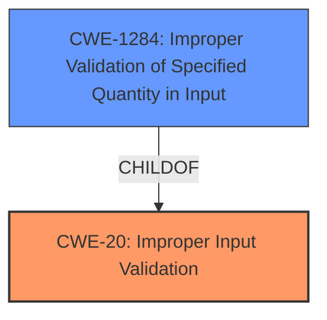

# Raw Analyzer Response for CVE-2022-20589

# Summary
| CWE ID | CWE Name | Confidence | CWE Abstraction Level | CWE Vulnerability Mapping Label | CWE-Vulnerability Mapping Notes |
|---|---|---|---|---|---|
| CWE-20 ([CWE-20: Improper Input Validation](https://cwe.mitre.org/data/definitions/20.html)) | Improper Input Validation | 0.8 | Class | Primary | Discouraged |
| CWE-1284 ([CWE-1284: Improper Validation of Specified Quantity in Input](https://cwe.mitre.org/data/definitions/1284.html)) | Improper Validation of Specified Quantity in Input | 0.6 | Base | Secondary | Allowed |

## Evidence and Confidence

*   **Confidence Score:** 0.8
*   **Evidence Strength:** MEDIUM

## Relationship Analysis
The primary CWE selected is CWE-20 ([CWE-20: Improper Input Validation](https://cwe.mitre.org/data/definitions/20.html)), which is a Class-level CWE. However, due to the lack of specific details in the vulnerability description, a more specific Base CWE could not be confidently asserted. CWE-1284 ([CWE-1284: Improper Validation of Specified Quantity in Input](https://cwe.mitre.org/data/definitions/1284.html)) is a child of CWE-20 ([CWE-20: Improper Input Validation](https://cwe.mitre.org/data/definitions/20.html)) and represents a more specific case of **improper input validation** related to quantities. Although potentially applicable, the description doesn't explicitly mention quantities, making this a weaker secondary mapping.

## Vulnerability Chain
The vulnerability chain starts with **improper input validation** (CWE-20 ([CWE-20: Improper Input Validation](https://cwe.mitre.org/data/definitions/20.html))) which leads to information disclosure.
  - **Root Cause:** **Improper Input Validation** (CWE-20 ([CWE-20: Improper Input Validation](https://cwe.mitre.org/data/definitions/20.html)))
  - **Impact:** Information Disclosure

## Summary of Analysis
The vulnerability description indicates an **improper input validation** issue in `valid_va_secbuf_check` of `drm_access_control.c`. This **improper input validation** could lead to local information disclosure. The "CVE Reference Links Content Summary" states "An unspecified vulnerability exists in the LDFW (Low-level Debugging Firmware) component" and the weaknesses includes "The specific vulnerability is not detailed but is classified as an 'Information Disclosure' (ID)."

The primary CWE selected is CWE-20 ([CWE-20: Improper Input Validation](https://cwe.mitre.org/data/definitions/20.html)) because the vulnerability description explicitly mentions "**improper input validation**." While CWE-20 ([CWE-20: Improper Input Validation](https://cwe.mitre.org/data/definitions/20.html)) is discouraged for being too general, the lack of specific details prevents a more precise mapping. The description notes "**improper input validation**," which aligns directly with CWE-20 ([CWE-20: Improper Input Validation](https://cwe.mitre.org/data/definitions/20.html)).

CWE-1284 ([CWE-1284: Improper Validation of Specified Quantity in Input](https://cwe.mitre.org/data/definitions/1284.html)) was considered because it is a child of CWE-20 ([CWE-20: Improper Input Validation](https://cwe.mitre.org/data/definitions/20.html)) and relates to validating quantities, but the description does not specify if the **improper input validation** involves a quantity. Other CWEs like CWE-413 ([CWE-413: Improper Resource Locking](https://cwe.mitre.org/data/definitions/413.html)), CWE-770 ([CWE-770: Allocation of Resources Without Limits or Throttling](https://cwe.mitre.org/data/definitions/770.html)), and CWE-908 ([CWE-908: Use of Uninitialized Resource](https://cwe.mitre.org/data/definitions/908.html)) were also considered but deemed less relevant because the vulnerability description's key phrase focuses on **improper input validation**.

The selection of CWE-20 ([CWE-20: Improper Input Validation](https://cwe.mitre.org/data/definitions/20.html)) as the primary CWE is based on direct evidence from the vulnerability description. While the mapping guidance discourages using CWE-20 ([CWE-20: Improper Input Validation](https://cwe.mitre.org/data/definitions/20.html)) due to its generality, the limited information available and the explicit mention of "**improper input validation**" makes it the most appropriate choice.