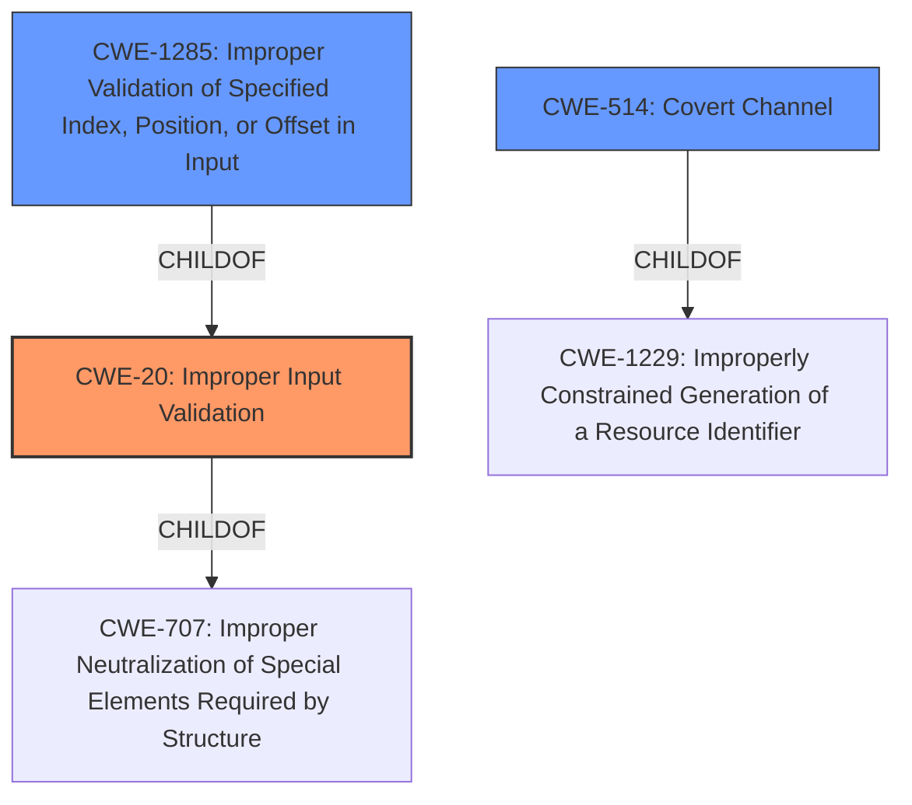

# Raw Analyzer Response for CVE-2022-20592

# Summary
| CWE ID | CWE Name | Confidence | CWE Abstraction Level | CWE Vulnerability Mapping Label | CWE-Vulnerability Mapping Notes |
|---|---|---|---|---|---|
| CWE-20 ([CWE-20: Improper Input Validation](https://cwe.mitre.org/data/definitions/20.html)) | Improper Input Validation | 0.8 | Class | Primary | Allowed-with-Review, The vulnerability description explicitly states "**improper input validation**". |
| CWE-514 ([CWE-514: Covert Channel](https://cwe.mitre.org/data/definitions/514.html)) | Covert Channel | 0.6 | Class | Secondary | Allowed-with-Review, Information disclosure can occur through a covert channel. |
| CWE-1285 ([CWE-1285: Improper Validation of Specified Index, Position, or Offset in Input](https://cwe.mitre.org/data/definitions/1285.html)) | Improper Validation of Specified Index, Position, or Offset in Input | 0.6 | Base | Secondary | Allowed, if the input validation relates to index, position or offset. |

## Evidence and Confidence

*   **Confidence Score:** 0.8
*   **Evidence Strength:** MEDIUM

## Relationship Analysis
The primary CWE is CWE-20 ([CWE-20: Improper Input Validation](https://cwe.mitre.org/data/definitions/20.html)), which is a class-level CWE. CWE-20 ([CWE-20: Improper Input Validation](https://cwe.mitre.org/data/definitions/20.html)) is a child of CWE-707. CWE-514 ([CWE-514: Covert Channel](https://cwe.mitre.org/data/definitions/514.html)) is a class-level CWE and child of CWE-1229. CWE-1285 ([CWE-1285: Improper Validation of Specified Index, Position, or Offset in Input](https://cwe.mitre.org/data/definitions/1285.html)) is a base-level CWE and child of CWE-20 ([CWE-20: Improper Input Validation](https://cwe.mitre.org/data/definitions/20.html)). The choice of CWE-20 ([CWE-20: Improper Input Validation](https://cwe.mitre.org/data/definitions/20.html)) as the primary CWE is based on the explicit mention of "**improper input validation**" in the vulnerability description. The other CWEs are potentially related depending on the specifics of the **improper input validation**.

## Vulnerability Chain
The vulnerability chain starts with **improper input validation** (CWE-20 ([CWE-20: Improper Input Validation](https://cwe.mitre.org/data/definitions/20.html))). This leads to a potential information disclosure. Information can be disclosed through a covert channel (CWE-514 ([CWE-514: Covert Channel](https://cwe.mitre.org/data/definitions/514.html))). If the validation is related to index, position or offset (CWE-1285 ([CWE-1285: Improper Validation of Specified Index, Position, or Offset in Input](https://cwe.mitre.org/data/definitions/1285.html))).

## Summary of Analysis
The initial assessment, based on the vulnerability description key phrases, identified "**improper input validation**" as the root cause, aligning with CWE-20 ([CWE-20: Improper Input Validation](https://cwe.mitre.org/data/definitions/20.html)). The "CVE Reference Links Content Summary" supports this by highlighting the vulnerability's presence within the LDFW component and the resultant information disclosure.

The graph relationships and retriever results provided additional context. CWE-1285 ([CWE-1285: Improper Validation of Specified Index, Position, or Offset in Input](https://cwe.mitre.org/data/definitions/1285.html)) was considered because input validation might involve indices or offsets. CWE-514 ([CWE-514: Covert Channel](https://cwe.mitre.org/data/definitions/514.html)) was considered as a potential mechanism for information disclosure.

The final decision to prioritize CWE-20 ([CWE-20: Improper Input Validation](https://cwe.mitre.org/data/definitions/20.html)) as the primary CWE is based on the direct statement of "**improper input validation**" in the vulnerability description. The other CWEs are secondary candidates.

Other considered CWEs:

*   CWE-665 ([CWE-665: Improper Initialization](https://cwe.mitre.org/data/definitions/665.html)): While initialization issues can lead to unexpected states, the primary weakness is the lack of validation, not the initialization itself.
*   CWE-862 ([CWE-862: Missing Authorization](https://cwe.mitre.org/data/definitions/862.html)): The vulnerability description focuses on validation, not authorization.
*   CWE-667 ([CWE-667: Improper Locking](https://cwe.mitre.org/data/definitions/667.html)): Locking issues are not indicated in the vulnerability description.
*   CWE-770 ([CWE-770: Allocation of Resources Without Limits or Throttling](https://cwe.mitre.org/data/definitions/770.html)): Resource allocation is not mentioned in the description.
*   CWE-362 ([CWE-362: Concurrent Execution using Shared Resource with Improper Synchronization ('Race Condition')](https://cwe.mitre.org/data/definitions/362.html)): Concurrency issues are not indicated in the vulnerability description.
*   CWE-908 ([CWE-908: Use of Uninitialized Resource](https://cwe.mitre.org/data/definitions/908.html)): Similar to CWE-665 ([CWE-665: Improper Initialization](https://cwe.mitre.org/data/definitions/665.html)), the focus is on validation, not uninitialized resources.
*   CWE-413 ([CWE-413: Improper Resource Locking](https://cwe.mitre.org/data/definitions/413.html)): Locking issues are not indicated in the vulnerability description.
*   CWE-41 ([CWE-41: Improper Resolution of Path Equivalence](https://cwe.mitre.org/data/definitions/41.html)), CWE-22 ([CWE-22: Improper Limitation of a Pathname to a Restricted Directory ('Path Traversal')](https://cwe.mitre.org/data/definitions/22.html)), CWE-73 ([CWE-73: External Control of File Name or Path](https://cwe.mitre.org/data/definitions/73.html)): These path-related CWEs were not chosen because the description doesn't provide enough information to determine that file paths are involved.
*   CWE-190 ([CWE-190: Integer Overflow or Wraparound](https://cwe.mitre.org/data/definitions/190.html)): Integer overflows are not indicated in the description.
*   CWE-476 ([CWE-476: NULL Pointer Dereference](https://cwe.mitre.org/data/definitions/476.html)): Null pointer dereferences are not indicated in the description.

The choice of CWE-20 ([CWE-20: Improper Input Validation](https://cwe.mitre.org/data/definitions/20.html)) is at the