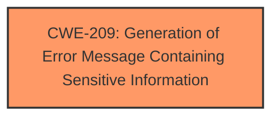

# Enhanced Analysis for CVE-2022-2062

# Summary
| CWE ID | CWE Name | Confidence | CWE Abstraction Level | CWE Vulnerability Mapping Label | CWE-Vulnerability Mapping Notes |
|---|---|---|---|---|---|
| CWE-209 | Generation of Error Message Containing Sensitive Information | 1.0 | Base | Allowed | Primary CWE |

## Evidence and Confidence

*   **Confidence Score:** 1.0
*   **Evidence Strength:** HIGH

## Relationship Analysis
The primary CWE identified is CWE-209 (**CWE-209: Generation of Error Message Containing Sensitive Information**), which is a Base level CWE. There are no other relationships to consider.



## Vulnerability Chain
The vulnerability chain starts with **improper input sanitization**, which leads to the **generation of error messages containing sensitive information**. The impact is **information disclosure**.

## Summary of Analysis
The primary weakness is the **generation of error messages containing sensitive information**. This is due to **improper input sanitization** and the logging of error details. The vulnerability description clearly states that sensitive server information was being logged and exposed in error messages. The analysis is based on the provided evidence, which includes:

*   Vulnerability Description Key Phrases: "**rootcause:** **improper input sanitization**" and "**impact:** information disclosure"
*   CVE Reference Links Content Summary: "The root cause is the inclusion of potentially sensitive server-related data in the response of the SMTP test API." and "The primary vulnerability is information disclosure through the SMTP test API."

The graph relationships influenced the selection by confirming that CWE-209 (**CWE-209: Generation of Error Message Containing Sensitive Information**) is a valid base level CWE, that has direct applicability to this vulnerability.

The selected CWE is at the optimal level of specificity because it directly addresses the root cause, which is the generation of error messages containing sensitive information. This aligns with the guidance to choose the lowest level (Base or Variant) that accurately represents the weakness.

Relevant CWE Information:
The following CWEs were considered but not selected:

*   CWE-138 (**CWE-138: Improper Neutralization of Special Elements**): This CWE was considered because the vulnerability involves **improper input sanitization**. However, it is a Class level CWE and not as specific as CWE-209 (**CWE-209: Generation of Error Message Containing Sensitive Information**), which directly addresses the information disclosure aspect.

*   CWE-116 (**CWE-116: Improper Encoding or Escaping of Output**): This CWE was considered because it relates to preparing structured messages for communication. However, the vulnerability is more directly related to the generation of error messages containing sensitive information rather than improper encoding or escaping of output.

*   CWE-79 (**CWE-79: Improper Neutralization of Input During Web Page Generation ('Cross-site Scripting')**): This CWE was considered because it relates to improper neutralization of input. However, the vulnerability is not related to cross-site scripting, but rather to information disclosure through error messages.

*   CWE-126 (**CWE-126: Buffer Over-read**): This CWE was not applicable because the vulnerability does not involve reading data past the end of a buffer.

*   CWE-210 (**CWE-210: Self-generated Error Message Containing Sensitive Information**): This is a child of CWE-209 (**CWE-209: Generation of Error Message Containing Sensitive Information**) which makes it a valid candidate, but the description states that the product creates its own diagnostics and the description notes that CWE-209 can be "externally generated" which makes CWE-209 a better fit.

*   CWE-756 (**CWE-756: Missing Custom Error Page**): This CWE was considered because it relates to error pages. However, the vulnerability is not about missing error pages, but rather about the information contained in the error messages.

* CWE-36 (**CWE-36: Absolute Path Traversal**): This CWE was not applicable because the vulnerability does not involve path traversal.
* CWE-770 (**CWE-770: Allocation of Resources Without Limits or Throttling**): This CWE was not applicable because the vulnerability does not involve resource allocation without limits.
* CWE-130 (**CWE-130: Improper Handling of Length Parameter Inconsistency**): This CWE was not applicable because the vulnerability does not involve length parameter inconsistency.


## CWE Relationship Analysis

Current CWEs represent these abstraction levels: .


### Vulnerability Chain Analysis

**Chain starting from CWE-209:**
- 209 (Generation of Error Message Containing Sensitive Information) - ROOT


**Chain starting from CWE-210:**
- 210 (Self-generated Error Message Containing Sensitive Information) - ROOT


### CWE Relationship Diagram

```mermaid
graph TD
    classDef primary fill:#f96,stroke:#333,stroke-width:2px
    classDef secondary fill:#69f,stroke:#333
    classDef tertiary fill:#9e9,stroke:#333
```