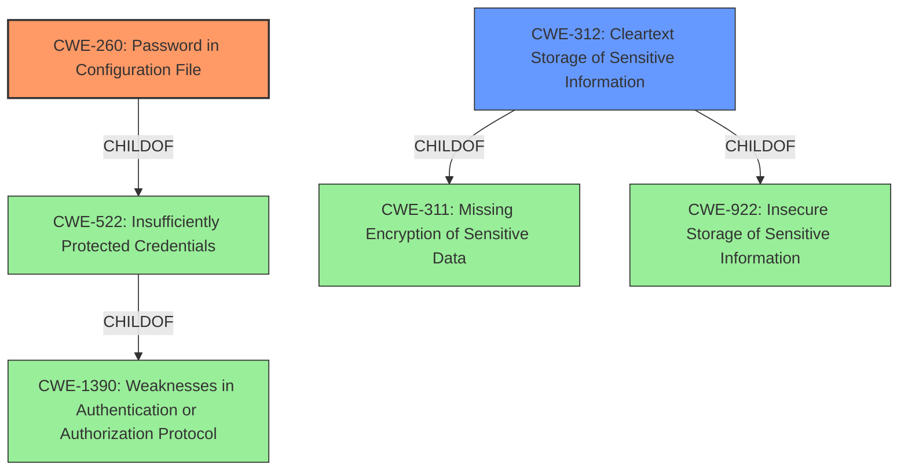

# Enhanced Analysis for CVE-2022-20621

# Summary
| CWE ID | CWE Name | Confidence | CWE Abstraction Level | CWE Vulnerability Mapping Label | CWE-Vulnerability Mapping Notes |
|---|---|---|---|---|---|
| CWE-260 | Password in Configuration File | 1.0 | Base | Allowed | Primary CWE |
| CWE-312 | Cleartext Storage of Sensitive Information | 0.8 | Base | Allowed | Secondary Candidate |
| CWE-256 | Plaintext Storage of a Password | 0.7 | Base | Allowed | Secondary Candidate |

## Evidence and Confidence

*   **Confidence Score:** 0.9
*   **Evidence Strength:** HIGH

## Relationship Analysis
The primary relationship influencing the CWE selection is the hierarchical one. CWE-260 (Password in Configuration File) is a more specific case of CWE-522 (Insufficiently Protected Credentials) and CWE-312 (Cleartext Storage of Sensitive Information). The vulnerability clearly states that the **access key is unencrypted** and stored in the configuration file.


## Vulnerability Chain
The vulnerability chain starts with the **unencrypted storage of the access key** in the configuration file. This leads to the exposure of the access key to users with access to the Jenkins controller file system, potentially leading to unauthorized access or other malicious activities.

## Summary of Analysis
The initial assessment pointed towards CWE-260 (Password in Configuration File) as the primary candidate due to the specific mention of the access key stored **unencrypted** in a configuration file. This is supported by the vulnerability description, which states that the Jenkins Metrics Plugin stores an **access key unencrypted** in its global configuration file.

The selection of CWE-260 is further justified by the fact that it is a Base-level CWE, which is the preferred level of abstraction for mapping to the root causes of vulnerabilities. The "Retriever Results" also lists CWE-260 as the top candidate.

CWE-312 (Cleartext Storage of Sensitive Information) and CWE-256 (Plaintext Storage of a Password) were considered as secondary candidates due to their relevance to the **unencrypted storage** of sensitive information, but are not as specific as CWE-260 regarding the configuration file.

Relevant CWE Information:

# Enhanced Context (25 CWEs)
The following CWEs were identified as potentially relevant to this vulnerability:

## CWE-312: Cleartext Storage of Sensitive Information
**Abstraction Level**: Base
**Similarity Score**: 0.83
**Source**: dense

**Description**:
The product stores sensitive information in cleartext within a resource that might be accessible to another control sphere.

**Mapping Guidance**:
- Usage: Allowed
- Rationale: This CWE entry is at the Base level of abstraction, which is a preferred level of abstraction for mapping to the root causes of vulnerabilities.

## CWE-260: Password in Configuration File
**Abstraction:** Base
**Status:** Incomplete

### Description
The product stores a password in a configuration file that might be accessible to actors who do not know the password.

### Extended Description
This can result in compromise of the system for which the password is used. An attacker could gain access to this file and learn the stored password or worse yet, change the password to one of their choosing.

### Alternative Terms
None

### Relationships
ChildOf -> CWE-522

### Mapping Guidance
**Usage:** Allowed
**Rationale:** This CWE entry is at the Base level of abstraction, which is a preferred level of abstraction for mapping to the root causes of vulnerabilities.
**Comments:** Carefully read both the name and description to ensure that this mapping is an appropriate fit. Do not try to 'force' a mapping to a lower-level Base/Variant simply to comply with this preferred level of abstraction.
**Reasons:**
- Acceptable-Use


## CWE Relationship Analysis

Current CWEs represent these abstraction levels: .


### Vulnerability Chain Analysis

**Chain starting from CWE-922:**
- 922 (Insecure Storage of Sensitive Information) - ROOT


**Chain starting from CWE-522:**
- 522 (Insufficiently Protected Credentials) - ROOT


### CWE Relationship Diagram

```mermaid
graph TD
    classDef primary fill:#f96,stroke:#333,stroke-width:2px
    classDef secondary fill:#69f,stroke:#333
    classDef tertiary fill:#9e9,stroke:#333
```