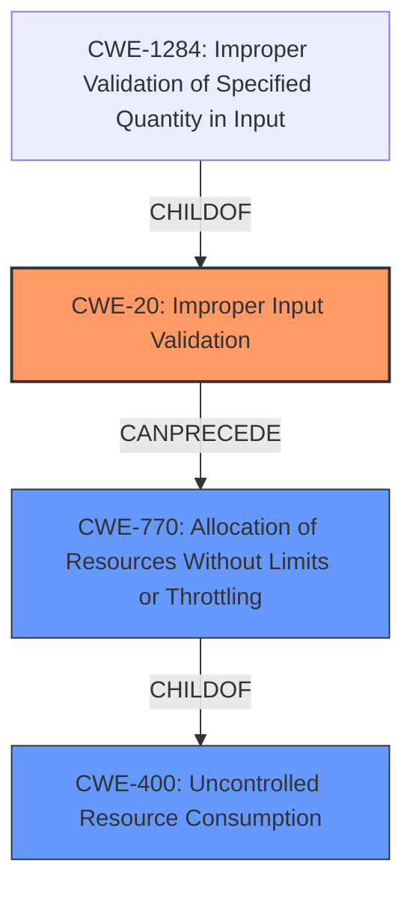

# Analysis Report for CVE-2022-20624

# Vulnerability Analysis Report: CVE-2022-20624

## Description


## Analysis (with Relationship Data)

# Summary
| CWE ID | CWE Name | Confidence | CWE Abstraction Level | CWE Vulnerability Mapping Label | CWE-Vulnerability Mapping Notes |
|---|---|---|---|---|---|
| CWE-20 | Improper Input Validation | 0.9 | Class | Primary CWE | Discouraged |
| CWE-770 | Allocation of Resources Without Limits or Throttling | 0.6 | Base | Secondary Candidate | Allowed |
| CWE-400 | Uncontrolled Resource Consumption | 0.5 | Class | Secondary Candidate | Discouraged |

## Evidence and Confidence

*   **Confidence Score:** 0.8
*   **Evidence Strength:** HIGH

## Relationship Analysis
The primary CWE selected is CWE-20, which is a class-level CWE. While it's generally discouraged to map to class-level CWEs when more specific options exist, the provided information doesn't offer the level of detail needed to pinpoint a more specific variant. CWE-20 has child CWEs like CWE-1284 (Improper Validation of Specified Quantity in Input) which could be relevant if the crafted packets involved specific quantity fields.

CWE-770 is a base-level CWE and a child of CWE-400 and represents the allocation of resources without limits, contributing to potential resource exhaustion.

CWE-400 is a class-level CWE and represents the uncontrolled consumption of resources, which is the impact of the vulnerability. It is discouraged as it's too high-level.



## Vulnerability Chain
The vulnerability chain starts with **insufficient validation of incoming CFSoIP packets** (CWE-20), which allows an attacker to send **crafted CFSoIP packets**. This can then lead to **allocation of resources without limits or throttling** (CWE-770), ultimately resulting in a **denial of service (DoS) condition** (CWE-400) due to the device reloading.

## Summary of Analysis
The initial assessment identified the **root cause** as **insufficient validation of incoming CFSoIP packets**, which directly aligns with CWE-20 (Improper Input Validation). The provided evidence from the vulnerability description and CVE reference links consistently points to this **lack of validation** as the primary weakness. The impact of this vulnerability is a denial-of-service (DoS) condition, which is a consequence of the **insufficient validation**.

The graph relationships influenced the final selection by highlighting the potential for a chain of weaknesses. CWE-20 can precede CWE-770, indicating that the **improper input validation** can lead to **uncontrolled resource allocation**, and ultimately, a DoS.

CWE-20 is selected as the primary CWE because it directly addresses the **root cause** of the vulnerability, which is the **insufficient validation of incoming CFSoIP packets**. While CWE-20 is a class-level CWE and discouraged, the provided information lacks the specificity needed to pinpoint a more detailed (child) CWE. However, the consistent identification of **insufficient validation** as the core issue supports its selection. The selection of CWE-20 is further justified by the evidence from the vulnerability description: "This vulnerability is due to **insufficient validation of incoming CFSoIP packets**."

The additional CWEs considered are CWE-770 because the **lack of validation** could allow an attacker to exhaust resources. CWE-400 was also considered, as it describes the DoS impact, but it is less descriptive of the **root cause** than CWE-20.

Relevant CWE Information:
# Enhanced Context (25 CWEs)
The following CWEs were identified as potentially relevant to this vulnerability:

## CWE-405: Asymmetric Resource Consumption (Amplification)
**Abstraction Level**: Class
**Similarity Score**: 0.77
**Source**: dense

**Description**:
The product does not properly control situations in which an adversary can cause the product to consume or produce excessive resources without requiring the adversary to invest equivalent work or otherwise prove authorization, i.e., the adversary's influence is "asymmetric."

**Mapping Guidance**:
- Usage: Allowed-with-Review
- Rationale: This CWE entry is a Class and might have Base-level children that would be more appropriate

## CWE-799: Improper Control of Interaction Frequency
**Abstraction Level**: Class
**Similarity Score**: 0.77
**Source**: dense

**Description**:
The product does not properly limit the number or frequency of interactions that it has with an actor, such as the number of incoming requests.

**Mapping Guidance**:
- Usage: Allowed-with-Review
- Rationale: This CWE entry is a Class and might have Base-level children that would be more appropriate

## CWE-664: Improper Control of a Resource Through its Lifetime
**Abstraction Level**: Pillar
**Similarity Score**: 0.76
**Source**: dense

**Description**:
The product does not maintain or incorrectly maintains control over a resource throughout its lifetime of creation, use, and release.

**Mapping Guidance**:
- Usage: Discouraged
- Rationale: This CWE entry is high-level when lower-level children are available.

## CWE-404: Improper Resource Shutdown or Release
**Abstraction Level**: Class
**Similarity Score**: 0.75
**Source**: dense

**Description**:
The product does not release or incorrectly releases a resource before it is made available for re-use.

**Mapping Guidance**:
- Usage: Allowed-with-Review
- Rationale: This CWE entry is a Class and might have Base-level children that would be more appropriate

## CWE-1289: Improper Validation of Unsafe Equivalence in Input
**Abstraction Level**: Base
**Similarity Score**: 0.75
**Source**: dense

**Description**:
The product receives an input value that is used as a resource identifier or other type of reference, but it does not validate or incorrectly validates that the input is equivalent to a potentially-unsafe value.

**Mapping Guidance**:
- Usage: Allowed
- Rationale: This CWE entry is at the Base level of abstraction, which is a preferred level of abstraction for mapping to the root causes of vulnerabilities.

## CWE-789: Memory Allocation with Excessive Size Value
**Abstraction Level**: Variant
**Similarity Score**: 0.74
**Source**: dense

**Description**:
The product allocates memory based on an untrusted, large size value, but it does not ensure that the size is within expected limits, allowing arbitrary amounts of memory to be allocated.

**Mapping Guidance**:
- Usage: Allowed
- Rationale: This CWE entry is at the Variant level of abstraction, which is a preferred level of abstraction for mapping to the root causes of vulnerabilities.

## CWE-226: Sensitive Information in Resource Not Removed Before Reuse
**Abstraction Level**: Base
**Similarity Score**: 0.74
**Source**: dense

**Description**:
The product releases a resource such as memory or a file so that it can be made available for reuse, but it does not clear or "zeroize" the information contained in the resource before the product performs a critical state transition or makes the resource available for reuse by other entities.

**Mapping Guidance**:
- Usage: Allowed
- Rationale: This CWE entry is at the Base level of abstraction, which is a preferred level of abstraction for mapping to the root causes of vulnerabilities.

## CWE-668: Exposure of Resource to Wrong Sphere
**Abstraction Level**: Class
**Similarity Score**: 0.74
**Source**: dense

**Description**:
The product exposes a resource to the wrong control sphere, providing unintended actors with inappropriate access to the resource.

**Mapping Guidance**:
- Usage: Discouraged
- Rationale: CWE-668 is high-level and is often misused as a catch-all when lower-level CWE IDs might be applicable. It is sometimes used for low-information vulnerability reports [REF-1287]. It is a level-1 Class (i.e., a child of a Pillar). It is not useful for trend analysis.

## CWE-191: Integer Underflow (Wrap or Wraparound)
**Abstraction Level**: Base
**Similarity Score**: 0.74
**Source**: dense

**Description**:
The product subtracts one value from another, such that the result is less than the minimum allowable integer value, which produces a value that is not equal to the correct result.

**Mapping Guidance**:
- Usage


## CWE Relationship Analysis

Current CWEs represent these abstraction levels: .


### Vulnerability Chain Analysis

**Chain starting from CWE-400:**
- 400 (Uncontrolled Resource Consumption) - ROOT


**Chain starting from CWE-405:**
- 405 (Asymmetric Resource Consumption (Amplification)) - ROOT


### CWE Relationship Diagram

```mermaid
graph TD
    classDef primary fill:#f96,stroke:#333,stroke-width:2px
    classDef secondary fill:#69f,stroke:#333
    classDef tertiary fill:#9e9,stroke:#333
```


*Report generated on 2025-03-31 05:57:13*
