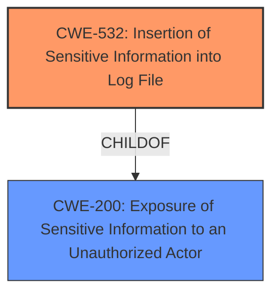

# Analysis for CVE-2022-20630

# Summary
| CWE ID | CWE Name | Confidence | CWE Abstraction Level | CWE Vulnerability Mapping Label | CWE-Vulnerability Mapping Notes |
|---|---|---|---|---|---|
| CWE-532 | Insertion of Sensitive Information into Log File | 1.0 | Base | Allowed | Primary CWE |
| CWE-200 | Exposure of Sensitive Information to an Unauthorized Actor | 0.5 | Class | Discouraged | Secondary Candidate |

## Evidence and Confidence

*   **Confidence Score:** 0.8
*   **Evidence Strength:** HIGH

## Relationship Analysis
The primary relationship that influenced my decision was the ChildOf relationship between CWE-532 and CWE-200, where CWE-532 (Insertion of Sensitive Information into Log File) is a child of CWE-200 (Exposure of Sensitive Information to an Unauthorized Actor). Although CWE-200 is listed in the CVE description, CWE-532 is a more specific Base level CWE and the preferred mapping.

## Vulnerability Chain
The vulnerability chain starts with the **unsecured logging of sensitive information**, which leads to the exposure of sensitive data in clear text.

## Summary of Analysis
The initial analysis identified CWE-532 as the primary candidate, with CWE-200 considered as a broader classification. The final decision favored CWE-532 due to its specific match with the vulnerability description and the MITRE mapping guidance favoring Base-level CWEs.

The evidence from the "Vulnerability Description Key Phrases" section, specifically "**rootcause:** **unsecured logging of sensitive information**" supports the selection of CWE-532.

The graph relationships influenced the final selection by highlighting the parent-child relationship between CWE-532 and CWE-200, guiding the decision towards the more specific CWE-532.

The selected CWEs are at the optimal level of specificity because CWE-532 directly addresses the root cause of the vulnerability, while CWE-200 is a more general classification of the resulting information exposure.

Relevant CWE Information:

# Enhanced Context (25 CWEs)
The following CWEs were identified as potentially relevant to this vulnerability:

## CWE-532: Insertion of Sensitive Information into Log File
**Abstraction:** Base
**Similarity Score**: 0.643 (Retriever Results)
**Description**: The product writes sensitive information to a log file.

**Relationships**:
ChildOf -> CWE-538
ChildOf -> CWE-200

## CWE-200: Exposure of Sensitive Information to an Unauthorized Actor
**Abstraction:** Class
**Similarity Score**: 5965.46 (sparse)
**Description**: The product exposes sensitive information to an actor that is not explicitly authorized to have access to that information.

**Mapping Guidance:**
- Usage: Discouraged
- Rationale: CWE-200 is commonly misused to represent the loss of confidentiality in a vulnerability, but confidentiality loss is a technical impact - not a root cause error.

**Relationships**:
ChildOf -> CWE-668

## CWE-532: Insertion of Sensitive Information into Log File
**CWE-532** (Insertion of Sensitive Information into Log File) is the primary CWE. The vulnerability description clearly states "**unsecured logging of sensitive information**," which aligns perfectly with CWE-532's description: "The product writes sensitive information to a log file." The "CVE Reference Links Content Summary" section also supports this by mentioning "Sensitive data, including user credentials, is logged in clear text." This CWE is at the Base level of abstraction, as recommended by MITRE guidance. The security implication is that an attacker with access to the logs can view sensitive information.

## CWE-200: Exposure of Sensitive Information to an Unauthorized Actor
**CWE-200** (Exposure of Sensitive Information to an Unauthorized Actor) was considered because it is the CWE listed in the CVE details. However, it is a Class-level CWE and is discouraged by MITRE for direct mapping when a more specific CWE is available. While the vulnerability does result in the exposure of sensitive information, the root cause is specifically related to logging, making CWE-532 a better fit.