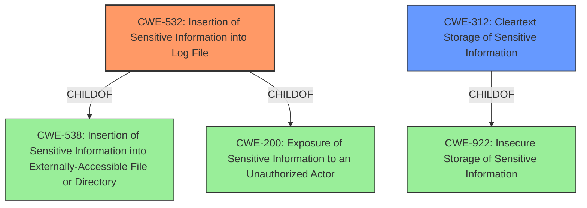

# Analysis for CVE-2022-20651

# Summary
| CWE ID | CWE Name | Confidence | CWE Abstraction Level | CWE Vulnerability Mapping Label | CWE-Vulnerability Mapping Notes |
|---|---|---|---|---|---|
| CWE-532 | Insertion of Sensitive Information into Log File | 1.0 | Base | Primary | Allowed |
| CWE-312 | Cleartext Storage of Sensitive Information | 0.9 | Base | Secondary | Allowed |

## Evidence and Confidence

*   **Confidence Score:** 0.95
*   **Evidence Strength:** HIGH

## Relationship Analysis
The primary CWE selected is CWE-532, which focuses on the **insertion of sensitive information into log files**. This is a **Base** level CWE.

CWE-532 has a ChildOf relationship to CWE-538 (Insertion of Sensitive Information into Externally-Accessible File or Directory) and CWE-200 (Exposure of Sensitive Information to an Unauthorized Actor).

CWE-312 (Cleartext Storage of Sensitive Information) is a related weakness, and has a ChildOf relationship to CWE-922 (Insecure Storage of Sensitive Information).

## Vulnerability Chain
The vulnerability chain starts with the **storage of unencrypted credentials** (**ROOTCAUSE**). This leads to sensitive information being present in the logs. The vulnerability allows an attacker to access the logs and view the credentials of other users (**IMPACT**).

## Summary of Analysis
The initial assessment based on the vulnerability description and CVE reference summary strongly points towards **storage of unencrypted credentials in logs**, which aligns directly with CWE-532 (Insertion of Sensitive Information into Log File) as the primary weakness. The vulnerability description key phrases support this. The evidence from the CVE reference links content summary confirms the **storage of unencrypted credentials in logs** as the root cause.

The graph relationships show that the selected CWE is at the appropriate level of specificity. CWE-532 is more specific than its parents, CWE-538 and CWE-200, and accurately describes the vulnerability.

The final decision is based on the evidence provided in the vulnerability description, the CVE reference summary, and the relationships between the CWEs. CWE-532 is the most appropriate CWE because it directly addresses the **insertion of sensitive information into log files**, which is the core issue. CWE-312 is also included as a secondary issue due to the fact the information is stored in cleartext.

Relevant CWE Information:

# Enhanced Context (25 CWEs)

## CWE-807: Reliance on Untrusted Inputs in a Security Decision
**Abstraction Level**: Base
**Similarity Score**: 0.78
**Source**: dense

This CWE was not selected as it doesn't fit the vulnerability description, which focuses on storing unencrypted credentials rather than making security decisions based on untrusted inputs.

## CWE-1289: Improper Validation of Unsafe Equivalence in Input
**Abstraction Level**: Base
**Similarity Score**: 0.78
**Source**: dense

This CWE was not selected because the vulnerability is not about improper validation of input equivalence. It is about storing sensitive information in cleartext in logs.

## CWE-538: Insertion of Sensitive Information into Externally-Accessible File or Directory
**Abstraction Level**: Base
**Similarity Score**: 0.77
**Source**: dense

CWE-538 is a parent of CWE-532 (the selected CWE). While the logs are externally accessible, CWE-532 is a more specific description of the issue.

## CWE-312: Cleartext Storage of Sensitive Information
**Abstraction Level**: Base
**Similarity Score**: 0.76
**Source**: dense

The product stores sensitive information in cleartext within a resource that might be accessible to another control sphere.

This CWE was considered as a secondary weakness. The vulnerability involves storing unencrypted credentials in logs, which means the information is stored in cleartext. The fact that the credentials are unencrypted is a contributing factor to the vulnerability.

## CWE-1391: Use of Weak Credentials
**Abstraction Level**: Class
**Similarity Score**: 0.76
**Source**: dense

This CWE was not selected because the vulnerability is not about using weak credentials, but about storing credentials in cleartext.

## CWE-226: Sensitive Information in Resource Not Removed Before Reuse
**Abstraction Level**: Base
**Similarity Score**: 0.75
**Source**: dense

This CWE was not selected because the vulnerability is not about failing to remove sensitive information before reuse.

## CWE-319: Cleartext Transmission of Sensitive Information
**Abstraction Level**: Base
**Similarity Score**: 0.75
**Source**: dense

This CWE was not selected because the vulnerability is not about transmitting sensitive information in cleartext.

## CWE-212: Improper Removal of Sensitive Information Before Storage or Transfer
**Abstraction Level**: Base
**Similarity Score**: 0.75
**Source**: dense

This CWE was not selected because the vulnerability is not about improper removal of sensitive information.

## CWE-183: Permissive List of Allowed Inputs
**Abstraction Level**: Base
**Similarity Score**: 0.75
**Source**: dense

This CWE was not selected because the vulnerability is not about a permissive list of allowed inputs.

## CWE-922: Insecure Storage of Sensitive Information
**Abstraction Level**: Class
**Similarity Score**: 0.74
**Source**: dense

CWE-922 is a class-level CWE. It is less specific than CWE-312 (Cleartext Storage of Sensitive Information), which is already considered as a secondary weakness.

## CWE-798: Use of Hard-coded Credentials
**Abstraction Level**: Base
**Similarity Score**: 6924.73
**Source**: sparse

This CWE was not selected because the vulnerability is not about using hard-coded credentials.

## CWE-200: Exposure of Sensitive Information to an Unauthorized Actor
**Abstraction Level**: Class
**Similarity Score**: 6865.63
**Source**: sparse

CWE-200 is a parent of CWE-532 (the selected CWE). While the vulnerability does lead to exposure of sensitive information, CWE-532 is a more specific description of the issue.

## CWE-321: Use of Hard-coded Cryptographic Key
**Abstraction Level**: Variant
**Similarity Score**: 6835.46
**Source**: sparse

This CWE was not selected because the vulnerability is not about using hard-coded cryptographic keys.

## CWE-532: Insertion of Sensitive Information into Log File
**Abstraction Level**: Base
**Similarity Score**: 6803.92
**Source**: sparse

The product writes sensitive information to a log file.

The vulnerability involves storing unencrypted credentials in logs. This aligns directly with CWE-532. The successful exploit allows the attacker to view the credentials of other users. This CWE is at the Base level of abstraction, which is the preferred level.

## CWE-1391: Use of Weak Credentials
**Abstraction Level**: Class
**Similarity Score**: 6802.42
**Source**: sparse

This CWE was not selected because the vulnerability is not about using weak credentials, but about storing credentials in cleartext.

## CWE-41: Improper Resolution of Path Equivalence
**Abstraction Level**: base
**Similarity Score**: 5.03
**Source**: graph

This CWE was not selected because the vulnerability is not about path equivalence.

## CWE-22: Improper Limitation of a Pathname to a Restricted Directory ('Path Traversal')
**Abstraction Level**: base
**Similarity Score**: 4.33
**Source**: graph

This CWE was not selected because the vulnerability is not about path traversal.

## CWE-73: External Control of File Name or Path
**Abstraction Level**: base
**Similarity Score**: 4.33
**Source**: graph

This CWE was not selected because the vulnerability is not about external control of file name or path.

## CWE-770: Allocation of Resources Without Limits or Throttling
**Abstraction Level**: base
**Similarity Score**: 4.33
**