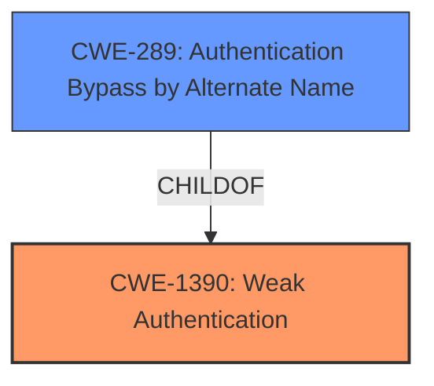

# Enhanced Analysis for CVE-2022-20662

# Summary
| CWE ID    | CWE Name                                                       | Confidence | CWE Abstraction Level | CWE Vulnerability Mapping Label | CWE-Vulnerability Mapping Notes |
| :--------- | :------------------------------------------------------------- | :--------- | :-------------------- | :------------------------------ | :------------------------------ |
| CWE-1390   | Weak Authentication                                           | 0.9        | Class               | Allowed-with-Review                | Primary                       |
| CWE-289   | Authentication Bypass by Alternate Name                                            | 0.7       | Base               | Allowed                | Secondary                      |

## Evidence and Confidence

*   **Confidence Score:** 0.8
*   **Evidence Strength:** HIGH

## Relationship Analysis
The analysis focuses on the parent-child relationship between CWE-1390 and CWE-289. CWE-1390 (Weak Authentication) is a class-level CWE, while CWE-289 (Authentication Bypass by Alternate Name) is a base-level CWE and a child of CWE-1390. The vulnerability involves bypassing authentication by **improperly matching smart card users**, which aligns with both the general concept of weak authentication (CWE-1390) and the more specific scenario of bypassing authentication by alternate name (CWE-289). Choosing CWE-1390 as the primary CWE acknowledges the overarching issue of authentication failure, and choosing CWE-289 as a secondary CWE captures the specific bypass method.



## Vulnerability Chain
The vulnerability chain begins with the **improper smart card user matching**, leading to **authentication bypass**, and ultimately resulting in **unauthorized access**.

## Summary of Analysis
The initial assessment identified CWE-1390 (Weak Authentication) as the primary candidate due to the vulnerability's core issue: the product uses an authentication mechanism that does not sufficiently prove the claimed identity is correct. The vulnerability description states that the "**assigned user of a smart card is not properly matched with the authenticating user,**" directly indicating a failure in the authentication process. The "CVE Reference Links Content Summary" reinforces this, stating that the "**core weakness lies in the flawed user-smart card association logic, allowing any PIV smart card to be used for authentication regardless of whether it is assigned to the authenticating user**."

CWE-289 (Authentication Bypass by Alternate Name) was considered because the vulnerability allows an attacker to bypass authentication by **configuring a smart card login**, effectively using an alternate identity or method to gain access.

The final decision favors CWE-1390 as the primary CWE because it captures the broader issue of weak authentication. CWE-289 is included as a secondary CWE to capture the specific bypass mechanism involving the smart card login configuration.

Both selected CWEs are at appropriate levels of specificity, with CWE-1390 being a Class and CWE-289 being a Base. This combination provides a comprehensive representation of the vulnerability, addressing both the high-level authentication failure and the specific method of bypassing it.

Relevant CWE Information:
# Enhanced Context (25 CWEs)
The following CWEs were identified as potentially relevant to this vulnerability:

## CWE-312: Cleartext Storage of Sensitive Information
**Abstraction Level**: Base
**Similarity Score**: 0.75
**Source**: dense

**Description**:
The product stores sensitive information in cleartext within a resource that might be accessible to another control sphere.

**Mapping Guidance**:
- Usage: Allowed
- Rationale: This CWE entry is at the Base level of abstraction, which is a preferred level of abstraction for mapping to the root causes of vulnerabilities.

**Rationale for not using:** This CWE is not relevant because the vulnerability is not about storing sensitive information in cleartext.

## CWE-1391: Use of Weak Credentials
**Abstraction Level**: Class
**Similarity Score**: 0.75
**Source**: dense

**Description**:
The product uses weak credentials (such as a default key or hard-coded password) that can be calculated, derived, reused, or guessed by an attacker.

**Mapping Guidance**:
- Usage: Allowed-with-Review
- Rationale: This CWE entry is a Class and might have Base-level children that would be more appropriate

**Rationale for not using:** This CWE is not relevant because the vulnerability does not involve the use of weak credentials like default keys or hard-coded passwords.

## CWE-1390: Weak Authentication
**Abstraction Level**: Class
**Similarity Score**: 0.75
**Source**: dense

**Description**:
The product uses an authentication mechanism to restrict access to specific users or identities, but the mechanism does not sufficiently prove that the claimed identity is correct.

**Mapping Guidance**:
- Usage: Allowed-with-Review
- Rationale: This CWE entry is a Class and might have Base-level children that would be more appropriate

**Rationale for using:** This CWE is the primary CWE as it perfectly describes the issue of **improper smart card user matching** and the resulting **authentication bypass**.

## CWE-807: Reliance on Untrusted Inputs in a Security Decision
**Abstraction Level**: Base
**Similarity Score**: 0.75
**Source**: dense

**Description**:
The product uses a protection mechanism that relies on the existence or values of an input, but the input can be modified by an untrusted actor in a way that bypasses the protection mechanism.

**Mapping Guidance**:
- Usage: Allowed
- Rationale: This CWE entry is at the Base level of abstraction, which is a preferred level of abstraction for mapping to the root causes of vulnerabilities.

**Rationale for not using:** While there's a reliance on smart card input, the core issue isn't that the *input* itself is untrusted, but rather the *matching* of the input to the user is **improper**.

## CWE-274: Improper Handling of Insufficient Privileges
**Abstraction Level**: Base
**Similarity Score**: 0.74
**Source**: dense

**Description**:
The product does not handle or incorrectly handles when it has insufficient privileges to perform an operation, leading to resultant weaknesses.

**Mapping Guidance**:
- Usage: Discouraged
- Rationale: This CWE entry could be deprecated in a future version of CWE.

**Rationale for not using:** This CWE doesn't fit because the issue isn't about insufficient privileges, but about **improper** handling of authentication.

## CWE-303: Incorrect Implementation of Authentication Algorithm
**Abstraction Level**: Base
**Similarity Score**: 0.74
**Source**: dense

**Description**:
The requirements for the product dictate the use of an established authentication algorithm, but the implementation of the algorithm is incorrect.

**Mapping Guidance**:
- Usage: Allowed
- Rationale: This CWE entry is at the Base level of abstraction, which is a preferred level of abstraction for mapping to the root causes of vulnerabilities.

**Rationale for not using:** While there might be an incorrect implementation, the description focuses more on the **improper matching** of users rather than a fundamentally flawed algorithm implementation.

## CWE-288: Authentication Bypass Using an Alternate Path or Channel
**Abstraction Level**: Base
**Similarity Score**: 0.74
**Source**: dense

**Description**:
The product requires authentication, but the product has an alternate path or channel that does not require authentication.

**Mapping Guidance**:
- Usage: Allowed
- Rationale: This CWE entry is at the Base level of abstraction, which is a preferred level of abstraction for mapping to the root causes of vulnerabilities.

**Rationale for considering:** This CWE is potentially relevant because the **improper smart card user matching** allows an attacker to effectively bypass authentication using an alternate "path" (any PIV smart card).

## CWE-798: Use of Hard-coded Credentials
**Abstraction Level**: Base
**Similarity Score**: 0.74
**Source**: dense

**Description**:
The product contains hard-coded credentials, such as a password or cryptographic key.

**Mapping Guidance**:
- Usage: Allowed
- Rationale: This CWE entry is at the Base level of abstraction, which is a preferred level of abstraction for mapping to the root causes of vulnerabilities.

**Rationale for not using:** This CWE is not relevant because the vulnerability does not involve the use of hard-coded credentials.

## CWE-668: Exposure of Resource to Wrong Sphere
**Abstraction Level**: Class
**Similarity Score**: 0.74
**Source**: dense

**Description**:
The product exposes a resource to the wrong control sphere, providing unintended actors with inappropriate access to the resource.

**Mapping Guidance**:
- Usage: Discouraged
- Rationale: CWE-668 is high-level and is often misused as a catch-all when lower-level CWE IDs might be applicable. It is sometimes used for low-information vulnerability reports [REF-1287]. It is a level-1 Class (i.e., a child


## CWE Relationship Analysis

Current CWEs represent these abstraction levels: .


### Vulnerability Chain Analysis

**Chain starting from CWE-1390:**
- 1390 (Weak Authentication) - ROOT


**Chain starting from CWE-312:**
- 312 (Cleartext Storage of Sensitive Information) - ROOT


### CWE Relationship Diagram

```mermaid
graph TD
    classDef primary fill:#f96,stroke:#333,stroke-width:2px
    classDef secondary fill:#69f,stroke:#333
    classDef tertiary fill:#9e9,stroke:#333
```