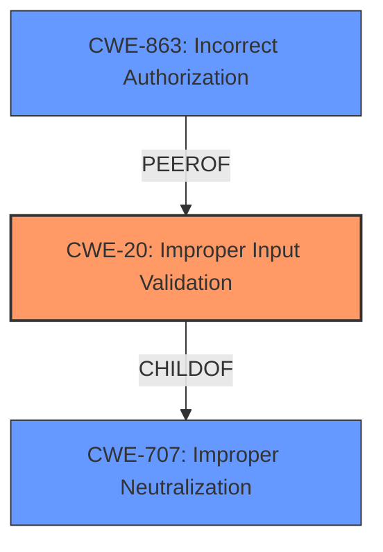

# Enhanced Analysis for CVE-2022-20664

# Summary
| CWE ID | CWE Name | Confidence | CWE Abstraction Level | CWE Vulnerability Mapping Label | CWE-Vulnerability Mapping Notes |
|---|---|---|---|---|---|
| CWE-20 | Improper Input Validation | 0.9 | Class | Allowed-with-Review | Primary CWE |
| CWE-863 | Incorrect Authorization | 0.5 | Class | Allowed-with-Review | Secondary Candidate |

## Evidence and Confidence

*   **Confidence Score:** 0.9
*   **Evidence Strength:** HIGH

## Relationship Analysis
The primary CWE identified is CWE-20, "Improper Input Validation". It's a Class-level CWE and a child of CWE-707. While normally discouraged, in this case it aligns with the provided description of "**lack of proper input sanitization**".

CWE-863 (Incorrect Authorization) was also considered as a secondary issue.



## Vulnerability Chain
The vulnerability chain starts with the **lack of proper input sanitization** (CWE-20) which leads to the potential to retrieve sensitive information, including user credentials from the external authentication server. The attacker exploits this by sending a crafted query.

## Summary of Analysis
The initial assessment strongly points to CWE-20 (Improper Input Validation) as the primary weakness. The vulnerability description clearly states the **lack of proper input sanitization** as the root cause. This aligns directly with CWE-20's description of failing to validate input properties for safe and correct processing. The retriever results also list CWE-20 as a candidate.

The evidence from the "CVE Reference Links Content Summary" section explicitly mentions "The vulnerability is due to a **lack of proper input sanitization** while querying the external authentication server." This reinforces the selection of CWE-20.

CWE-863 (Incorrect Authorization) was considered because the vulnerability allows access to sensitive information. However, the root cause is the **lack of input sanitization**, which then leads to the possibility of unauthorized data retrieval. Therefore, CWE-20 is more directly related to the root cause.

The selection of CWE-20 is at the Class level. While the guidance discourages this, a more specific CWE is not evident from the provided information.

Relevant CWE Information:

# Enhanced Context (25 CWEs)

## CWE-807: Reliance on Untrusted Inputs in a Security Decision
**Abstraction Level**: Base
**Similarity Score**: 0.80
**Source**: dense

**Description**:
The product uses a protection mechanism that relies on the existence or values of an input, but the input can be modified by an untrusted actor in a way that bypasses the protection mechanism.

**Mapping Guidance**:
- Usage: Allowed
- Rationale: This CWE entry is at the Base level of abstraction, which is a preferred level of abstraction for mapping to the root causes of vulnerabilities.

## CWE-20: Improper Input Validation
**Abstraction Level**: Class
**Similarity Score**: 2.98
**Source**: graph

**Description**:
CWE-20: Improper Input Validation

**Mapping Guidance**:
- Usage: Discouraged
- Rationale: CWE-20 is commonly misused in low-information vulnerability reports when lower-level CWEs could be used instead, or when more details about the vulnerability are available [REF-1287]. It is not useful for trend analysis. It is also a level-1 Class (i.e., a child of a Pillar).

**Relationships**:
- CHILDOF -> CWE-707
- PEEROF -> CWE-345
- CANPRECEDE -> CWE-22
- CANPRECEDE -> CWE-41
- CANPRECEDE -> CWE-74


## CWE Relationship Analysis

Current CWEs represent these abstraction levels: .


### Vulnerability Chain Analysis

**Chain starting from CWE-41:**
- 41 (Improper Resolution of Path Equivalence) - ROOT


**Chain starting from CWE-807:**
- 807 (Reliance on Untrusted Inputs in a Security Decision) - ROOT


### CWE Relationship Diagram

```mermaid
graph TD
    classDef primary fill:#f96,stroke:#333,stroke-width:2px
    classDef secondary fill:#69f,stroke:#333
    classDef tertiary fill:#9e9,stroke:#333
```