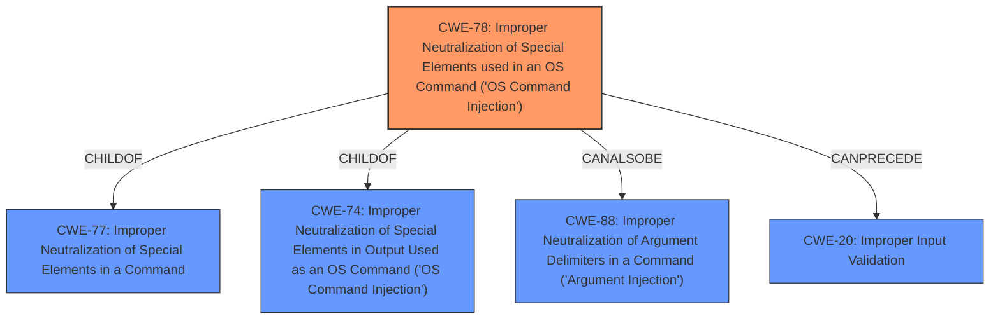

# Analysis Report for CVE-2022-20665

# Vulnerability Analysis Report: CVE-2022-20665

## Description


## Analysis (with Relationship Data)

# Summary
| CWE ID | CWE Name | Confidence | CWE Abstraction Level | CWE Vulnerability Mapping Label | CWE-Vulnerability Mapping Notes |
|---|---|---|---|---|---|
| CWE-78 | Improper Neutralization of Special Elements used in an OS Command ('OS Command Injection') | 0.9 | Base | Allowed | Primary CWE |
| CWE-20 | Improper Input Validation | 0.7 | Class | Discouraged | Secondary Candidate |

## Evidence and Confidence

*   **Confidence Score:** 0.8
*   **Evidence Strength:** HIGH

## Relationship Analysis
The primary CWE is CWE-78, which is a base-level CWE. It's related to CWE-77 (Improper Neutralization of Special Elements in a Command) as a child. CWE-78 is also related to CWE-74 (Improper Neutralization of Special Elements in Output Used as an OS Command ('OS Command Injection')) and CWE-88 (Improper Neutralization of Argument Delimiters in a Command ('Argument Injection')) as a child. While CWE-20 (Improper Input Validation) is a potential contributing factor, CWE-78 more directly captures the **root cause** of the command injection vulnerability.


## Vulnerability Chain
The vulnerability chain starts with **insufficient input validation** which leads to the possibility of injecting OS commands. The successful injection leads to arbitrary code execution with root privileges, which results in privilege escalation.
  - **Root Cause:** **Insufficient Input Validation**
  - **Weakness:** OS Command Injection
  - **Impact:** Privilege Escalation

## Summary of Analysis
The vulnerability is due to **insufficient input validation** of CLI commands. An attacker could exploit this by sending crafted commands to the CLI. A successful exploit could allow the attacker to execute arbitrary code with the privileges of the root user.

The primary CWE match is CWE-78 (Improper Neutralization of Special Elements used in an OS Command ('OS Command Injection')). This is based on the "Vulnerability Description Key Phrases" that identify the **rootcause** as "**insufficient input validation**" and the attack vector as "crafted commands". The "CVE Reference Links Content Summary" confirms that the **root_cause** is "**insufficient input validation** of CLI commands" which allows command injection.

CWE-20 (Improper Input Validation) was considered, but it is too general. While **insufficient input validation** is the **root cause**, CWE-78 describes the specific weakness of command injection. The mapping guidance for CWE-20 discourages its use when more specific CWEs exist.

CWE-78 is at the Base level of abstraction, which is the preferred level. It accurately represents the vulnerability where crafted commands are injected due to **insufficient input validation**, leading to arbitrary code execution.

Therefore, CWE-78 is the most appropriate CWE for this vulnerability.


## CWE Relationship Analysis

Current CWEs represent these abstraction levels: .


### Vulnerability Chain Analysis

**Chain starting from CWE-20:**
- 20 (Improper Input Validation) - ROOT


**Chain starting from CWE-78:**
- 78 (Improper Neutralization of Special Elements used in an OS Command ('OS Command Injection')) - ROOT


### CWE Relationship Diagram

```mermaid
graph TD
    classDef primary fill:#f96,stroke:#333,stroke-width:2px
    classDef secondary fill:#69f,stroke:#333
    classDef tertiary fill:#9e9,stroke:#333
```


*Report generated on 2025-03-30 22:41:29*
