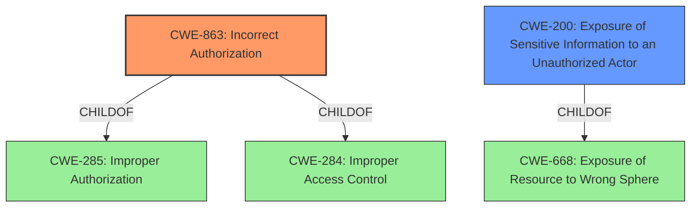

# Raw Analyzer Response for CVE-2022-20680

# Summary
| CWE ID  | CWE Name                                                     | Confidence | CWE Abstraction Level | CWE Vulnerability Mapping Label | CWE-Vulnerability Mapping Notes |
| :-------- | :----------------------------------------------------------- | :--------- | :---------------------- | :------------------------------ | :------------------------------ |
| CWE-863   | Incorrect Authorization                                      | 0.9        | Class                   | Primary                         | Allowed-with-Review             |
| CWE-200   | Exposure of Sensitive Information to an Unauthorized Actor | 0.6        | Class                   | Secondary                       | Discouraged                     |

## Evidence and Confidence

*   **Confidence Score:** 0.8
*   **Evidence Strength:** HIGH

## Relationship Analysis
The primary relationship influencing the CWE selection is the parent-child relationship between CWE-285 (Improper Authorization), CWE-284 (Improper Access Control), and CWE-863 (Incorrect Authorization). CWE-863 is a child of both CWE-285 and CWE-284, making it a more specific classification than either of its parents. The analysis also considered the relationship between CWE-668 (Exposure of Resource to Wrong Sphere) and CWE-200 (Exposure of Sensitive Information to an Unauthorized Actor). While CWE-200 describes the impact of the vulnerability, CWE-863 focuses on the root cause, aligning with the principle of mapping to the underlying coding error rather than the symptom.

## Vulnerability Chain
The vulnerability chain starts with the **improper enforcement of Administrator privilege levels** (CWE-863), which then leads to the **exposure of sensitive information** (CWE-200) to an attacker with read-only Administrator access.

## Summary of Analysis
The initial assessment focused on identifying the root cause of the vulnerability based on the provided evidence. The description explicitly states the vulnerability is due to **"improper enforcement of Administrator privilege levels for low-value sensitive data."** The "CVE Reference Links Content Summary" reinforces this by stating: "The vulnerability stems from **improper enforcement of Administrator privilege levels** when accessing low-value sensitive data."

The Retriever Results pointed to CWE-285 (Improper Authorization) and CWE-863 (Incorrect Authorization) as potential candidates. However, CWE-285 is discouraged because it is high-level, and lower-level CWEs can frequently be used instead. CWE-863 (Incorrect Authorization) is a child of CWE-285 and is more specific. It is a Class-level CWE and is flagged as "Allowed-with-Review", suggesting that a more specific child might exist, but none seem applicable in this case.

CWE-200 (Exposure of Sensitive Information to an Unauthorized Actor) was also considered, but it describes the impact of the vulnerability rather than the root cause. The official MITRE mapping guidance for CWE-200 explicitly discourages its use as a primary CWE when the root cause is a different weakness. "CWE-200 is commonly misused to represent the loss of confidentiality in a vulnerability, but confidentiality loss is a technical impact - not a root cause error."

Therefore, CWE-863 (Incorrect Authorization) is selected as the primary CWE because it accurately reflects the **improper enforcement of privilege levels**, which is the root cause of the vulnerability. CWE-200 is added as a secondary CWE to represent the resulting impact of the vulnerability, which is the exposure of sensitive information.

Relevant CWE Information:

# Enhanced Context (25 CWEs)

## CWE-807: Reliance on Untrusted Inputs in a Security Decision
**Abstraction Level**: Base
**Similarity Score**: 0.77
**Source**: dense

**Description**:
The product uses a protection mechanism that relies on the existence or values of an input, but the input can be modified by an untrusted actor in a way that bypasses the protection mechanism.
**Not Used:** This CWE doesn't apply because the vulnerability isn't about relying on untrusted inputs, but about how existing privilege levels are enforced.

## CWE-274: Improper Handling of Insufficient Privileges
**Abstraction Level**: Base
**Similarity Score**: 0.75
**Source**: dense

**Description**:
The product does not handle or incorrectly handles when it has insufficient privileges to perform an operation, leading to resultant weaknesses.
**Not Used:** This CWE is about insufficient privileges, but the described vulnerability is about **improper enforcement of existing privilege levels**, which makes CWE-863 a more accurate fit.

## CWE-303: Incorrect Implementation of Authentication Algorithm
**Abstraction Level**: Base
**Similarity Score**: 0.75
**Source**: dense

**Description**:
The requirements for the product dictate the use of an established authentication algorithm, but the implementation of the algorithm is incorrect.
**Not Used:** Authentication is not the issue being described.

## CWE-280: Improper Handling of Insufficient Permissions or Privileges 
**Abstraction Level**: Base
**Similarity Score**: 0.74
**Source**: dense

**Description**:
The product does not handle or incorrectly handles when it has insufficient privileges to access resources or functionality as specified by their permissions. This may cause it to follow unexpected code paths that may leave the product in an invalid state.
**Not Used:** Similar to CWE-274, the described vulnerability is about **improper enforcement of existing privilege levels**, not about generally having insufficient privileges.

## CWE-1390: Weak Authentication
**Abstraction Level**: Class
**Similarity Score**: 0.74
**Source**: dense

**Description**:
The product uses an authentication mechanism to restrict access to specific users or identities, but the mechanism does not sufficiently prove that the claimed identity is correct.
**Not Used:** Authentication is not the issue being described.

## CWE-653: Improper Isolation or Compartmentalization
**Abstraction Level**: Class
**Similarity Score**: 0.74
**Source**: dense

**Description**:
The product does not properly compartmentalize or isolate functionality, processes, or resources that require different privilege levels, rights, or permissions.
**Not Used:** Isolation isn't the issue being described.

## CWE-1289: Improper Validation of Unsafe Equivalence in Input
**Abstraction Level**: Base
**Similarity Score**: 0.74
**Source**: dense

**Description**:
The product receives an input value that is used as a resource identifier or other type of reference, but it does not validate or incorrectly validates that the input is equivalent to a potentially-unsafe value.
**Not Used:** Input validation isn't the issue being described.

## CWE-668: Exposure of Resource to Wrong Sphere
**Abstraction Level**: Class
**Similarity Score**: 0.74
**Source**: dense

**Description**:
The product exposes a resource to the wrong control sphere, providing unintended actors with inappropriate access to the resource.
**Not Used:** While related to the impact (information exposure), it doesn't represent the root cause, which is **improper enforcement of privilege levels**.

## CWE-657: Violation of Secure Design Principles
**Abstraction Level**: Class
**Similarity Score**: 0.73
**Source**: dense

**Description**:
The product violates well-established principles for secure design.
**Not Used:** Too generic of a description.

## CWE-1220: Insufficient Granularity of Access Control
**Abstraction Level**: Base
**Similarity Score**: 0.73
**Source**: dense

**Description**:
The product implements access controls via a policy or other feature with the intention to disable or restrict accesses (reads and/or writes) to assets in a system from untrusted agents. However, implemented access controls lack required granularity, which renders the control policy too broad because it allows accesses from unauthorized agents to the security-sensitive assets.
**Not Used:** Lack of Granularity isn't the primary issue being described.

## CWE-863: Incorrect Authorization
**Abstraction Level**: Class
**Similarity Score**: 7884.81
**Source**: sparse

**Description**:
The product performs an authorization check when an actor attempts to access a resource or perform an action, but it does not correctly perform the check.
**Used:** This is the primary CWE, as the vulnerability stems from **improper enforcement of Administrator