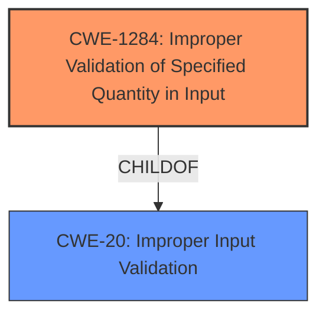

# Enhanced Analysis for CVE-2022-20687

# Summary
| CWE ID | CWE Name | Confidence | CWE Abstraction Level | CWE Vulnerability Mapping Label | CWE-Vulnerability Mapping Notes |
|---|---|---|---|---|---|
| CWE-1284 | Improper Validation of Specified Quantity in Input | 1.0 | Base | Allowed | Primary CWE |

## Evidence and Confidence

*   **Confidence Score:** 1.0
*   **Evidence Strength:** HIGH

## Relationship Analysis
The primary CWE, CWE-1284, is a base-level CWE that is a child of CWE-20 (Improper Input Validation). This indicates that the vulnerability is a specific type of input validation issue. There are no canPrecede or canFollow relationships that influence this decision.



## Vulnerability Chain
The chain of events for this vulnerability is:
1.  **Root Cause:** **Missing length validation** (CWE-1284) in LLDP packet header fields.
2.  **Impact:** Allows an attacker to send a malicious LLDP packet, leading to arbitrary code execution and denial of service.

## Summary of Analysis
The vulnerability description clearly states that the root cause is "**missing length validation** of certain LLDP packet header fields." This directly aligns with CWE-1284 (Improper Validation of Specified Quantity in Input), which describes situations where a product receives input that is expected to specify a quantity (such as size or length) but does not validate that the quantity has the required properties. The CVE reference links content summary confirms this with the statement: "Missing length validation of LLDP packet header fields".

The retriever results also list CWE-1284 as the top combined result.

CWE-20 (Improper Input Validation) was considered but not selected as the primary CWE because CWE-1284 is a more specific base-level CWE that accurately describes the **missing length validation** issue. CWE-20 is a class-level CWE and is generally discouraged when more specific CWEs are available.

Relevant CWE Information:

# Enhanced Context (25 CWEs)

## CWE-1284: Improper Validation of Specified Quantity in Input
**Abstraction:** Base
**Status:** Incomplete

### Description
The product receives input that is expected to specify a quantity (such as size or length), but it does not validate or incorrectly validates that the quantity has the required properties.

### Extended Description


Specified quantities include size, length, frequency, price, rate, number of operations, time, and others. Code may rely on specified quantities to allocate resources, perform calculations, control iteration, etc. When the quantity is not properly validated, then attackers can specify malicious quantities to cause excessive resource allocation, trigger unexpected failures, enable buffer overflows, etc.


## CWE Relationship Analysis

Current CWEs represent these abstraction levels: .


### Vulnerability Chain Analysis

**Chain starting from CWE-1284:**
- 1284 (Improper Validation of Specified Quantity in Input) - ROOT


**Chain starting from CWE-20:**
- 20 (Improper Input Validation) - ROOT


### CWE Relationship Diagram

```mermaid
graph TD
    classDef primary fill:#f96,stroke:#333,stroke-width:2px
    classDef secondary fill:#69f,stroke:#333
    classDef tertiary fill:#9e9,stroke:#333
```