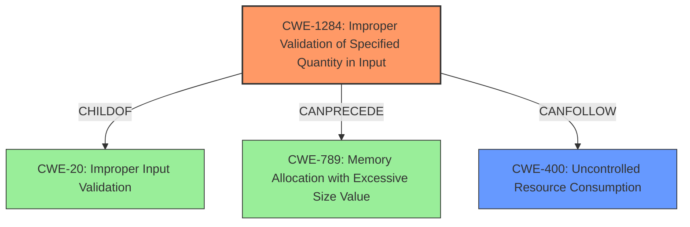

# Analysis for CVE-2022-20691

# Summary
| CWE ID    | CWE Name                                                       | Confidence | CWE Abstraction Level | CWE Vulnerability Mapping Label | CWE-Vulnerability Mapping Notes |
| --------- | -------------------------------------------------------------- | ---------- | --------------------- | ------------------------------- | ------------------------------- |
| CWE-1284  | Improper Validation of Specified Quantity in Input             | 0.9        | Base                  | Primary                         | Allowed                       |
| CWE-400 | Uncontrolled Resource Consumption | 0.7        | Class                  | Secondary                        | Discouraged                      |

## Evidence and Confidence

*   **Confidence Score:** 0.8
*   **Evidence Strength:** HIGH

## Relationship Analysis
The primary relationship considered was the child-parent relationship between CWE-1284 and CWE-20, where CWE-1284 is a more specific instance of improper input validation. Additionally, the CANPRECEDE relationship between CWE-1284 and CWE-789 (Memory Allocation with Excessive Size Value) was considered, suggesting a potential chain where improper input validation leads to excessive memory allocation. CWE-400 is a high level class which made it less desirable.

## Vulnerability Chain
The vulnerability chain starts with the **missing length validation** (CWE-1284), which allows an attacker to send crafted packets. These crafted packets cause the device to exhaust available memory, leading to a service restart and ultimately a denial-of-service (DoS) condition (CWE-400).

## Summary of Analysis
The initial assessment, based on the provided evidence, pointed towards CWE-1284 (Improper Validation of Specified Quantity in Input) as the primary CWE due to the "**missing length validation**" of CDP packet header fields. The "CVE Reference Links Content Summary" explicitly states that "The vulnerability stems from a missing length validation of certain Cisco Discovery Protocol (CDP) packet header fields." This aligns directly with the description of CWE-1284, which focuses on the improper validation of specified quantities in input, such as size or length.

CWE-400 (Uncontrolled Resource Consumption) was considered as a secondary CWE because the exploitation leads to the device exhausting available memory. However, the root cause is the **missing validation**, not the resource consumption itself. Therefore, CWE-1284 is the more accurate representation of the vulnerability's root cause.

The graph relationships reinforced the decision to prioritize CWE-1284, as it is a more specific instance of CWE-20 (Improper Input Validation) and can lead to other weaknesses like CWE-789 (Memory Allocation with Excessive Size Value).

The selected CWEs are at the optimal level of specificity because CWE-1284 directly addresses the **missing validation** issue, while CWE-400 captures the consequence of the vulnerability. This provides a comprehensive understanding of both the root cause and the resulting impact.
# Relevant CWE Information:

# Enhanced Context (25 CWEs)

## CWE-1284: Improper Validation of Specified Quantity in Input
**Abstraction Level**: Base
**Similarity Score**: 8440.52
**Source**: sparse

**Description**:
The product receives input that is expected to specify a quantity (such as size or length), but it does not validate or incorrectly validates that the quantity has the required properties.

**Mapping Guidance**:
- Usage: Allowed
- Rationale: This CWE entry is at the Base level of abstraction, which is a preferred level of abstraction for mapping to the root causes of vulnerabilities.

## CWE-400: Uncontrolled Resource Consumption
**Abstraction Level**: Class
**Similarity Score**: 0.603
**Source**: sparse

**Description**:
The product does not properly control the allocation and maintenance of a limited resource, thereby enabling an actor to influence the amount of resources consumed, eventually leading to the exhaustion of available resources.

**Mapping Guidance**:
- Usage: Discouraged
- Rationale: CWE-400 is intended for incorrect behaviors in which the product is expected to track and restrict how many resources it consumes, but CWE-400 is often misused because it is conflated with the "technical impact" of vulnerabilities in which resource consumption occurs. It is sometimes used for low-information vulnerability reports. It is a level-1 Class (i.e., a child of a Pillar).