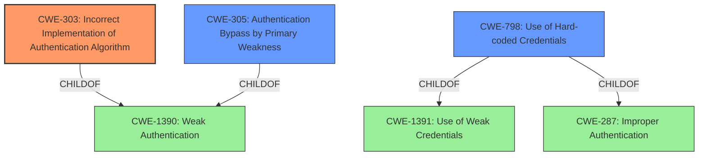

# Analysis for CVE-2022-20695

# Summary
| CWE ID | CWE Name | Confidence | CWE Abstraction Level | CWE Vulnerability Mapping Label | CWE-Vulnerability Mapping Notes |
|---|---|---|---|---|---|
| CWE-303 | Incorrect Implementation of Authentication Algorithm | 1.0 | Base | Allowed | Primary CWE |
| CWE-305 | Authentication Bypass by Primary Weakness | 0.75 | Base | Allowed | Secondary Candidate |
| CWE-798 | Use of Hard-coded Credentials | 0.5 | Base | Allowed | Secondary Candidate |

## Evidence and Confidence

*   **Confidence Score:** 0.85
*   **Evidence Strength:** HIGH

## Relationship Analysis
The primary CWE, CWE-303, is a base-level CWE that is a child of CWE-1390 (Weak Authentication). This indicates a hierarchical relationship where CWE-303 is a more specific type of weak authentication. CWE-305 is another base-level CWE and a child of CWE-1390, representing an authentication bypass due to a primary weakness. CWE-798 (Use of Hard-coded Credentials) is also a base-level CWE which is a child of CWE-1391 (Use of Weak Credentials) and CWE-287 (Improper Authentication). These relationships help to understand the context of the vulnerability and provide alternative classifications.

## Vulnerability Chain
The vulnerability chain begins with the **improper implementation of the password validation algorithm** (CWE-303). This leads to an authentication bypass, allowing an unauthenticated, remote attacker to log in to the device through the management interface. The attacker can then obtain privileges at the same level as an administrative user.

## Summary of Analysis
The primary assessment is based on the vulnerability description, which clearly states the root cause as the **"improper implementation of the password validation algorithm"**. This aligns perfectly with CWE-303 (Incorrect Implementation of Authentication Algorithm). The provided evidence includes the Vulnerability Description Key Phrases and the CVE Reference Links Content Summary, which both confirm the root cause.

The retriever results also support this assessment, with CWE-303 being the top-ranked CWE. The relationship analysis indicates that CWE-303 is a specific type of weak authentication (CWE-1390), making it an appropriate choice.

CWE-305 (Authentication Bypass by Primary Weakness) was considered because the vulnerability ultimately leads to an authentication bypass. However, it is less specific than CWE-303, which directly addresses the **incorrect implementation** of the algorithm. It is included as a secondary candidate because the description notes an authentication bypass.

CWE-798 (Use of Hard-coded Credentials) was considered because it is a common authentication weakness. However, the vulnerability description does not explicitly mention the use of hard-coded credentials. Instead, it focuses on the **improper implementation of the password validation algorithm**. It is included as a secondary candidate because, although not explicitly stated, the **improper implementation** *could* involve some form of hardcoded check.

The selected CWEs are at the optimal level of specificity because they directly address the root cause and resulting impact of the vulnerability, while also adhering to the MITRE mapping guidance.

Relevant CWE Information:

# Enhanced Context (25 CWEs)
The following CWEs were identified as potentially relevant to this vulnerability:

## CWE-807: Reliance on Untrusted Inputs in a Security Decision
**Abstraction Level**: Base
**Similarity Score**: 0.75
**Source**: dense

**Description**:
The product uses a protection mechanism that relies on the existence or values of an input, but the input can be modified by an untrusted actor in a way that bypasses the protection mechanism.

**Mapping Guidance**:
- Usage: Allowed
- Rationale: This CWE entry is at the Base level of abstraction, which is a preferred level of abstraction for mapping to the root causes of vulnerabilities.

## CWE-303: Incorrect Implementation of Authentication Algorithm
**Abstraction Level**: Base
**Similarity Score**: 0.75
**Source**: dense

**Description**:
The requirements for the product dictate the use of an established authentication algorithm, but the implementation of the algorithm is incorrect.

**Mapping Guidance**:
- Usage: Allowed
- Rationale: This CWE entry is at the Base level of abstraction, which is a preferred level of abstraction for mapping to the root causes of vulnerabilities.

## CWE-305: Authentication Bypass by Primary Weakness
**Abstraction Level**: Base
**Similarity Score**: 0.75
**Source**: dense

**Description**:
The authentication algorithm is sound, but the implemented mechanism can be bypassed as the result of a separate weakness that is primary to the authentication error.

**Mapping Guidance**:
- Usage: Allowed
- Rationale: This CWE entry is at the Base level of abstraction, which is a preferred level of abstraction for mapping to the root causes of vulnerabilities.

## CWE-1391: Use of Weak Credentials
**Abstraction Level**: Class
**Similarity Score**: 0.75
**Source**: dense

**Description**:
The product uses weak credentials (such as a default key or hard-coded password) that can be calculated, derived, reused, or guessed by an attacker.

**Mapping Guidance**:
- Usage: Allowed-with-Review
- Rationale: This CWE entry is a Class and might have Base-level children that would be more appropriate

## CWE-1289: Improper Validation of Unsafe Equivalence in Input
**Abstraction Level**: Base
**Similarity Score**: 0.74
**Source**: dense

**Description**:
The product receives an input value that is used as a resource identifier or other type of reference, but it does not validate or incorrectly validates that the input is equivalent to a potentially-unsafe value.

**Mapping Guidance**:
- Usage: Allowed
- Rationale: This CWE entry is at the Base level of abstraction, which is a preferred level of abstraction for mapping to the root causes of vulnerabilities.

## CWE-798: Use of Hard-coded Credentials
**Abstraction Level**: Base
**Similarity Score**: 0.74
**Source**: dense

**Description**:
The product contains hard-coded credentials, such as a password or cryptographic key.

**Mapping Guidance**:
- Usage: Allowed
- Rationale: This CWE entry is at the Base level of abstraction, which is a preferred level of abstraction for mapping to the root causes of vulnerabilities.

## CWE-1390: Weak Authentication
**Abstraction Level**: Class
**Similarity Score**: 0.74
**Source**: dense

**Description**:
The product uses an authentication mechanism to restrict access to specific users or identities, but the mechanism does not sufficiently prove that the claimed identity is correct.

**Mapping Guidance**:
- Usage: Allowed-with-Review
- Rationale: This CWE entry is a Class and might have Base-level children that would be more appropriate

## CWE-302: Authentication Bypass by Assumed-Immutable Data
**Abstraction Level**: Base
**Similarity Score**: 0.74
**Source**: dense

**Description**:
The authentication scheme or implementation uses key data elements that are assumed to be immutable, but can be controlled or modified by the attacker.

**Mapping Guidance**:
- Usage: Allowed
- Rationale: This CWE entry is at the Base level of abstraction, which is a preferred level of abstraction for mapping to the root causes of vulnerabilities.

## CWE-307: Improper Restriction of Excessive Authentication Attempts
**Abstraction Level**: Base
**Similarity Score**: 0.73
**Source**: dense

**Description**:
The product does not implement sufficient measures to prevent multiple failed authentication attempts within a short time frame.

**Mapping Guidance**:
- Usage: Allowed
- Rationale: This CWE entry is at the Base level of abstraction, which is a preferred level of abstraction for mapping to the root causes of vulnerabilities.

## CWE-657: Violation of Secure Design Principles
**Abstraction Level**: Class
**Similarity Score**: 0.73
**Source**: dense