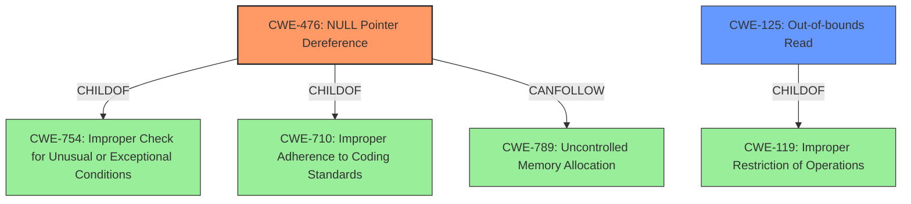

# Raw Analyzer Response for CVE-2022-20698

# Summary
| CWE ID | CWE Name | Confidence | CWE Abstraction Level | CWE Vulnerability Mapping Label | CWE-Vulnerability Mapping Notes |
|---|---|---|---|---|---|
| CWE-476 | NULL Pointer Dereference | 0.9 | Base | Primary | Allowed |
| CWE-125 | Out-of-bounds Read | 0.7 | Base | Secondary | Allowed |

## Evidence and Confidence

*   **Confidence Score:** 0.8
*   **Evidence Strength:** HIGH

## Relationship Analysis
The primary CWE, CWE-476, is a base-level CWE, providing a good balance between specificity and general applicability. It is child of CWE-754 and CWE-710. CWE-125 is a variant of CWE-119 and represents a more specific type of memory access issue. The relationship between CWE-476 and other CWEs like CWE-789 (Resource Exhaustion) reflects potential impact chains where a null pointer dereference leads to a crash and denial of service.

## Vulnerability Chain
The vulnerability chain starts with **improper checks** leading to an **invalid pointer read** (CWE-476) which causes a crash, resulting in a denial of service. The crafted OOXML file serves as the attack vector that triggers this chain.

## Summary of Analysis
The analysis is based on the vulnerability description and the CVE reference summary. The primary weakness is due to an **invalid pointer read**, which directly corresponds to CWE-476 (NULL Pointer Dereference). The vulnerability description explicitly mentions the **invalid pointer read**, which solidifies this classification.

The description indicates that the **improper checks** result in an **invalid pointer read**. This means a pointer that is expected to be valid is actually NULL. This leads to a crash when the code attempts to dereference the NULL pointer. The CVE Reference Links Content Summary confirms this by stating, "An invalid pointer read can occur when ClamAV is compiled with libjson-c."

CWE-125 (Out-of-bounds Read) was considered as a secondary CWE because an **invalid pointer read** could also be related to reading memory outside the intended buffer. While the description does not explicitly state that the read goes out of bounds, the possibility is there, making CWE-125 a possible secondary weakness.

The decision to select CWE-476 as the primary CWE is due to the explicit mention of **invalid pointer read** in the vulnerability description. CWE-476 directly addresses this issue. The mapping guidance for CWE-476 also indicates that it is at the Base level of abstraction, which is a preferred level. The confidence score is high (0.9) due to the strong evidence and direct mapping.

Relevant CWE Information:
- CWE-476: NULL Pointer Dereference: The product dereferences a pointer that it expects to be valid but is NULL.
- CWE-125: Out-of-bounds Read: The product reads data past the end, or before the beginning, of the intended buffer.
- CWE-119: Improper Restriction of Operations within the Bounds of a Memory Buffer: The product performs operations on a memory buffer, but it reads from or writes to a memory location outside the buffer's intended boundary.