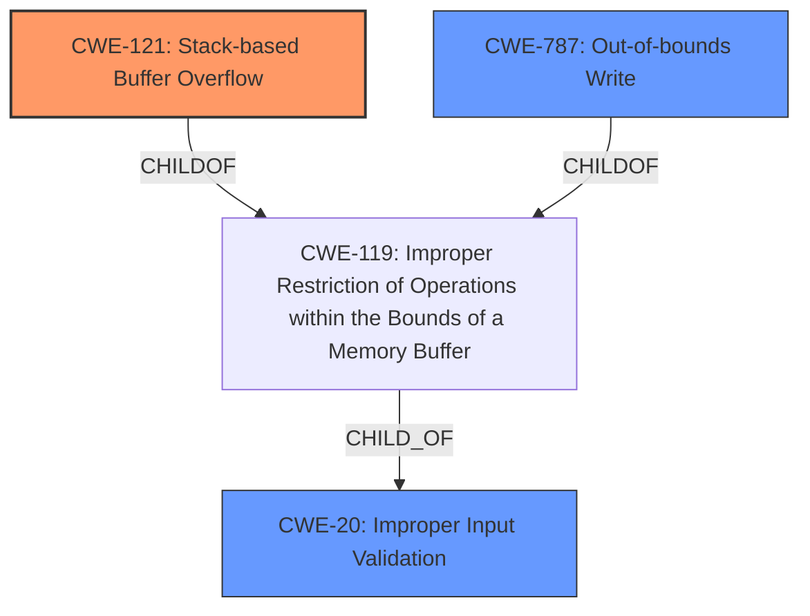

# Enhanced Analysis for CVE-2022-20699

# Summary

| CWE ID  | CWE Name                                                                                                  | Confidence | CWE Abstraction Level | CWE Vulnerability Mapping Label | CWE-Vulnerability Mapping Notes |
|---------|-----------------------------------------------------------------------------------------------------------|------------|-----------------------|---------------------------------|-----------------------------------|
| CWE-121 | Stack-based Buffer Overflow                                                                      | 0.95      | Base                  | Primary CWE                      | Allowed                           |
| CWE-787 | Out-of-bounds Write                                                                                   | 0.85      | Base                  | Secondary Candidate            | Allowed                           |
| CWE-20  | Improper Input Validation                                                                              | 0.60      | Class                 | Secondary Candidate            | Discouraged                       |

## Evidence and Confidence

*   **Confidence Score:** 0.90
*   **Evidence Strength:** HIGH

## Relationship Analysis

The primary relationship impacting the decision is that CWE-121 (Stack-based Buffer Overflow) is a specific type of buffer overflow, which falls under the broader category of CWE-119 (Improper Restriction of Operations within the Bounds of a Memory Buffer). While CWE-787 (Out-of-bounds Write) is also a related CWE, CWE-121 is more specific given the stack-based nature of the overflow described in the CVE details. The "Top CWEs" section also lists CWE-787. CWE-20 (Improper Input Validation) is often a cause of buffer overflows, as **missing or improper validation** can lead to data exceeding buffer limits.



## Vulnerability Chain

The vulnerability chain starts with the **lack of proper input validation** in the SSL VPN module, leading to a stack-based buffer overflow. The overflow allows an attacker to inject and execute arbitrary code with root privileges.

1.  **Root Cause:** **Insufficient boundary checks/Improper Input Validation (CWE-20)**
2.  **Weakness:** **Stack-based Buffer Overflow (CWE-121)**
3.  **Impact:** Remote Code Execution with Root Privileges

## Summary of Analysis

The initial assessment, guided by the "Top CWEs" section, pointed to CWE-787 (Out-of-bounds Write). However, the CVE Reference Links Content Summary clearly states that the vulnerability is a "stack-based buffer overflow" and even explicitly mentions **CWE-121 (Stack-based Buffer Overflow)**. Therefore, **CWE-121** is the most accurate primary classification, as it is a more specific variant of a buffer overflow than **CWE-787**.

The evidence supporting **CWE-121** is strong:

*   "The vulnerability stems from insufficient boundary checks within the SSL VPN module when processing specific HTTP requests. This **lack of proper validation** allows for a buffer overflow."
*   "**Stack-based Buffer Overflow:** The primary vulnerability is a stack-based buffer overflow. User-supplied data is copied to a fixed-length stack-based buffer without proper validation of its length, leading to the overflow."

The vulnerability chain highlights the importance of input validation in preventing buffer overflows. Without proper checks on the size of user-supplied data, it's possible to write beyond the allocated buffer on the stack.

The selected CWEs are at the optimal level of specificity. While CWE-119 (Improper Restriction of Operations within the Bounds of a Memory Buffer) is a broader category, **CWE-121** specifically identifies the stack-based nature of the overflow. **CWE-20** is also included since the root cause is **lack of proper input validation**.

Relevant CWE Information:

# Enhanced Context (25 CWEs)

## CWE-41: Improper Resolution of Path Equivalence
**Abstraction Level**: Base
**Similarity Score**: 0.78
**Source**: dense

**Description**:
The product is vulnerable to file system contents disclosure through path equivalence. Path equivalence involves the use of special characters in file and directory names. The associated manipulations are intended to generate multiple names for the same object.

**Why Not Used**: This CWE is not relevant because the vulnerability is not related to file system path equivalence.

## CWE-1289: Improper Validation of Unsafe Equivalence in Input
**Abstraction Level**: Base
**Similarity Score**: 0.78
**Source**: dense

**Description**:
The product receives an input value that is used as a resource identifier or other type of reference, but it does not validate or incorrectly validates that the input is equivalent to a potentially-unsafe value.

**Why Not Used**: This CWE is not relevant because the vulnerability is a buffer overflow and the root cause is related to input length.

## CWE-23: Relative Path Traversal
**Abstraction Level**: Base
**Similarity Score**: 0.78
**Source**: dense

**Description**:
The product uses external input to construct a pathname that should be within a restricted directory, but it does not properly neutralize sequences such as ".." that can resolve to a location that is outside of that directory.

**Why Not Used**: This CWE is not relevant because the vulnerability is not related to path traversal.

## CWE-73: External Control of File Name or Path
**Abstraction Level**: Base
**Similarity Score**: 0.77
**Source**: dense

**Description**:
The product allows user input to control or influence paths or file names that are used in filesystem operations.

**Why Not Used**: This CWE is not relevant because the vulnerability is not related to file name or path control.

## CWE-807: Reliance on Untrusted Inputs in a Security Decision
**Abstraction Level**: Base
**Similarity Score**: 0.77
**Source**: dense

**Description**:
The product uses a protection mechanism that relies on the existence or values of an input, but the input can be modified by an untrusted actor in a way that bypasses the protection mechanism.

**Why Not Used**: This CWE is not relevant because the vulnerability is not about relying on untrusted inputs for security decisions.

## CWE-74: Improper Neutralization of Special Elements in Output Used by a Downstream Component ('Injection')
**Abstraction Level**: Class
**Similarity Score**: 0.77
**Source**: dense

**Description**:
The product constructs all or part of a command, data structure, or record using externally-influenced input from an upstream component, but it does not neutralize or incorrectly neutralizes special elements that could modify how it is parsed or interpreted when it is sent to a downstream component.

**Why Not Used**: This CWE is not relevant because it is more about code injection, not a buffer overflow.

## CWE-59: Improper Link Resolution Before File Access ('Link Following')
**Abstraction Level**: Base
**Similarity Score**: 0.76
**Source**: dense

**Description**:
The product attempts to access a file based on the filename, but it does not properly prevent that filename from identifying a link or shortcut that resolves to an unintended resource.

**Why Not Used**: This CWE is not relevant because it is related to file access via links or shortcuts.

## CWE-668: Exposure of Resource to Wrong Sphere
**Abstraction Level**: Class
**Similarity Score**: 0.76
**Source**: dense

**Description**:
The product exposes a resource to the wrong control sphere, providing unintended actors with inappropriate access to the resource.

**Why Not Used**: This CWE is too high-level and not specific to the buffer overflow vulnerability.

## CWE-138: Improper Neutralization of Special Elements
**Abstraction Level**: Class
**Similarity Score**: 0.76
**Source**: dense

**Description**:
The product receives input from an upstream component, but it does not neutralize or incorrectly neutralizes special elements that could be interpreted as control elements or syntactic markers when they are sent to a downstream component.

**Why Not Used**: This CWE is too high-level and not specific to the buffer overflow vulnerability.

## CWE-184: Incomplete List of Disallowed Inputs
**Abstraction Level**: Base
**Similarity Score**: 0.76
**Source**: dense

**Description**:
The product implements a protection mechanism that relies on a list of inputs (or properties of inputs) that are not allowed by policy or otherwise require other action to neutralize before additional processing takes place, but the list is incomplete.

**Why Not Used**: This CWE is not relevant as it's about an incomplete list of disallowed inputs, not a buffer overflow.

##


## CWE Relationship Analysis

Current CWEs represent these abstraction levels: .


### Vulnerability Chain Analysis

**Chain starting from CWE-41:**
- 41 (Improper Resolution of Path Equivalence) - ROOT


**Chain starting from CWE-184:**
- 184 (Incomplete List of Disallowed Inputs) - ROOT


### CWE Relationship Diagram

```mermaid
graph TD
    classDef primary fill:#f96,stroke:#333,stroke-width:2px
    classDef secondary fill:#69f,stroke:#333
    classDef tertiary fill:#9e9,stroke:#333
```