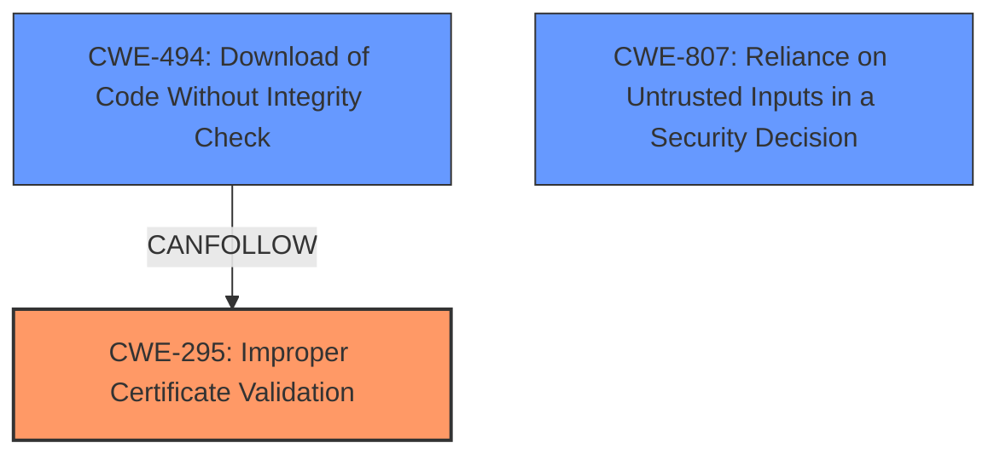

# Analysis for CVE-2022-20703

# Summary
| CWE ID   | CWE Name                                                                           | Confidence | CWE Abstraction Level | CWE Vulnerability Mapping Label | CWE-Vulnerability Mapping Notes |
| :-------- | :---------------------------------------------------------------------------------- | :---------- | :---------------------- | :------------------------------ | :------------------------------ |
| CWE-295   | Improper Certificate Validation                                                       | 0.9         | Base                    | Allowed                        | Primary CWE                     |
| CWE-494   | Download of Code Without Integrity Check                                          | 0.7         | Base                    | Allowed                        | Secondary CWE                  |
| CWE-807   | Reliance on Untrusted Inputs in a Security Decision                                          | 0.6         | Base                    | Allowed                        | Secondary CWE                  |

## Evidence and Confidence

*   **Confidence Score:** 0.8
*   **Evidence Strength:** HIGH

## Relationship Analysis
The primary CWE selected is CWE-295, which describes the **improper certificate validation** that leads to the vulnerability. This is a Base level CWE, providing a specific description of the weakness. CWE-494, download of code without integrity check, and CWE-807, Reliance on Untrusted Inputs in a Security Decision, are chosen as secondary CWEs to provide a more complete picture of the attack vector.

## Vulnerability Chain
The vulnerability chain starts with the **improper certificate validation** (CWE-295), allowing the attacker to bypass the integrity check of the software image (CWE-494) which leads to the execution of arbitrary code, privilege escalation, command execution, authentication and authorization bypass, running unsigned software and denial of service.

## Summary of Analysis
The primary weakness is the **improper validation** of the digital signature of the firmware image before installation (CWE-295). The device accepts and installs unsigned or maliciously modified firmware images because of this **lack of proper digital signature verification.** This allows the attacker to completely compromise the router by loading malicious software.

The description explicitly states that the device "fails to properly validate the digital signature of the firmware image before installation," directly corresponding to CWE-295. Given the available information and the direct correlation between the vulnerability description and the CWE definition, a high confidence score of 0.9 is assigned.

The retriever results also suggest CWE-295 as the best match.

Other CWEs Considered:

*   CWE-787: Although it is listed as the primary CWE match in the "CWE for similar CVE Descriptions" section, the root cause is not an out-of-bounds write but rather the **improper certificate validation.**
*   CWE-20: Improper Input Validation is too broad. The issue is specifically related to certificate validation.
*   CWE-1284: Improper Validation of Specified Quantity in Input is not relevant as the vulnerability does not involve validating a quantity.
*   CWE-78: Improper Neutralization of Special Elements used in an OS Command ('OS Command Injection') is not relevant because the vulnerability is not related to command injection.
*   CWE-494: Download of Code Without Integrity Check - This is a good secondary match since after bypassing certificate validation, the router will allow the download of code without integrity check.

Relevant CWE Information:

# Enhanced Context (25 CWEs)

## CWE-41: Improper Resolution of Path Equivalence
**Abstraction Level**: Base
**Similarity Score**: 0.78
**Source**: dense

**Description**:
The product is vulnerable to file system contents disclosure through path equivalence. Path equivalence involves the use of special characters in file and directory names. The associated manipulations are intended to generate multiple names for the same object.

**Mapping Guidance**:
- Usage: Allowed
- Rationale: This CWE entry is at the Base level of abstraction, which is a preferred level of abstraction for mapping to the root causes of vulnerabilities.

## CWE-1289: Improper Validation of Unsafe Equivalence in Input
**Abstraction Level**: Base
**Similarity Score**: 0.78
**Source**: dense

**Description**:
The product receives an input value that is used as a resource identifier or other type of reference, but it does not validate or incorrectly validates that the input is equivalent to a potentially-unsafe value.

**Mapping Guidance**:
- Usage: Allowed
- Rationale: This CWE entry is at the Base level of abstraction, which is a preferred level of abstraction for mapping to the root causes of vulnerabilities.

## CWE-23: Relative Path Traversal
**Abstraction Level**: Base
**Similarity Score**: 0.78
**Source**: dense

**Description**:
The product uses external input to construct a pathname that should be within a restricted directory, but it does not properly neutralize sequences such as ".." that can resolve to a location that is outside of that directory.

**Mapping Guidance**:
- Usage: Allowed
- Rationale: This CWE entry is at the Base level of abstraction, which is a preferred level of abstraction for mapping to the root causes of vulnerabilities.

## CWE-73: External Control of File Name or Path
**Abstraction Level**: Base
**Similarity Score**: 0.77
**Source**: dense

**Description**:
The product allows user input to control or influence paths or file names that are used in filesystem operations.

**Mapping Guidance**:
- Usage: Allowed
- Rationale: This CWE entry is at the Base level of abstraction, which is a preferred level of abstraction for mapping to the root causes of vulnerabilities.

## CWE-807: Reliance on Untrusted Inputs in a Security Decision
**Abstraction Level**: Base
**Similarity Score**: 0.77
**Source**: dense

**Description**:
The product uses a protection mechanism that relies on the existence or values of an input, but the input can be modified by an untrusted actor in a way that bypasses the protection mechanism.

**Mapping Guidance**:
- Usage: Allowed
- Rationale: This CWE entry is at the Base level of abstraction, which is a preferred level of abstraction for mapping to the root causes of vulnerabilities.

## CWE-59: Improper Link Resolution Before File Access ('Link Following')
**Abstraction Level**: Base
**Similarity Score**: 0.76
**Source**: dense

**Description**:
The product attempts to access a file based on the filename, but it does not properly prevent that filename from identifying a link or shortcut that resolves to an unintended resource.

**Mapping Guidance**:
- Usage: Allowed
- Rationale: This CWE entry is at the Base level of abstraction, which is a preferred level of abstraction for mapping to the root causes of vulnerabilities.

## CWE-74: Improper Neutralization of Special Elements in Output Used by a Downstream Component ('Injection')
**Abstraction Level**: Class
**Similarity Score**: 0.76
**Source**: dense

**Description**:
The product constructs all or part of a command, data structure, or record using externally-influenced input from an upstream component, but it does not neutralize or incorrectly neutralizes special elements that could modify how it is parsed or interpreted when it is sent to a downstream component.

**Mapping Guidance**:
- Usage: Discouraged
- Rationale: CWE-74 is high-level and often misused when lower-level weaknesses are more appropriate.

## CWE-668: Exposure of Resource to Wrong Sphere
**Abstraction Level**: Class
**Similarity Score**: 0.76
**Source**: dense

**Description**:
The product exposes a resource to the wrong control sphere, providing unintended actors with inappropriate access to the resource.

**Mapping Guidance**:
- Usage: Discouraged
- Rationale: CWE-668 is high-level and is often misused as a catch-all when lower-level CWE IDs might be applicable. It is sometimes used for low-information vulnerability reports [REF-1287]. It is a level-1 Class (i.e., a child of a Pillar). It is not useful for trend analysis.

## CWE-138: Improper Neutralization of Special Elements
**Abstraction Level**: Class
**Similarity Score**: 0.76
**Source**: dense

**Description**:
The product receives input from an upstream component, but it does not neutralize or incorrectly neutralizes special elements that could be interpreted as control elements or syntactic markers when they are sent to a downstream component.

**Mapping Guidance**:
- Usage: Discouraged
- Rationale: This CWE entry is a level-1 Class (i.e., a child of a Pillar). It might have lower-level children that would be more appropriate

## CWE-184: Incomplete List of Disallowed Inputs
**Abstraction Level**: Base
**Similarity Score**: 0.76
**Source**: dense