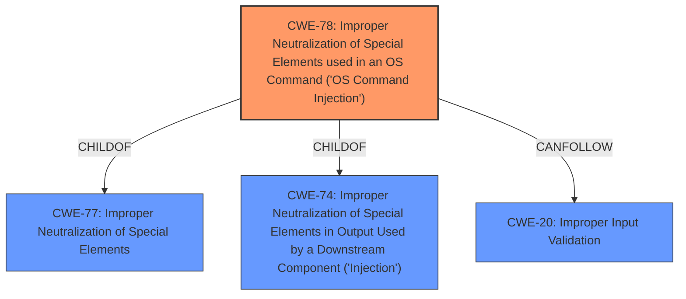

# Analysis Report for CVE-2022-20708

# Vulnerability Analysis Report: CVE-2022-20708

## Description


## Analysis (with Relationship Data)

# Summary
| CWE ID    | CWE Name                                                                                   | Confidence | CWE Abstraction Level | CWE Vulnerability Mapping Label | CWE-Vulnerability Mapping Notes |
| --------- | ------------------------------------------------------------------------------------------ | ---------- | ----------------------- | ------------------------------- | ------------------------------- |
| CWE-78    | Improper Neutralization of Special Elements used in an OS Command ('OS Command Injection') | 0.9        | Base                    | Primary                         | Allowed                         |
| CWE-20    | Improper Input Validation                                                                  | 0.7        | Class                   | Secondary                       | Discouraged                     |

## Evidence and Confidence

*   **Confidence Score:** 0.8
*   **Evidence Strength:** HIGH

## Relationship Analysis
The primary weakness is CWE-78, which represents the root cause of the command injection vulnerability due to **insufficient validation of user-supplied input**. CWE-78 is a child of CWE-77 (Improper Neutralization of Special Elements) and CWE-74 (Improper Neutralization of Special Elements in Output Used by a Downstream Component ('Injection')). CWE-20 (Improper Input Validation) is a related weakness, as **insufficient validation of user-supplied input** is the root cause. The relationship between CWE-20 and CWE-78 is that **improper input validation** can lead to OS command injection if the input is used to construct OS commands without proper sanitization.



## Vulnerability Chain
The vulnerability chain starts with the **insufficient validation of user-supplied input** (CWE-20), which leads to the ability to inject and execute arbitrary commands on the underlying operating system (CWE-78). The chain is:
1.  **Improper Input Validation** (CWE-20): The application does not properly validate user-supplied input.
2.  **OS Command Injection** (CWE-78): An attacker can inject and execute arbitrary commands on the underlying operating system due to **insufficient validation**.

## Summary of Analysis
The analysis concludes that the primary CWE for this vulnerability is CWE-78 (Improper Neutralization of Special Elements used in an OS Command ('OS Command Injection')), with a confidence score of 0.9. This is based on the CVE description and the "CVE Reference Links Content Summary," which states that the vulnerability is due to **insufficient validation of user-supplied input** in the web-based management interface, allowing an attacker to inject and execute arbitrary commands.

CWE-20 (Improper Input Validation) is identified as a secondary CWE with a confidence score of 0.7. This is because **insufficient validation** is the root cause that enables the command injection. While CWE-20 is a broader category, it accurately reflects the underlying issue that leads to the vulnerability.

The selection of CWE-78 is at the optimal level of specificity because it directly describes the command injection vulnerability. CWE-20 is a related but broader category that describes the **improper input validation**.

Relevant CWE Information:

# Enhanced Context (25 CWEs)
The following CWEs were identified as potentially relevant to this vulnerability:

## CWE-295: Improper Certificate Validation
**Abstraction Level**: Base
**Similarity Score**: 8242.14
**Source**: sparse

**Description**:
The product does not validate, or incorrectly validates, a certificate.

**Mapping Guidance**:
- Usage: Allowed
- Rationale: This CWE entry is at the Base level of abstraction, which is a preferred level of abstraction for mapping to the root causes of vulnerabilities.

**Relationships**:
- PARENTOF -> CWE-599
- PARENTOF -> CWE-299
- PARENTOF -> CWE-298
- PARENTOF -> CWE-297
- PARENTOF -> CWE-296

This CWE was considered but rejected because it is not relevant to the described vulnerability, which involves command injection due to **insufficient input validation**, not certificate validation.

## CWE-250: Execution with Unnecessary Privileges
**Abstraction Level**: Base
**Similarity Score**: 0.119
**Source**: sparse

**Description**:
The product performs an operation at a privilege level that is higher than the minimum level required, which creates new weaknesses or amplifies the consequences of other weaknesses.

This CWE was considered but rejected because while the attacker may be able to elevate privileges, the root cause is the command injection, not the unnecessary privileges.

## CWE-20: Improper Input Validation
**Abstraction Level**: Class
**Similarity Score**: 0.116
**Source**: sparse

**Description**:
The product receives input or data, but it does
        not validate or incorrectly validates that the input has the
        properties that are required to process the data safely and
        correctly.

**Mapping Guidance**:
- Usage: Discouraged
- Rationale: CWE-20 is commonly misused in low-information vulnerability reports when lower-level CWEs could be used instead, or when more details about the vulnerability are available [REF-1287]. It is not useful for trend analysis. It is also a level-1 Class (i.e., a child of a Pillar).
**Comments:** Consider lower-level children such as Improper Use of Validation Framework (CWE-1173) or improper validation involving specific types or properties of input such as Specified Quantity (CWE-1284); Specified Index, Position, or Offset (CWE-1285); Syntactic Correctness (CWE-1286); Specified Type (CWE-1287); Consistency within Input (CWE-1288); or Unsafe Equivalence (CWE-1289).
**Reasons:**
- Frequent Misuse

CWE-20 is included as a secondary weakness because the **insufficient validation of user-supplied input** is the underlying cause of the command injection vulnerability.

## CWE-1284: Improper Validation of Specified Quantity in Input
**Abstraction Level**: Base
**Similarity Score**: 0.108
**Source**: sparse

**Description**:
The product receives input that is expected to specify a quantity (such as size or length), but it does not validate or incorrectly validates that the quantity has the required properties.

This CWE was considered but rejected because the vulnerability is not specifically related to the validation of quantities.

## CWE-119: Improper Restriction of Operations within the Bounds of a Memory Buffer
**Abstraction Level**: Class
**Similarity Score**: 0.105
**Source**: sparse

**Description**:
The product performs operations on a memory buffer, but it reads from or writes to a memory location outside the buffer's intended boundary. This may result in read or write operations on unexpected memory locations that could be linked to other variables, data structures, or internal program data.

This CWE was considered but rejected because the vulnerability is not related to memory buffer operations.

## CWE-78: Improper Neutralization of Special Elements used in an OS Command ('OS Command Injection')
**Abstraction Level**: Base
**Similarity Score**: 0.641
**Source**: dense

**Description**:
The product constructs all or part of an OS command using externally-influenced input from an upstream component, but it does not neutralize or incorrectly neutralizes special elements that could modify the intended OS command when it is sent to a downstream component.

This CWE is the primary weakness because it directly describes the command injection vulnerability.

## CWE-190: Integer Overflow or Wraparound
**Abstraction Level**: Base
**Similarity Score**: 0.003
**Source**: graph

**Description**:
The product performs a calculation that can
         produce an integer overflow or wraparound when the logic
         assumes that the resulting value will always be larger than
         the original value. This occurs when an integer value is
         incremented to a value that is too large to store in the
         associated representation. When this occurs, the value may
         become a very small or negative number.

This CWE was considered but rejected because it is not directly related to the described vulnerability.

## CWE-305: Authentication Bypass by Primary Weakness
**Abstraction Level**: Base
**Similarity Score**: 0.104
**Source**: sparse

**Description**:
The authentication algorithm is sound, but the implemented mechanism can be bypassed as the result of a separate weakness that is primary


## CWE Relationship Analysis

Current CWEs represent these abstraction levels: .


### Vulnerability Chain Analysis

**Chain starting from CWE-297:**
- 297 (Improper Validation of Certificate with Host Mismatch) - ROOT


**Chain starting from CWE-78:**
- 78 (Improper Neutralization of Special Elements used in an OS Command ('OS Command Injection')) - ROOT


### CWE Relationship Diagram

```mermaid
graph TD
    classDef primary fill:#f96,stroke:#333,stroke-width:2px
    classDef secondary fill:#69f,stroke:#333
    classDef tertiary fill:#9e9,stroke:#333
```


*Report generated on 2025-03-31 05:07:34*
