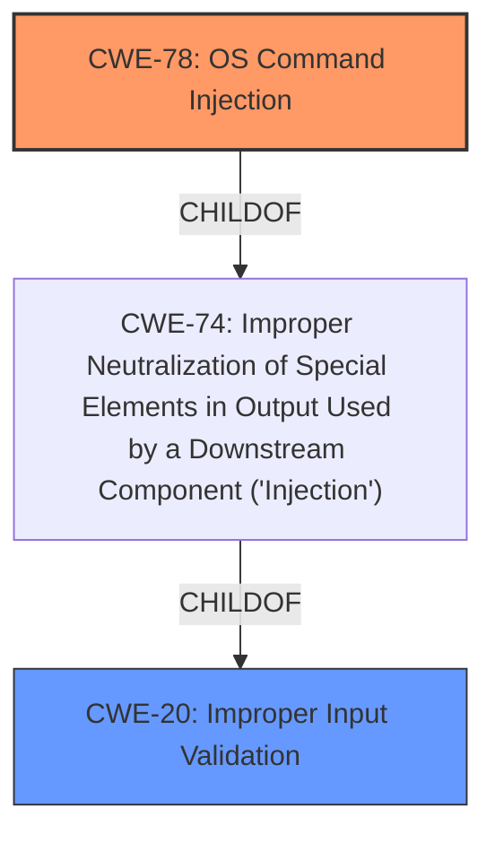

# Raw Analyzer Response for CVE-2022-20718

# Summary
| CWE ID | CWE Name | Confidence | CWE Abstraction Level | CWE Vulnerability Mapping Label | CWE-Vulnerability Mapping Notes |
|---|---|---|---|---|---|
| **CWE-78** | Improper Neutralization of Special Elements used in an OS Command ('OS Command Injection') | 1 | Base | Primary | Allowed |
| CWE-20 | Improper Input Validation | 0.7 | Class | Secondary | Discouraged |

## Evidence and Confidence

*   **Confidence Score:** 0.9
*   **Evidence Strength:** HIGH

## Relationship Analysis
The primary CWE is CWE-78, which represents the root cause of the command injection vulnerability. CWE-20 is a parent Class of CWE-78 (via CWE-74), indicating that improper input validation contributed to the vulnerability.

## Vulnerability Chain
The vulnerability chain starts with **improper input validation**, which allows an attacker to inject arbitrary commands, leading to **OS Command Injection** and ultimately resulting in **arbitrary code execution** on the underlying host operating system.

## Summary of Analysis
The analysis is based on the provided evidence, specifically the "CVE Reference Links Content Summary" section, which indicates that the root cause of the vulnerability is the incomplete sanitization of parameters, allowing for command injection and subsequent arbitrary code execution.

The "CVE Reference Links Content Summary" states:

- "The vulnerability stems from the incomplete sanitization of parameters passed during the activation of an application within the Cisco IOx application hosting environment. Specifically, the `interface` field within the `package.yaml` file is not properly validated."
- "**Parameter Injection:** The lack of proper sanitization of the 'interface' field allows an attacker to inject arbitrary commands into this field."
- "**Command Injection:** The injected commands are then executed by the underlying operating system by passing to the shell."
- "**Arbitrary Code Execution:** A successful exploit allows an attacker to execute arbitrary code as *root* on the underlying host operating system. This grants them full control over the affected device."

Based on this evidence, CWE-78 is the most appropriate primary CWE, as it accurately describes the **improper neutralization of special elements used in an OS command**, leading to command injection.

CWE-20 is considered as a secondary CWE since the root cause started with the **improper input validation** that led to the **OS Command Injection**.

The selected CWEs are at the optimal level of specificity, with CWE-78 being a Base-level CWE and CWE-20 being a Class-level CWE that captures the broader context of improper input validation.

Relevant CWE Information:

# Enhanced Context (25 CWEs)

## CWE-78: Improper Neutralization of Special Elements used in an OS Command ('OS Command Injection')
**Abstraction:** Base
**Similarity Score**: 5.03
**Source**: graph

**Description**:
The product constructs all or part of an OS command using externally-influenced input from an upstream component, but it does not neutralize or incorrectly neutralizes special elements that could modify the intended OS command when it is sent to a downstream component.

**Mapping Guidance**:
- Usage: Allowed
- Rationale: This CWE entry is at the Base level of abstraction, which is a preferred level of abstraction for mapping to the root causes of vulnerabilities.

## CWE-20: Improper Input Validation
**Abstraction:** Class
**Similarity Score**: 0.143
**Source**: sparse

**Description**:
The product receives input or data, but it does not validate or incorrectly validates that the input has the properties that are required to process the data safely and correctly.

**Mapping Guidance**:
- Usage: Discouraged
- Rationale: CWE-20 is commonly misused in low-information vulnerability reports when lower-level CWEs could be used instead, or when more details about the vulnerability are available [REF-1287]. It is not useful for trend analysis. It is also a level-1 Class (i.e., a child of a Pillar).