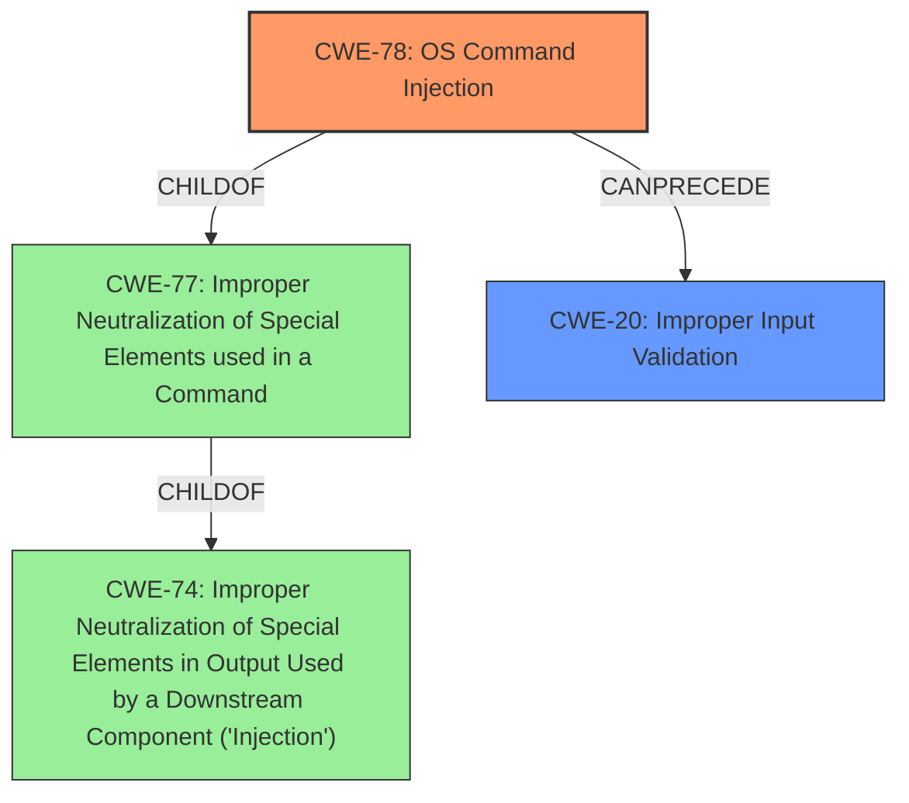

# Analysis for CVE-2022-20719

# Summary
| CWE ID | CWE Name | Confidence | CWE Abstraction Level | CWE Vulnerability Mapping Label | CWE-Vulnerability Mapping Notes |
|---|---|---|---|---|---|
| CWE-78 | Improper Neutralization of Special Elements used in an OS Command ('OS Command Injection') | 0.9 | Base | Allowed | Primary CWE |
| CWE-20 | Improper Input Validation | 0.6 | Class | Discouraged | Secondary CWE |

## Evidence and Confidence

*   **Confidence Score:** 0.75
*   **Evidence Strength:** MEDIUM

## Relationship Analysis
The primary CWE is CWE-78, which is a Base level CWE and a child of CWE-77. CWE-77 is a Class level CWE which is a child of CWE-74. CWE-20 is a Class level CWE. The relationships show that CWE-78 is the most specific and accurate representation of the **command injection** vulnerability, while CWE-20 represents the broader issue of **improper input validation**.

## Vulnerability Chain
The vulnerability chain starts with **insufficient input sanitization** which leads to **parameter injection**, resulting in **arbitrary code execution**.

1.  **Root Cause:** Insufficient input sanitization of parameters in the IOx package descriptor.
2.  **Weakness:** Parameter injection due to the root cause.
3.  **Impact:** Arbitrary code execution as root on the underlying host OS, arbitrary file removal.

## Summary of Analysis
The initial analysis focused on identifying the root cause and resulting impact. The **Vulnerability Description** clearly states a **command injection** vulnerability. The **CVE Reference Links Content Summary** confirms this, noting the incomplete sanitization of parameters in the Cisco IOx application hosting environment. This leads to the ability to execute arbitrary code with root privileges.

The Retriever Results listed CWE-77, CWE-78 and CWE-22 as top candidates. CWE-77 is "Improper Neutralization of Special Elements used in a Command ('Command Injection')", while CWE-78 is "Improper Neutralization of Special Elements used in an OS Command ('OS Command Injection')". Given the specific context of the vulnerability affecting the underlying operating system, CWE-78 is a more precise fit than CWE-77. CWE-22, "Improper Limitation of a Pathname to a Restricted Directory ('Path Traversal')", was also considered due to its high ranking. However, the core vulnerability is the ability to inject commands, not directly related to path traversal, so it is not the primary CWE. CWE-20, "Improper Input Validation" is added as a secondary CWE, since the root cause is the lack of proper validation.

The MITRE mapping guidance for CWE-78 recommends it as an allowed Base level of abstraction which is the preferred level.

Therefore, CWE-78 is the most appropriate primary CWE because it directly addresses the **command injection** vulnerability and the ability to execute arbitrary code on the host operating system.

Relevant CWE Information:

# Enhanced Context (25 CWEs)

## CWE-77: Improper Neutralization of Special Elements used in a Command ('Command Injection')
**Abstraction Level**: Class
**Similarity Score**: 1.00
**Source**: alternate\_terms

**Description**:
The product constructs all or part of a command using externally-influenced input from an upstream component, but it does not neutralize or incorrectly neutralizes special elements that could modify the intended command when it is sent to a downstream component.

## CWE-78: Improper Neutralization of Special Elements used in an OS Command ('OS Command Injection')
**Abstraction Level**: Base
**Similarity Score**: 0.70
**Source**: alternate\_terms

**Description**:
The product constructs all or part of an OS command using externally-influenced input from an upstream component, but it does not neutralize or incorrectly neutralizes special elements that could modify the intended OS command when it is sent to a downstream component.

## CWE-20: Improper Input Validation
**Abstraction Level**: Class
**Similarity Score**: 0.413
**Source**: sparse

**Description**:
The product receives input or data, but it does
        not validate or incorrectly validates that the input has the
        properties that are required to process the data safely and
        correctly.