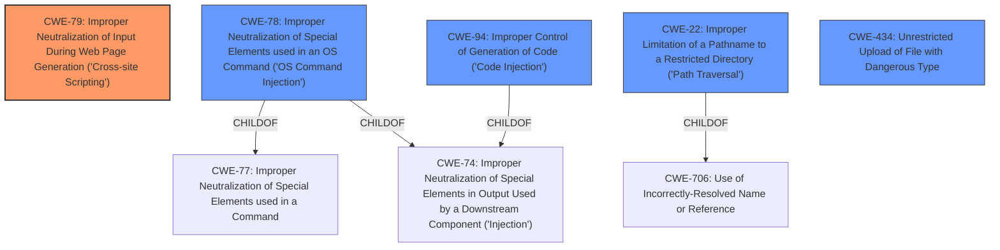

# Raw Analyzer Response for CVE-2022-20725

# Summary

| CWE ID | CWE Name | Confidence | CWE Abstraction Level | CWE Vulnerability Mapping Label | CWE-Vulnerability Mapping Notes |
|---|---|---|---|---|---|
| CWE-79 | Improper Neutralization of Input During Web Page Generation ('Cross-site Scripting') | 0.9 | Base | Allowed | Primary CWE |
| CWE-78 | Improper Neutralization of Special Elements used in an OS Command ('OS Command Injection') | 0.8 | Base | Allowed | Secondary Candidate |
| CWE-94 | Improper Control of Generation of Code ('Code Injection') | 0.7 | Base | Allowed-with-Review | Secondary Candidate |
| CWE-22 | Improper Limitation of a Pathname to a Restricted Directory ('Path Traversal') | 0.6 | Base | Allowed | Secondary Candidate |
| CWE-434 | Unrestricted Upload of File with Dangerous Type | 0.5 | Base | Allowed | Secondary Candidate |

## Evidence and Confidence

*   **Confidence Score:** 0.8
*   **Evidence Strength:** MEDIUM

## Relationship Analysis
The primary weakness, CWE-79, is a Base-level CWE with direct relevance to the XSS attack mentioned in the vulnerability description. CWE-78 and CWE-94, also Base-level CWEs, are considered because the vulnerability description mentions arbitrary command and code execution. CWE-22 is also considered because of the potential for path manipulation. The relationships between these CWEs are important because they can represent different stages or facets of the attack. For example, an improper input validation (CWE-20, not explicitly mapped due to its discouraged usage) could lead to OS command injection (CWE-78).

## Vulnerability Chain
The vulnerability chain starts with **insufficient validation of user-supplied input**, as noted in the CVE Reference Links Content Summary. This **weakness** can lead to several potential impacts:

1.  **Cross-Site Scripting (CWE-79)**: Malicious code injected into the system settings tab can be executed in the context of the affected web interface.
2.  **OS Command Injection (CWE-78)**: Arbitrary commands can be injected into the underlying host operating system due to **improper neutralization of special elements**.
3.  **Code Injection (CWE-94)**: Arbitrary code can be executed on the underlying host operating system due to **improper control of generation of code**.
4.  **Path Traversal (CWE-22)**: Attackers might manipulate file paths to access unauthorized resources.
5.  **Unrestricted Upload of File with Dangerous Type (CWE-434)**: Applications can be installed without authentication by uploading files of dangerous types.

## Summary of Analysis
The initial analysis focused on the primary impact described in the vulnerability description: cross-site scripting (XSS), arbitrary command execution, arbitrary code execution, and unauthorized application installation. The CVE Reference Links Content Summary confirms that the root cause is **insufficient validation of user-supplied input**.

The final selection includes:

*   **CWE-79 (Primary):** Matches the XSS attack mentioned in the vulnerability description. The vulnerability description states that an attacker could conduct a cross-site scripting (XSS) attack against a user of the affected software. The CVE Reference Links Content Summary confirms the presence of a stored XSS vulnerability due to the **insufficient validation of user-supplied input** by the web-based Local Manager interface.
*   **CWE-78:** Matches the arbitrary command execution on the underlying host operating system. The vulnerability description states that an attacker could inject arbitrary commands into the underlying host operating system. This is due to **improper neutralization of special elements** used in an OS command.
*   **CWE-94:** Matches the arbitrary code execution on the underlying host operating system. The vulnerability description states that an attacker could execute arbitrary code on the underlying host operating system. This is due to **improper control of generation of code**.
*   **CWE-22:** Considered due to the potential for path traversal, given the possibility of manipulating file paths through user-supplied input.
*   **CWE-434:** Considered due to the unauthorized application installation, which could be achieved by uploading files of dangerous types without proper authentication.

The selected CWEs are at the optimal level of specificity, as they represent the specific types of weaknesses present in the Cisco IOx application hosting environment. The decision is based on the provided evidence, graph relationships, and mapping guidance.

Relevant CWE Information:

# Enhanced Context (25 CWEs)
The following CWEs were identified as potentially relevant to this vulnerability:

## CWE-41: Improper Resolution of Path Equivalence
**Abstraction Level**: Base
**Similarity Score**: 0.77
**Source**: dense

**Description**:
The product is vulnerable to file system contents disclosure through path equivalence. Path equivalence involves the use of special characters in file and directory names. The associated manipulations are intended to generate multiple names for the same object.

**Mapping Guidance**:
- Usage: Allowed
- Rationale: This CWE entry is at the Base level of abstraction, which is a preferred level of abstraction for mapping to the root causes of vulnerabilities.

**Why Not Used:** This CWE is not directly supported by the evidence in the vulnerability description.

## CWE-74: Improper Neutralization of Special Elements in Output Used by a Downstream Component ('Injection')
**Abstraction Level**: Class
**Similarity Score**: 0.76
**Source**: dense

**Description**:
The product constructs all or part of a command, data structure, or record using externally-influenced input from an upstream component, but it does not neutralize or incorrectly neutralizes special elements that could modify how it is parsed or interpreted when it is sent to a downstream component.

**Mapping Guidance**:
- Usage: Discouraged
- Rationale: CWE-74 is high-level and often misused when lower-level weaknesses are more appropriate.

**Why Not Used:** While injection is a broad theme, more specific CWEs like CWE-78 and CWE-79 are more relevant.

## CWE-1289: Improper Validation of Unsafe Equivalence in Input
**Abstraction Level**: Base
**Similarity Score**: 0.76
**Source**: dense

**Description**:
The product receives an input value that is used as a resource identifier or other type of reference, but it does not validate or incorrectly validates that the input is equivalent to a potentially-unsafe value.

**Mapping Guidance**:
- Usage: Allowed
- Rationale: This CWE entry is at the Base level of abstraction, which is a preferred level of abstraction for mapping to the root causes of vulnerabilities.

**Why Not Used:** This CWE is not directly supported by the evidence in the vulnerability description.

## CWE-184: Incomplete List of Disallowed Inputs
**Abstraction Level**: Base
**Similarity Score**: 0.76
**Source**: dense

**Description**:
The product implements a protection mechanism that relies on a list of inputs (or properties of inputs) that are not allowed by policy or otherwise require other action to neutralize before additional processing takes place, but the list is incomplete.

**Mapping Guidance**:
- Usage: Allowed
- Rationale: This CWE entry is at the Base level of abstraction, which is a preferred level of abstraction for mapping to the root causes of vulnerabilities.

**Why Not Used:** This CWE is not directly supported by the evidence in the vulnerability description.

## CWE-73: External Control of File Name or Path
**Abstraction Level**: Base
**Similarity Score**: 0.76
**Source**: dense

**Description**:
The product allows user input to control or influence paths or file names that are used in filesystem operations.

**Mapping Guidance**:
- Usage: Allowed
- Rationale: This CWE entry is at the Base level of abstraction,