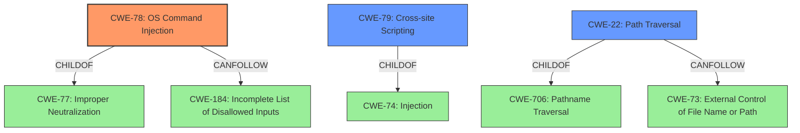

# Analysis Report for CVE-2022-20726

# Vulnerability Analysis Report: CVE-2022-20726

## Description


## Analysis (with Relationship Data)

# Summary
| CWE ID | CWE Name | Confidence | CWE Abstraction Level | CWE Vulnerability Mapping Label | CWE-Vulnerability Mapping Notes |
|---|---|---|---|---|---|
| CWE-78 | Improper Neutralization of Special Elements used in an OS Command ('OS Command Injection') | 0.7 | Base | Allowed | Primary CWE |
| CWE-79 | Improper Neutralization of Input During Web Page Generation ('Cross-site Scripting') | 0.7 | Base | Allowed | Secondary Candidate |
| CWE-22 | Improper Limitation of a Pathname to a Restricted Directory ('Path Traversal') | 0.6 | Base | Allowed | Secondary Candidate |

## Evidence and Confidence

*   **Confidence Score:** 0.7
*   **Evidence Strength:** MEDIUM

## Relationship Analysis
The primary CWE is CWE-78, which has a parent CWE of CWE-77 (Improper Neutralization of Special Elements used in a Command). CWE-78 can also be related to CWE-184 (Incomplete List of Disallowed Inputs) via a CANFOLLOW relationship, indicating that an incomplete list of disallowed inputs might lead to command injection. CWE-79, as a potential secondary weakness, has a parent CWE of CWE-74 (Improper Neutralization of Special Elements in Output Used by a Downstream Component ('Injection')). CWE-22 has a parent CWE of CWE-706 and is related to CWE-73. The selection is at the Base level, which is the preferred level of abstraction.



## Vulnerability Chain
The vulnerability chain starts with the attacker injecting arbitrary commands, potentially due to **improper neutralization** of special elements. This leads to arbitrary code execution on the underlying host OS. Additionally, the attacker can install applications without authentication and conduct XSS attacks.
  - **Root Cause:** **Improper neutralization** of input in OS commands
  - **Weakness 1:** Code injection
  - **Weakness 2:** Missing Authentication
  - **Weakness 3:** Cross-site Scripting
  - **Impact:** Arbitrary code execution, unauthorized application installation, XSS attacks

## Summary of Analysis
The initial assessment identified several potential CWEs based on the vulnerability description. The description highlights the ability of an attacker to "inject arbitrary commands into the underlying host operating system, execute arbitrary code on the underlying host operating system, install applications without being authenticated, or conduct a cross-site scripting (XSS) attack." The key phrases point to OS command injection, missing authentication, and XSS.

The retriever results and similar CVE descriptions suggest CWE-22 (Path Traversal) as a primary match, but after careful consideration, CWE-78 (OS Command Injection) is more relevant because the vulnerability description explicitly states the ability to inject arbitrary commands. The presence of XSS in the description supports including CWE-79 as a secondary concern. While CWE-22 is listed as a top CWE for similar CVE descriptions, its applicability is less direct than CWE-78 and CWE-79, given the explicit mention of command injection and XSS attacks in the vulnerability description.

The evidence from the vulnerability description, specifically the phrase "inject arbitrary commands into the underlying host operating system," directly supports the selection of CWE-78. The mention of "conduct a cross-site scripting (XSS) attack" directly supports the selection of CWE-79.

CWE-78 is chosen because the vulnerability allows an attacker to inject commands. CWE-79 is chosen because the vulnerability allows XSS attacks. CWE-22 is considered because similar vulnerabilities were classified as such, but it is less directly supported by the provided evidence compared to CWE-78 and CWE-79. The selection of Base-level CWEs provides the optimal level of specificity.

Relevant CWE Information:

# Enhanced Context (25 CWEs)
The following CWEs were identified as potentially relevant to this vulnerability:

## CWE-80: Improper Neutralization of Script-Related HTML Tags in a Web Page (Basic XSS)
**Abstraction Level**: Variant
**Similarity Score**: 0.80
**Source**: dense
- CWE-80 was not selected because the description does not specify the improper neutralization of script-related HTML tags.

## CWE-1289: Improper Validation of Unsafe Equivalence in Input
**Abstraction Level**: Base
**Similarity Score**: 0.78
**Source**: dense
- CWE-1289 was not selected because the description doesn't focus on equivalence validation.

## CWE-74: Improper Neutralization of Special Elements in Output Used by a Downstream Component ('Injection')
**Abstraction Level**: Class
**Similarity Score**: 0.77
**Source**: dense
- CWE-74 was considered but not selected because it is a Class-level CWE, and more specific Base-level CWEs like CWE-78 and CWE-79 are more appropriate.

## CWE-184: Incomplete List of Disallowed Inputs
**Abstraction Level**: Base
**Similarity Score**: 0.77
**Source**: dense
- CWE-184 was not selected because the description does not specifically mention an incomplete list of disallowed inputs.

## CWE-807: Reliance on Untrusted Inputs in a Security Decision
**Abstraction Level**: Base
**Similarity Score**: 0.77
**Source**: dense
- CWE-807 was not selected because the vulnerability doesn't explicitly involve security decisions based on untrusted inputs.

## CWE-41: Improper Resolution of Path Equivalence
**Abstraction Level**: Base
**Similarity Score**: 0.76
**Source**: dense
- CWE-41 was not selected because path equivalence isn't a primary factor.

## CWE-138: Improper Neutralization of Special Elements
**Abstraction Level**: Class
**Similarity Score**: 0.76
**Source**: dense
- CWE-138 was considered but not selected because it's a higher-level Class, and more specific CWEs are available.

## CWE-73: External Control of File Name or Path
**Abstraction Level**: Base
**Similarity Score**: 0.75
**Source**: dense
- CWE-73 was not selected because external control of file names/paths isn't the main issue.

## CWE-472: External Control of Assumed-Immutable Web Parameter
**Abstraction Level**: Base
**Similarity Score**: 0.75
**Source**: dense
- CWE-472 was not selected because assumed-immutable web parameters are not involved.

## CWE-116: Improper Encoding or Escaping of Output
**Abstraction Level**: Class
**Similarity Score**: 0.75
**Source**: dense
- CWE-116 was considered but not selected because it is a Class-level CWE, and more specific Base-level CWEs like CWE-78 and CWE-79 are more appropriate.

## CWE-22: Improper Limitation of a Pathname to a Restricted Directory ('Path Traversal')
**Abstraction Level**: Base
**Similarity Score**: 11440.18
**Source**: sparse
- CWE-22 was selected as a secondary candidate because similar CVEs were classified as such and path traversal might occur.

## CWE-23: Relative Path Traversal
**Abstraction Level**: Base
**Similarity Score**: 10902.38
**Source**: sparse
- CWE-23 was considered, but CWE-22 is more general and fits the description better.

## CWE-79: Improper Neutralization of Input During Web Page Generation ('Cross-site Scripting')
**Abstraction Level**: Base
**Similarity Score**: 10741.61
**Source**: sparse
- CWE-79 was selected as a secondary candidate because the description mentions XSS attacks.

## CWE-59: Improper Link Resolution Before File Access ('Link Following')
**


## CWE Relationship Analysis

Current CWEs represent these abstraction levels: .


### Vulnerability Chain Analysis

**Chain starting from CWE-80:**
- 80 (Improper Neutralization of Script-Related HTML Tags in a Web Page (Basic XSS)) - ROOT


**Chain starting from CWE-472:**
- 472 (External Control of Assumed-Immutable Web Parameter) - ROOT


### CWE Relationship Diagram

```mermaid
graph TD
    classDef primary fill:#f96,stroke:#333,stroke-width:2px
    classDef secondary fill:#69f,stroke:#333
    classDef tertiary fill:#9e9,stroke:#333
```


*Report generated on 2025-03-31 03:11:50*
