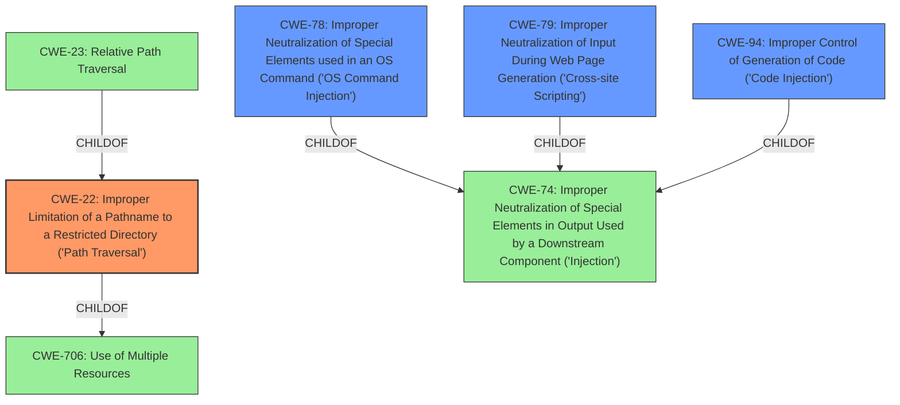

# Raw Analyzer Response for CVE-2022-20727

# Summary
| CWE ID | CWE Name | Confidence | CWE Abstraction Level | CWE Vulnerability Mapping Label | CWE-Vulnerability Mapping Notes |
|---|---|---|---|---|---|
| CWE-22 | Improper Limitation of a Pathname to a Restricted Directory ('Path Traversal') | 0.8 | Base | Primary | Allowed |
| CWE-78 | Improper Neutralization of Special Elements used in an OS Command ('OS Command Injection') | 0.6 | Base | Secondary | Allowed |
| CWE-79 | Improper Neutralization of Input During Web Page Generation ('Cross-site Scripting') | 0.6 | Base | Secondary | Allowed |
| CWE-94 | Improper Control of Generation of Code ('Code Injection') | 0.5 | Base | Secondary | Allowed-with-Review |

## Evidence and Confidence

*   **Confidence Score:** 0.7
*   **Evidence Strength:** MEDIUM

## Relationship Analysis
The primary CWE, CWE-22, is a base-level weakness that describes path traversal vulnerabilities. It is related to CWE-706 (Use of Multiple Resources), which is a parent, and has children like CWE-23 (Relative Path Traversal). CWE-78 (OS Command Injection) and CWE-79 (Cross-site Scripting) represent different types of injection vulnerabilities, and CWE-94 (Code Injection) is also considered due to the possibility of code execution. These can all stem from **improper input validation** or **neutralization**, and potentially lead to code execution or other impacts.

## Vulnerability Chain
The vulnerability chain starts with **insufficient validation of input** when loading IOx applications (root cause). This leads to the ability to modify application content, which can result in path traversal (CWE-22), OS command injection (CWE-78), Cross-Site Scripting (CWE-79), or Code Injection (CWE-94). The ultimate impact is gaining privileges equivalent to the root user.

## Summary of Analysis
Initially, the primary CWE match from similar CVE descriptions was CWE-22 (Improper Limitation of a Pathname to a Restricted Directory). The analysis of the vulnerability description and CVE reference links supports this, highlighting **insufficient validation of input** when loading IOx applications which leads to modification of application content and potential path traversal.

The "CVE Reference Links Content Summary" states: "Root cause of vulnerability: **Improper input validation** when loading Cisco IOx applications." and "Weaknesses/vulnerabilities present: **Insufficient validation of input** when loading IOx applications allows modification of application content."

Given that the vulnerability also allows injecting arbitrary commands and executing arbitrary code, CWE-78 (Improper Neutralization of Special Elements used in an OS Command) and CWE-94 (Improper Control of Generation of Code) are also considered, albeit with lower confidence. The possibility of conducting a Cross-Site Scripting (XSS) attack leads to considering CWE-79 (Improper Neutralization of Input During Web Page Generation).

The final selection is based on the evidence that **improper input validation** is the root cause, leading to multiple potential vulnerabilities, including path traversal, command injection, XSS, and code injection. CWE-22 is chosen as the primary due to its prevalence in similar CVE descriptions and alignment with the ability to modify application content. The other CWEs are added as secondary candidates, with their inclusion justified by the potential impacts described in the vulnerability description.

CWE-20 (Improper Input Validation) was considered but not used because it's a high-level class and the evidence points to more specific weaknesses. CWE-284 (Improper Access Control) was also considered but deemed too high-level for the specific vulnerability details available.