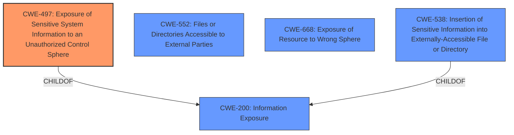

# Enhanced Analysis for CVE-2022-20734

# Summary
| CWE ID | CWE Name | Confidence | CWE Abstraction Level | CWE Vulnerability Mapping Label | CWE-Vulnerability Mapping Notes |
|---|---|---|---|---|---|
| CWE-497 | Exposure of Sensitive System Information to an Unauthorized Control Sphere | 0.8 | Base | Allowed | Primary CWE |
| CWE-552 | Files or Directories Accessible to External Parties | 0.6 | Base | Allowed | Secondary Candidate |
| CWE-668 | Exposure of Resource to Wrong Sphere | 0.5 | Class | Discouraged | Secondary Candidate |

## Evidence and Confidence

*   **Confidence Score:** 0.8
*   **Evidence Strength:** HIGH

## Relationship Analysis
The primary CWE selected is CWE-497, which focuses on the exposure of sensitive system information. This is a base-level CWE. CWE-200 (Information Exposure) is a parent of CWE-497. CWE-552, which focuses on making files or directories accessible to external parties, and CWE-668, which highlights exposure of a resource to the wrong sphere, are related but not as specific as CWE-497 in this context. CWE-668 is a Class level of abstraction, and the guidance discourages using it.



## Vulnerability Chain
The vulnerability chain starts with **insufficient file system restrictions**, leading to the exposure of sensitive information.

1.  **Root Cause:** **Insufficient file system restrictions**.
2.  **Weakness:** Improper access control allows unauthorized access to the `vshell`.
3.  **Impact:** An attacker can read sensitive information on the underlying operating system.

## Summary of Analysis
The primary CWE is CWE-497, which aligns with the vulnerability's core issue: the exposure of sensitive system information due to **insufficient file system restrictions**. The vulnerability description clearly states that "An authenticated attacker with netadmin privileges could exploit this vulnerability by accessing the vshell of an affected system. A successful exploit could allow the attacker to read sensitive information on the underlying operating system." This aligns directly with CWE-497's description: "The product does not properly prevent sensitive system-level information from being accessed by unauthorized actors who do not have the same level of access to the underlying system as the product does."

The choice of CWE-497 is also supported by the retriever results, where it is a top match. While other CWEs like CWE-552 and CWE-668 were considered, they are less specific to the exposure of sensitive *system* information. The base abstraction level of CWE-497 is ideal because it directly addresses the root cause.

CWE-552 (Files or Directories Accessible to External Parties) was considered as a secondary candidate because the **insufficient file system restrictions** allow access to files and directories that should not be accessible. However, CWE-497 more precisely captures the exposure of "sensitive system-level information".

CWE-668 (Exposure of Resource to Wrong Sphere) was also considered but ultimately deemed too high-level. The mapping guidance discourages its use when lower-level CWEs are applicable.

The final selection of CWE-497 is based on a combination of the vulnerability description, retriever results, and MITRE mapping guidance. It provides the most accurate and specific representation of the vulnerability's root cause and impact.


## CWE Relationship Analysis

Current CWEs represent these abstraction levels: .


### Vulnerability Chain Analysis

**Chain starting from CWE-552:**
- 552 (Files or Directories Accessible to External Parties) - ROOT


**Chain starting from CWE-200:**
- 200 (Exposure of Sensitive Information to an Unauthorized Actor) - ROOT


### CWE Relationship Diagram

```mermaid
graph TD
    classDef primary fill:#f96,stroke:#333,stroke-width:2px
    classDef secondary fill:#69f,stroke:#333
    classDef tertiary fill:#9e9,stroke:#333
```