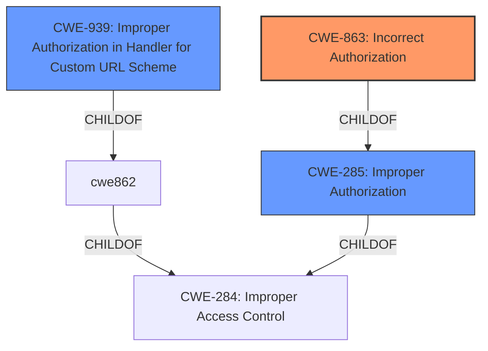

# Analysis Report for CVE-2022-20736

# Vulnerability Analysis Report: CVE-2022-20736

## Description


## Analysis (with Relationship Data)

# Summary
| CWE ID  | CWE Name                                                                | Confidence | CWE Abstraction Level | CWE Vulnerability Mapping Label | CWE-Vulnerability Mapping Notes |
| :-------- | :---------------------------------------------------------------------- | :--------- | :---------------------- | :------------------------------ | :------------------------------ |
| CWE-863 | Incorrect Authorization                                                     | 0.9        | Class                     | Primary                           | Allowed-with-Review             |
| CWE-285 | Improper Authorization                                                      | 0.7        | Class                     | Secondary                         | Discouraged                     |
| CWE-939 | Improper Authorization in Handler for Custom URL Scheme                     | 0.6        | Base                      | Secondary                         | Allowed                         |

## Evidence and Confidence

*   **Confidence Score:** 0.9
*   **Evidence Strength:** HIGH

## Relationship Analysis
The primary CWE selected is CWE-863, which is a Class-level CWE that describes a general case of incorrect authorization. CWE-285 is a parent of CWE-863, representing a broader class of improper authorization, but it is less specific. CWE-939 is a Base-level CWE that describes a specific case of improper authorization related to custom URL schemes.



## Vulnerability Chain
The vulnerability chain starts with **improper authorization checking** in the web-based management interface, leading to unauthorized access to a configuration file and the login page for an administrative console.

## Summary of Analysis
The initial assessment identified **improper authorization checking** as the root cause of the vulnerability. The selection of CWE-863 is based on the vulnerability description and the CVE reference links content summary, which explicitly mention **improper authorization**.

The vulnerability description states: "This vulnerability is due to **improper authorization checking** for HTTP requests that are submitted to the affected web-based management interface."

The CVE Reference Links Content Summary states: "Root cause of vulnerability: Improper authorization checking for HTTP requests submitted to the web-based management interface of Cisco AppDynamics Controller Software."

The Retriever Results also list CWE-863 as a relevant CWE with a high score.

CWE-863 is more specific than its parent CWE-285, which is a general "Improper Authorization" class. While CWE-285 could apply, CWE-863 more accurately reflects the vulnerability's nature of performing an authorization check but doing it incorrectly.

CWE-939 "Improper Authorization in Handler for Custom URL Scheme" was considered. However, the vulnerability description does not suggest that the **improper authorization** is related to custom URL schemes. Therefore, CWE-939 is a less precise fit.

The MITRE mapping guidance for CWE-863 suggests examining children of this entry to see if there is a better fit. However, no child CWEs were a better fit given the available information.

Therefore, CWE-863 is the most appropriate CWE for this vulnerability.


## CWE Relationship Analysis

Current CWEs represent these abstraction levels: .


### Vulnerability Chain Analysis

**Chain starting from CWE-285:**
- 285 (Improper Authorization) - ROOT


**Chain starting from CWE-939:**
- 939 (Improper Authorization in Handler for Custom URL Scheme) - ROOT


### CWE Relationship Diagram

```mermaid
graph TD
    classDef primary fill:#f96,stroke:#333,stroke-width:2px
    classDef secondary fill:#69f,stroke:#333
    classDef tertiary fill:#9e9,stroke:#333
```


*Report generated on 2025-03-30 13:21:07*
