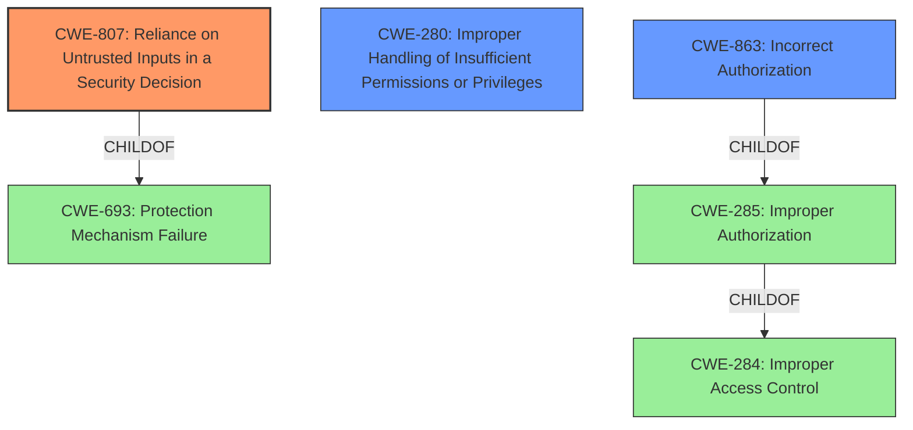

# Raw Analyzer Response for CVE-2022-20744

# Summary
| CWE ID | CWE Name | Confidence | CWE Abstraction Level | CWE Vulnerability Mapping Label | CWE-Vulnerability Mapping Notes |
|---|---|---|---|---|---|
| CWE-807 | Reliance on Untrusted Inputs in a Security Decision | 1.0 | Base | Allowed | Primary CWE |
| CWE-280 | Improper Handling of Insufficient Permissions or Privileges | 0.6 | Base | Allowed | Secondary Candidate |
| CWE-863 | Incorrect Authorization | 0.5 | Class | Allowed-with-Review | Secondary Candidate |

## Evidence and Confidence

*   **Confidence Score:** 0.8
*   **Evidence Strength:** HIGH

## Relationship Analysis
The primary CWE, CWE-807, is at the Base level, which is the preferred level for mapping. CWE-807's parent is CWE-693: Protection Mechanism Failure. CWE-280 and CWE-863 are related to authorization. CWE-285 is a parent of CWE-863 and child of CWE-284. The Mermaid diagram illustrates these relationships.

## Vulnerability Chain
The vulnerability chain starts with a **protection mechanism that relies on the existence or values of a specific input**. An attacker can then modify this input, which leads to a bypass of the protection mechanism and ultimately allows the attacker to **view data without proper authorization**.

## Summary of Analysis
The initial analysis identified CWE-807 as the primary weakness, due to the vulnerability description key phrases highlighting a "**protection mechanism that relies on the existence or values of a specific input**" and the ability to bypass it by modifying the input. This aligns directly with the description of CWE-807: "The product uses a protection mechanism that relies on the existence or values of an input, but the input can be modified by an untrusted actor in a way that bypasses the protection mechanism."

The CVE Reference Links Content Summary further supports this, stating: "The vulnerability exists due to a flaw in the input protection mechanism, where it relies on the existence or values of a specific input. An attacker can bypass this mechanism by modifying this input."

CWE-807 is a Base level CWE, which is the preferred level of abstraction.

CWE-280, **Improper Handling of Insufficient Permissions or Privileges**, was considered because the impact involves viewing data without proper authorization, potentially related to insufficient privileges. However, the root cause is more directly tied to the **reliance on a modifiable input** rather than a permissions issue. So it's less directly involved.

CWE-863, **Incorrect Authorization**, was also considered, but the vulnerability stems from the initial reliance on an untrusted input, making CWE-807 a more accurate representation of the root cause.

The selection of CWE-807 is at the optimal level of specificity because it directly addresses the root cause, which is the flawed protection mechanism based on modifiable inputs.

Relevant CWE Information:

# Enhanced Context (25 CWEs)
The following CWEs were identified as potentially relevant to this vulnerability:

## CWE-807: Reliance on Untrusted Inputs in a Security Decision
**Abstraction Level**: Base
**Similarity Score**: 0.79
**Source**: dense

**Description**:
The product uses a protection mechanism that relies on the existence or values of an input, but the input can be modified by an untrusted actor in a way that bypasses the protection mechanism.

**Mapping Guidance**:
- Usage: Allowed
- Rationale: This CWE entry is at the Base level of abstraction, which is a preferred level of abstraction for mapping to the root causes of vulnerabilities.

## CWE-280: Improper Handling of Insufficient Permissions or Privileges 
**Abstraction Level**: Base
**Similarity Score**: 0.75
**Source**: dense

**Description**:
The product does not handle or incorrectly handles when it has insufficient privileges to access resources or functionality as specified by their permissions. This may cause it to follow unexpected code paths that may leave the product in an invalid state.

**Mapping Guidance**:
- Usage: Allowed
- Rationale: This CWE entry is at the Base level of abstraction, which is a preferred level of abstraction for mapping to the root causes of vulnerabilities.

## CWE-863: Incorrect Authorization
**Abstraction Level**: Class
**Similarity Score**: 7656.75
**Source**: sparse

**Description**:
The product performs an authorization check when an actor attempts to access a resource or perform an action, but it does not correctly perform the check.

**Mapping Guidance**:
- Usage: Allowed-with-Review
- Rationale: This CWE entry is a Class and might have Base-level children that would be more appropriate