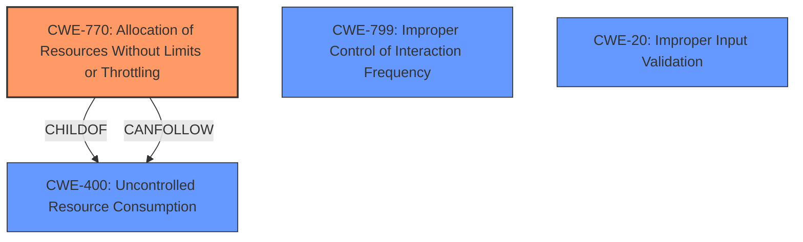

# Analysis for CVE-2022-20760

# Summary
| CWE ID | CWE Name | Confidence | CWE Abstraction Level | CWE Vulnerability Mapping Label | CWE-Vulnerability Mapping Notes |
|---|---|---|---|---|---|
| CWE-770 | Allocation of Resources Without Limits or Throttling | 0.8 | Base | Allowed | Primary CWE |
| CWE-400 | Uncontrolled Resource Consumption | 0.6 | Class | Discouraged | Secondary Candidate |
| CWE-799 | Improper Control of Interaction Frequency | 0.5 | Class | Allowed-with-Review | Secondary Candidate |
| CWE-20 | Improper Input Validation | 0.4 | Class | Discouraged | Secondary Candidate |

## Evidence and Confidence

*   **Confidence Score:** 0.7
*   **Evidence Strength:** HIGH

## Relationship Analysis
The primary weakness is CWE-770 Allocation of Resources Without Limits or Throttling (Base), which is a child of CWE-400 Uncontrolled Resource Consumption (Class). CWE-770 captures the specific issue of allocating resources without proper limits, leading to potential resource exhaustion. The analysis also considered CWE-799 Improper Control of Interaction Frequency (Class) and CWE-20 Improper Input Validation (Class) as potential contributing factors, but they are less directly related to the described vulnerability. The abstraction levels were carefully considered, favoring the more specific Base level CWE-770 over the more general Class level CWE-400.

## Vulnerability Chain
The chain of events is as follows:
1.  **Root Cause:** CWE-770 Allocation of Resources Without Limits or Throttling: The DNS inspection handler allocates resources for incoming DNS requests without proper limits.
2.  The attacker sends crafted DNS requests at a high rate.
3.  The affected device consumes excessive resources.
4.  **Impact:** The device stops responding, leading to a DoS condition.

## Summary of Analysis
The initial assessment focused on identifying the root cause of the denial-of-service vulnerability in the Cisco ASA and FTD software. The vulnerability description highlights a **"lack of proper processing of incoming requests"** in the DNS inspection handler. The CVE Reference Links Content Summary confirms this, stating the **root_cause** is a **"lack of proper processing of incoming requests"** and lists **"improper processing of incoming requests"** and **"lack of proper input validation"** as weaknesses.

The Retriever Results suggested several candidate CWEs, including CWE-20, CWE-400, CWE-119, CWE-617, CWE-401, CWE-406, CWE-770, CWE-799, CWE-755, and CWE-1284.

After carefully reviewing the CWE specifications and considering the specific details of the vulnerability, CWE-770 Allocation of Resources Without Limits or Throttling was selected as the primary CWE. This choice is supported by the evidence that the vulnerability stems from allocating resources without proper limits or throttling, which aligns directly with the description of CWE-770.

CWE-400 Uncontrolled Resource Consumption was considered but deemed less specific than CWE-770. CWE-400 represents a broader class of resource consumption issues, while CWE-770 pinpoints the specific problem of allocating resources without limits.

CWE-799 Improper Control of Interaction Frequency was also considered, as the attack involves sending requests at a high rate. However, the root cause is not primarily about the frequency of interactions, but rather the **lack of limits on resource allocation** for those interactions.

CWE-20 Improper Input Validation was considered because the "CVE Reference Links Content Summary" listed **"lack of proper input validation"** as a weakness. However, the description focuses on a **lack of processing** rather than a validation issue.

The final decision to prioritize CWE-770 is based on the evidence of **unlimited resource allocation** being the direct cause of the DoS vulnerability. This selection provides the most accurate and specific representation of the weakness.

Relevant CWE Information:

# Enhanced Context (25 CWEs)
The following CWEs were identified as potentially relevant to this vulnerability:

## CWE-405: Asymmetric Resource Consumption (Amplification)
**Abstraction Level**: Class
**Similarity Score**: 0.78
**Source**: dense

**Description**:
The product does not properly control situations in which an adversary can cause the product to consume or produce excessive resources without requiring the adversary to invest equivalent work or otherwise prove authorization, i.e., the adversary's influence is "asymmetric."

**Mapping Guidance**:
- Usage: Allowed-with-Review
- Rationale: This CWE entry is a Class and might have Base-level children that would be more appropriate

## CWE-799: Improper Control of Interaction Frequency
**Abstraction Level**: Class
**Similarity Score**: 0.77
**Source**: dense

**Description**:
The product does not properly limit the number or frequency of interactions that it has with an actor, such as the number of incoming requests.

**Mapping Guidance**:
- Usage: Allowed-with-Review
- Rationale: This CWE entry is a Class and might have Base-level children that would be more appropriate

## CWE-404: Improper Resource Shutdown or Release
**Abstraction Level**: Class
**Similarity Score**: 0.76
**Source**: dense

**Description**:
The product does not release or incorrectly releases a resource before it is made available for re-use.

**Mapping Guidance**:
- Usage: Allowed-with-Review
- Rationale: This CWE entry is a Class and might have Base-level children that would be more appropriate

## CWE-664: Improper Control of a Resource Through its Lifetime
**Abstraction Level**: Pillar
**Similarity Score**: 0.76
**Source**: dense

**Description**:
The product does not maintain or incorrectly maintains control over a resource throughout its lifetime of creation, use, and release.

**Mapping Guidance**:
- Usage: Discouraged
- Rationale: This CWE entry is high-level when lower-level children are available.

## CWE-1289: Improper Validation of Unsafe Equivalence in Input
**Abstraction Level**: Base
**Similarity Score**: 0.75
**Source**: dense

**Description**:
The product receives an input value that is used as a resource identifier or other type of reference, but it does not validate or incorrectly validates that the input is equivalent to a potentially-unsafe value.

**Mapping Guidance**:
- Usage: Allowed
- Rationale: This CWE entry is at the Base level of abstraction, which is a preferred level of abstraction for mapping to the root causes of vulnerabilities.

## CWE-789: Memory Allocation with Excessive Size Value
**Abstraction Level**: Variant
**Similarity Score**: 0.75
**Source**: dense

**Description**:
The product allocates memory based on an untrusted, large size value, but it does not ensure that the size is within expected limits, allowing arbitrary amounts of memory to be allocated.

**Mapping Guidance**:
- Usage: Allowed
- Rationale: This CWE entry is at the Variant level of abstraction, which is a preferred level of abstraction for mapping to the root causes of vulnerabilities.

## CWE-226: Sensitive Information in Resource Not Removed Before Reuse
**Abstraction Level**: Base
**Similarity Score**: 0.74
**Source**: dense

**Description**:
The product releases a resource such as memory or a file so that it can be made available for reuse, but it does not clear or "zeroize" the information contained in the resource before the product performs a critical state transition or makes the resource available for reuse by other entities.

**Mapping Guidance**:
- Usage: Allowed
- Rationale: This CWE entry is at the Base level of abstraction, which is a preferred level of abstraction for mapping to the root causes of vulnerabilities.

## CWE-668: Exposure of Resource to Wrong Sphere
**Abstraction Level**: Class
**Similarity Score**: 0.74
**Source**: dense

**Description**:
The product exposes a resource to the wrong control sphere, providing unintended actors with inappropriate access to the resource.

**Mapping Guidance**:
- Usage: Discouraged
- Rationale: CWE-668 is high-level and is often misused as a catch-all when lower-level CWE IDs might be applicable. It is sometimes used for low-information vulnerability reports [REF-1287]. It is a level-1 Class (i.e., a child of a Pillar). It is not useful for trend analysis.