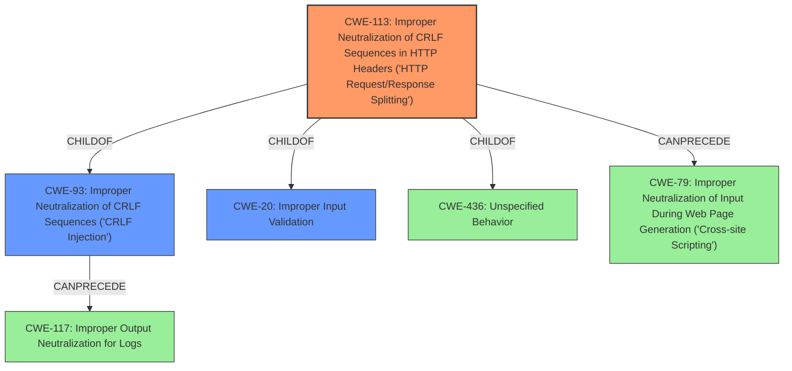

# Analysis for CVE-2022-20772

# Summary
| CWE ID | CWE Name | Confidence | CWE Abstraction Level | CWE Vulnerability Mapping Label | CWE-Vulnerability Mapping Notes |
|---|---|---|---|---|---|
| CWE-113 | Improper Neutralization of CRLF Sequences in HTTP Headers ('HTTP Request/Response Splitting') | 1.0 | Variant | Allowed | Primary CWE |
| CWE-93 | Improper Neutralization of CRLF Sequences ('CRLF Injection') | 0.7 | Base | Allowed | Secondary Candidate |
| CWE-20 | Improper Input Validation | 0.5 | Class | Discouraged | Secondary Candidate |

## Evidence and Confidence

*   **Confidence Score:** 0.9
*   **Evidence Strength:** HIGH

## Relationship Analysis
The primary CWE is CWE-113, which is a Variant of CWE-93 and a child of CWE-20 and CWE-436. CWE-93 can precede CWE-117. CWE-113 can precede CWE-79. The relationships show the progression from a general input issue (CWE-20) to the specific CRLF injection (CWE-93) that leads to HTTP Response Splitting (CWE-113).

## Vulnerability Chain
The vulnerability chain starts with **improper input sanitization**, leading to CRLF injection and finally resulting in HTTP response splitting.
  - **Root Cause:** **Improper Input Sanitization**
  - **Weakness:** CRLF Injection (CWE-93)
  - **Impact:** HTTP Response Splitting (CWE-113)

## Summary of Analysis
The initial assessment identified CWE-113 as the primary weakness due to the description of HTTP response splitting and the **improper sanitization** of input. The relationships between CWE-113 and its parent CWE-93 (CRLF Injection) support this conclusion. CWE-20, a parent of CWE-113, represents the general **improper input validation** but is less specific.

The evidence from the vulnerability description includes:
*   "This vulnerability is due to the failure of the application or its environment to properly sanitize input values."
*   "An attacker could exploit this vulnerability by injecting malicious HTTP headers, controlling the response body, or splitting the response into multiple responses."
*   "The vulnerability stems from the failure of the Cisco Email Security Appliance (ESA) and Cisco Secure Email and Web Manager to properly sanitize input values."

CWE-113 is the most specific and accurate representation of the vulnerability, making it the optimal choice. CWE-93 is a valid secondary classification as the root cause of the splitting. CWE-20 is too general and therefore less appropriate.

Relevant CWE Information:

# Enhanced Context (25 CWEs)

## CWE-204: Observable Response Discrepancy
**Abstraction Level**: Base
**Similarity Score**: 0.77
**Source**: dense

## CWE-203: Observable Discrepancy
**Abstraction Level**: Base
**Similarity Score**: 0.76
**Source**: dense

## CWE-208: Observable Timing Discrepancy
**Abstraction Level**: Base
**Similarity Score**: 0.75
**Source**: dense

## CWE-807: Reliance on Untrusted Inputs in a Security Decision
**Abstraction Level**: Base
**Similarity Score**: 0.75
**Source**: dense

## CWE-1289: Improper Validation of Unsafe Equivalence in Input
**Abstraction Level**: Base
**Similarity Score**: 0.75
**Source**: dense

## CWE-74: Improper Neutralization of Special Elements in Output Used by a Downstream Component ('Injection')
**Abstraction Level**: Class
**Similarity Score**: 0.75
**Source**: dense

## CWE-113: Improper Neutralization of CRLF Sequences in HTTP Headers ('HTTP Request/Response Splitting')
**Abstraction Level**: Variant
**Similarity Score**: 0.75
**Source**: dense

## CWE-668: Exposure of Resource to Wrong Sphere
**Abstraction Level**: Class
**Similarity Score**: 0.75
**Source**: dense

## CWE-41: Improper Resolution of Path Equivalence
**Abstraction Level**: Base
**Similarity Score**: 0.74
**Source**: dense

## CWE-205: Observable Behavioral Discrepancy
**Abstraction Level**: Base
**Similarity Score**: 0.74
**Source**: dense

## CWE-113: Improper Neutralization of CRLF Sequences in HTTP Headers ('HTTP Request/Response Splitting')
**Abstraction Level**: Variant
**Similarity Score**: 8006.33
**Source**: sparse

**Explanation:** This is the primary CWE and best describes the vulnerability.

## CWE-444: Inconsistent Interpretation of HTTP Requests ('HTTP Request/Response Smuggling')
**Abstraction Level**: Base
**Similarity Score**: 7767.75
**Source**: sparse

**Explanation:** Considered, but less relevant than CWE-113. Smuggling involves inconsistent interpretation, while this vulnerability is directly about splitting due to CRLF injection.

## CWE-22: Improper Limitation of a Pathname to a Restricted Directory ('Path Traversal')
**Abstraction Level**: Base
**Similarity Score**: 7422.32
**Source**: sparse

**Explanation:** Irrelevant to the vulnerability.

## CWE-93: Improper Neutralization of CRLF Sequences ('CRLF Injection')
**Abstraction Level**: Base
**Similarity Score**: 7115.57
**Source**: sparse

**Explanation:** This is a secondary CWE that contributes to the primary CWE-113.

## CWE-138: Improper Neutralization of Special Elements
**Abstraction Level**: Class
**Similarity Score**: 7091.47
**Source**: sparse

**Explanation:** Too general compared to CWE-113 and CWE-93.

## CWE-73: External Control of File Name or Path
**Abstraction Level**: base
**Similarity Score**: 4.82
**Source**: graph

**Explanation:** Irrelevant to the vulnerability.

## CWE-79: Improper Neutralization of Input During Web Page Generation ('Cross-site Scripting')
**Abstraction Level**: base
**Similarity Score**: 4.33
**Source**: graph

**Explanation:** XSS is a potential consequence of HTTP response splitting, but not the root cause.

## CWE-93: Improper Neutralization of CRLF Sequences ('CRLF Injection')
**Abstraction Level**: base
**Similarity Score**: 4.33
**Source**: graph

**Explanation:** This is a secondary CWE that contributes to the primary CWE-113.

## CWE-22: Improper Limitation of a Pathname to a Restricted Directory ('Path Traversal')
**Abstraction Level**: base
**Similarity Score**: 4.33
**Source**: graph

**Explanation:** Irrelevant to the vulnerability.

## CWE-770: Allocation of Resources Without Limits or Throttling
**Abstraction Level**: base
**Similarity Score**: 4.33
**Source**: graph

**Explanation:** Irrelevant to the vulnerability.

## CWE-190: Integer Overflow or Wraparound
**Abstraction Level**: base
**Similarity Score**: 4.33
**Source**: graph

**Explanation:** Irrelevant to the vulnerability.

## CWE-117: Improper Output Neutralization for Logs
**Abstraction Level**: base
**Similarity Score**: 4.33
**Source**: graph

**Explanation:** Irrelevant to the vulnerability.

## CWE-209: Generation of Error Message Containing Sensitive Information
**Abstraction Level**: base
**Similarity Score**: 3.64
**Source**: graph

**Explanation:** Irrelevant to the vulnerability.

## CWE-201