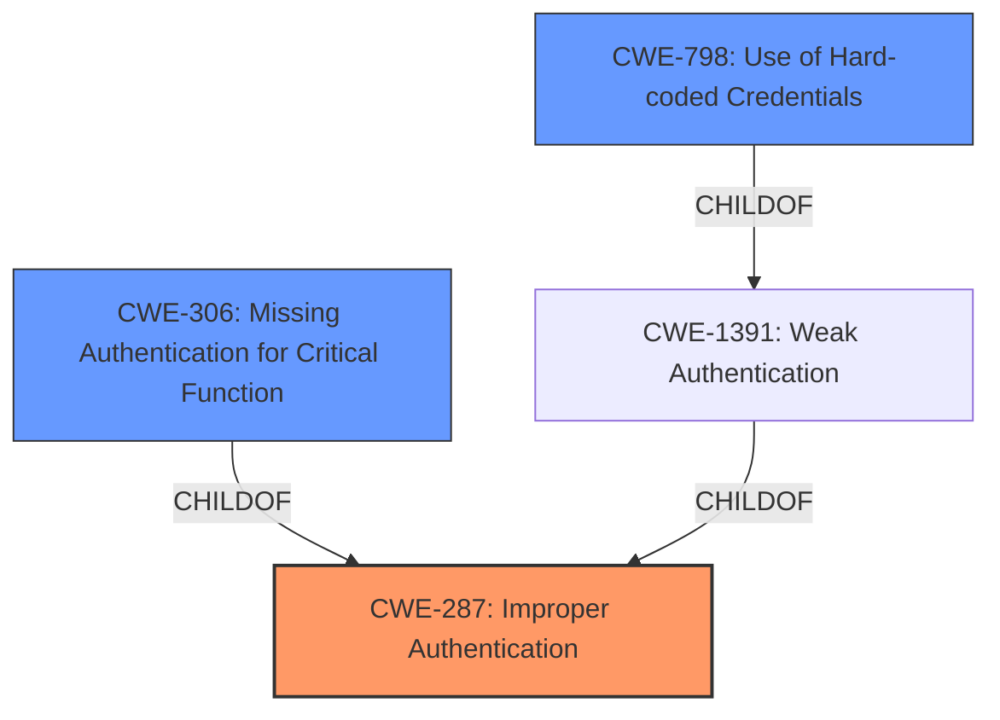

# Enhanced Analysis for CVE-2022-20798

# Summary

| CWE ID  | CWE Name                                      | Confidence | CWE Abstraction Level | CWE Vulnerability Mapping Label | CWE-Vulnerability Mapping Notes |
|---------|-----------------------------------------------|------------|-----------------------|---------------------------------|---------------------------------|
| CWE-287 | Improper Authentication                     | 1.0        | Class                 | Primary                           | Discouraged                    |
| CWE-306 | Missing Authentication for Critical Function | 0.75       | Base                  | Secondary                         | Allowed                        |
| CWE-798 | Use of Hard-coded Credentials               | 0.50       | Base                  | Secondary                         | Allowed                        |

## Evidence and Confidence

*   **Confidence Score:** 0.85
*   **Evidence Strength:** HIGH

## Relationship Analysis

The primary CWE selected is CWE-287, Improper Authentication, which is a Class-level CWE. The analysis also considered related CWEs such as CWE-306, Missing Authentication for Critical Function, and CWE-798, Use of Hard-coded Credentials. CWE-306 is a child of CWE-287. CWE-798 is also a child of CWE-287, but through CWE-1391, Weak Authentication. This hierarchical analysis helped refine the selection to the most appropriate CWE based on the available evidence.



## Vulnerability Chain

The vulnerability chain starts with **improper authentication checks** (CWE-287) leading to a potential bypass of authentication and unauthorized access to the web management interface. The chain could potentially involve **missing authentication for critical functions** (CWE-306) if certain parts of the application lack authentication altogether. Another potential path involves **use of hard-coded credentials** (CWE-798), although the provided description doesn't explicitly state it.

## Summary of Analysis

The initial analysis focused on identifying the root cause of the vulnerability. The description clearly states that the vulnerability is due to **improper authentication checks**. The CVE Reference Links Content Summary further reinforces this by explicitly mentioning "**improper authentication checks**" as the root cause.

The retriever results also suggested CWE-287, Improper Authentication, as a potential match, with a high similarity score. However, CWE-287 is a Class-level CWE, and the mapping guidance discourages its use when more specific CWEs are available. Therefore, the analysis explored child CWEs of CWE-287.

CWE-306, Missing Authentication for Critical Function, was considered because the **improper authentication checks** could potentially lead to certain functions being completely unprotected. However, since the description focuses on **improper checks** rather than a complete absence of authentication, CWE-287 was deemed more appropriate as the primary CWE.

CWE-798, Use of Hard-coded Credentials, was also considered, but it was not explicitly mentioned in the vulnerability description or CVE summary. While it is possible that hard-coded credentials are involved, there is insufficient evidence to support this.

Ultimately, CWE-287, Improper Authentication, was selected as the primary CWE because it accurately reflects the root cause of the vulnerability: **improper authentication checks** leading to authentication bypass. While it is a Class-level CWE, the available evidence does not strongly support a more specific Base or Variant CWE. The confidence in this mapping is high (0.85) due to the explicit mention of **improper authentication checks** in the vulnerability description and CVE summary.

CWE-306, Missing Authentication for Critical Function, and CWE-798, Use of Hard-coded Credentials, were selected as secondary CWEs due to the possibility of missing authentication or hardcoded credentials, although there is no explicit evidence.

Relevant CWE Information:

# Enhanced Context (25 CWEs)
The following CWEs were identified as potentially relevant to this vulnerability:

## CWE-807: Reliance on Untrusted Inputs in a Security Decision
**Abstraction Level**: Base
**Similarity Score**: 0.78
**Source**: dense

**Description**:
The product uses a protection mechanism that relies on the existence or values of an input, but the input can be modified by an untrusted actor in a way that bypasses the protection mechanism.
**Why Not Used:** While untrusted inputs are likely involved, the core weakness is in the **improper authentication checks** themselves.

## CWE-303: Incorrect Implementation of Authentication Algorithm
**Abstraction Level**: Base
**Similarity Score**: 0.77
**Source**: dense

**Description**:
The requirements for the product dictate the use of an established authentication algorithm, but the implementation of the algorithm is incorrect.
**Why Not Used:** While the implementation might be incorrect, the vulnerability description and CVE summary only state that the authentication checks are **improper**. There is no explicit evidence of an incorrect algorithm implementation.

## CWE-274: Improper Handling of Insufficient Privileges
**Abstraction Level**: Base
**Similarity Score**: 0.76
**Source**: dense

**Description**:
The product does not handle or incorrectly handles when it has insufficient privileges to perform an operation, leading to resultant weaknesses.
**Why Not Used:** The vulnerability is about **improper authentication**, not privilege handling.

## CWE-639: Authorization Bypass Through User-Controlled Key
**Abstraction Level**: Base
**Similarity Score**: 0.76
**Source**: dense

**Description**:
The system's authorization functionality does not prevent one user from gaining access to another user's data or record by modifying the key value identifying the data.
**Why Not Used:** The vulnerability is about **improper authentication**, not authorization bypass.

## CWE-1220: Insufficient Granularity of Access Control
**Abstraction Level**: Base
**Similarity Score**: 0.76
**Source**: dense

**Description**:
The product implements access controls via a policy or other feature with the intention to disable or restrict accesses (reads and/or writes) to assets in a system from untrusted agents. However, implemented access controls lack required granularity, which renders the control policy too broad because it allows accesses from unauthorized agents to the security-sensitive assets.
**Why Not Used:** The vulnerability is about **improper authentication**, not access control granularity.

## CWE-1390: Weak Authentication
**Abstraction Level**: Class
**Similarity Score**: 0.76
**Source**: dense

**Description**:
The product uses an authentication mechanism to restrict access to specific users or identities, but the mechanism does not sufficiently prove that the claimed identity is correct.
**Why Not Used:** The description focuses on **improper checks** which is best reflected in CWE-287.

## CWE-280: Improper Handling of Insufficient Permissions or Privileges
**Abstraction Level**: Base
**Similarity Score**: 0.75
**Source**: dense

**Description**:
The product does not handle or incorrectly handles when it has insufficient privileges to access resources or functionality as specified by their permissions. This may cause it to follow unexpected code paths that may leave the product in an invalid state.
**Why Not Used:** The vulnerability is about **improper authentication**, not privilege handling.

## CWE-302: Authentication Bypass by Assumed-Immutable Data
**Abstraction Level**: Base
**Similarity Score**: 0.75
**Source**: dense

**Description**:
The authentication scheme or implementation uses key data elements that are assumed to be immutable, but can be controlled or modified by the attacker.
**Why Not Used:** There is no explicit evidence in the description suggesting that the authentication scheme relies on assumed-immutable data. The description focuses on **improper authentication checks**.

## CWE-288: Authentication Bypass Using an Alternate Path or Channel
**Abstraction Level**: Base
**Similarity Score**: 0.75
**Source**: dense

**Description**:
The product requires authentication, but the product has an alternate path or channel that does not require authentication.
**Why Not Used:** The vulnerability isn't about alternate paths, it is about **improper authentication checks**.

## CWE-1391: Use of Weak Credentials
**Abstraction Level**: Class
**Similarity Score**: 0.75
**Source**: dense

**Description**:
The product uses weak credentials (such as a default key or hard-coded password) that can be calculated, derived, reused, or guessed by an attacker.
**Why Not Used:** While weak credentials might contribute to the vulnerability, the description focuses on **improper authentication checks**.

## CWE-798: Use of Hard-coded Credentials
**Abstraction Level**: Base


## CWE Relationship Analysis

Current CWEs represent these abstraction levels: .


### Vulnerability Chain Analysis

**Chain starting from CWE-280:**
- 280 (Improper Handling of Insufficient Permissions or Privileges ) - ROOT


**Chain starting from CWE-807:**
- 807 (Reliance on Untrusted Inputs in a Security Decision) - ROOT


### CWE Relationship Diagram

```mermaid
graph TD
    classDef primary fill:#f96,stroke:#333,stroke-width:2px
    classDef secondary fill:#69f,stroke:#333
    classDef tertiary fill:#9e9,stroke:#333
```