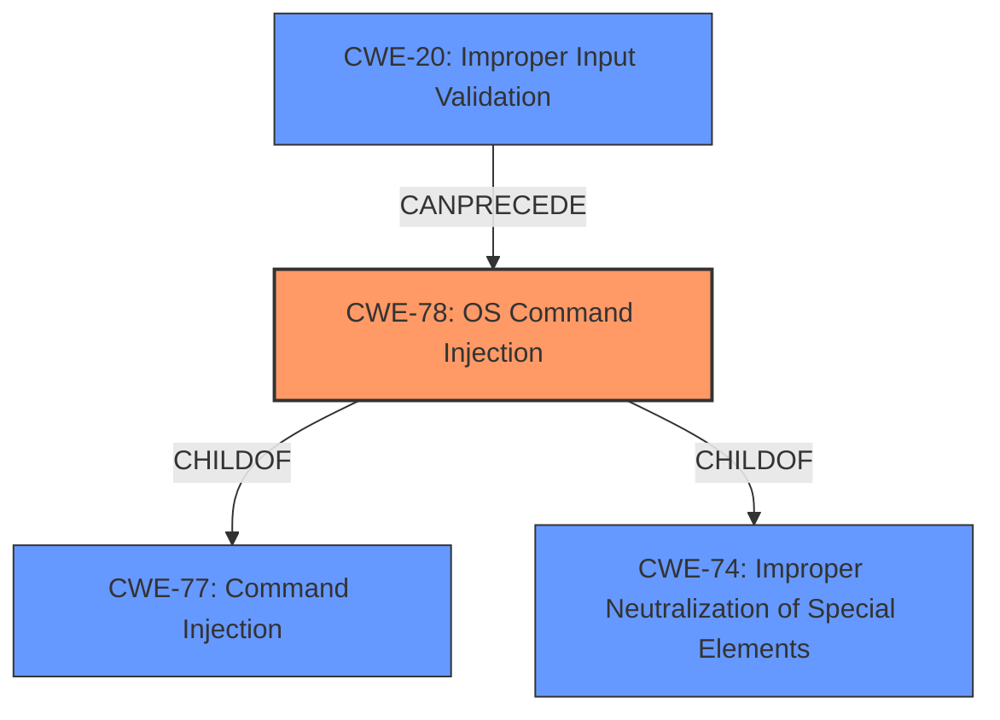

# Enhanced Analysis for CVE-2022-20799

# Summary
| CWE ID | CWE Name | Confidence | CWE Abstraction Level | CWE Vulnerability Mapping Label | CWE-Vulnerability Mapping Notes |
|---|---|---|---|---|---|
| CWE-78 | Improper Neutralization of Special Elements used in an OS Command ('OS Command Injection') | 1.0 | Base | Allowed | Primary CWE |
| CWE-20 | Improper Input Validation | 0.7 | Class | Discouraged | Secondary Candidate |

## Evidence and Confidence

*   **Confidence Score:** 0.9
*   **Evidence Strength:** HIGH

## Relationship Analysis
The primary CWE, CWE-78 (OS Command Injection), is a child of CWE-77 (Command Injection) and CWE-74 (Improper Neutralization of Special Elements). CWE-78 focuses specifically on OS commands, which aligns with the vulnerability's impact. CWE-20 (Improper Input Validation) is a high-level class that can precede CWE-78, indicating that **insufficient input validation** is a common precursor to command injection vulnerabilities. Choosing CWE-78 offers a more precise characterization of the vulnerability than either its parent CWE-77, CWE-74, or the high-level CWE-20.



## Vulnerability Chain
The vulnerability chain starts with **insufficient input validation** (potentially CWE-20), which allows an attacker to inject special elements into an OS command, leading to arbitrary command execution (CWE-78). The attacker requires valid administrator credentials, which is a prerequisite condition, not a CWE.

## Summary of Analysis
The vulnerability description clearly states that the root cause is **insufficient input validation**, which leads to the ability to "execute arbitrary commands on the underlying Linux operating system." The "CVE Reference Links Content Summary" also explicitly mentions "Command injection vulnerability" and associates the vulnerability with CWE-77 (Improper Neutralization of Special Elements used in a Command). However, since the impact is specifically on the "underlying Linux operating system," CWE-78 (Improper Neutralization of Special Elements used in an OS Command ('OS Command Injection')) is a more precise match.

CWE-20 (Improper Input Validation) was considered but not selected as the primary CWE because it is a broad, high-level class. While **insufficient input validation** is the root cause, CWE-78 accurately captures the specific type of vulnerability (OS command injection) that results from this **lack of validation**. The retriever results also listed CWE-78 with a high score, and the "CWE for similar CVE Descriptions" section lists CWE-78 as a Top CWE.

Other CWEs were considered from the Retriever Results but deemed less relevant. CWE-22 (Improper Limitation of a Pathname to a Restricted Directory ('Path Traversal')) and CWE-23 (Relative Path Traversal) are related to file path manipulation, which is not the focus of this vulnerability. CWE-94 (Improper Control of Generation of Code ('Code Injection')) is also related to code execution, but the vulnerability description doesn't involve the generation of new code; instead, it involves injecting commands into existing OS commands. CWE-250 (Execution with Unnecessary Privileges) might be a contributing factor, but the core weakness is the command injection, not the unnecessary privileges. CWE-1284 (Improper Validation of Specified Quantity in Input) does not apply because the input is not related to a quantity. CWE-73 (External Control of File Name or Path) does not apply as the vulnerability is not related to file paths. CWE-138 (Improper Neutralization of Special Elements) is too abstract and does not focus on OS Commands.

The final decision to map to CWE-78 is based on the specific evidence of OS command execution due to **insufficient input validation**, the retriever results, the CWE's base abstraction level, and its alignment with the described vulnerability.


## CWE Relationship Analysis

Current CWEs represent these abstraction levels: .


### Vulnerability Chain Analysis

**Chain starting from CWE-250:**
- 250 (Execution with Unnecessary Privileges) - ROOT


**Chain starting from CWE-20:**
- 20 (Improper Input Validation) - ROOT


### CWE Relationship Diagram

```mermaid
graph TD
    classDef primary fill:#f96,stroke:#333,stroke-width:2px
    classDef secondary fill:#69f,stroke:#333
    classDef tertiary fill:#9e9,stroke:#333
```