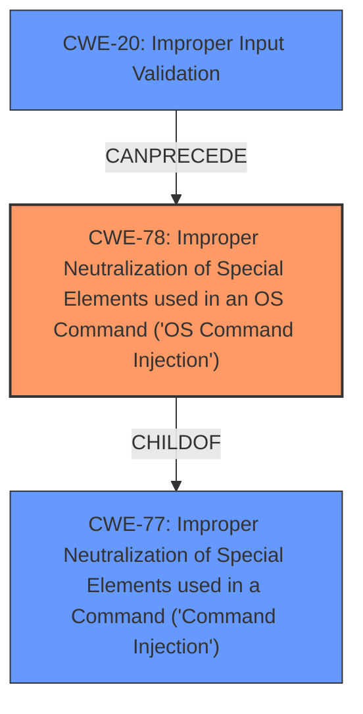

# Raw Analyzer Response for CVE-2022-20801

# Summary
| CWE ID | CWE Name | Confidence | CWE Abstraction Level | CWE Vulnerability Mapping Label | CWE-Vulnerability Mapping Notes |
|---|---|---|---|---|---|
| CWE-78 | Improper Neutralization of Special Elements used in an OS Command ('OS Command Injection') | 1 | Base | Primary | Allowed |
| CWE-20 | Improper Input Validation | 0.7 | Class | Secondary | Discouraged |

## Evidence and Confidence

*   **Confidence Score:** 0.85
*   **Evidence Strength:** HIGH

## Relationship Analysis
The primary CWE selected is CWE-78, which is a Base level weakness and a child of CWE-77. CWE-77 is a Class level weakness that covers command injection in general, while CWE-78 is specifically for OS command injection. CWE-20, Improper Input Validation, is a Class level weakness and can often precede other weaknesses like CWE-78. The relationship between CWE-20 and CWE-78 is that **improper input validation** can lead to command injection.

## Vulnerability Chain
The vulnerability chain starts with **insufficient input validation** (CWE-20), which allows an attacker to inject malicious input, leading to OS command injection (CWE-78), and ultimately arbitrary command execution on the underlying Linux operating system.

## Summary of Analysis
The vulnerability description clearly states that the root cause is **insufficient input validation**, which leads to command injection. The CVE Reference Links Content Summary confirms this by stating: "The vulnerability is caused by **insufficient validation of user-supplied input** in the web-based management interface... The lack of proper input validation allows an attacker to inject and execute arbitrary commands on the underlying operating system of the affected device."

The Retriever Results list CWE-78 as a potential match, and the CWE description aligns with the vulnerability details. CWE-78 (Improper Neutralization of Special Elements used in an OS Command ('OS Command Injection')) is the most appropriate CWE because the attacker can execute arbitrary commands on the underlying operating system. This aligns with the definition of CWE-78, which states: "The product constructs all or part of an OS command using externally-influenced input... but it does not neutralize or incorrectly neutralizes special elements that could modify the intended OS command."

CWE-20 (Improper Input Validation) was considered because the vulnerability description explicitly mentions **insufficient input validation**. However, CWE-20 is a high-level Class weakness, and the more specific Base weakness CWE-78 is a better fit for describing the actual vulnerability. As the MITRE mapping guidance discourages the use of CWE-20 when lower-level CWEs are available, CWE-78 is the primary CWE, and CWE-20 is a secondary contributing factor.

The selected CWEs are at the optimal level of specificity. CWE-78 is a Base weakness that accurately describes the command injection vulnerability. CWE-20 is a Class weakness that represents the **insufficient input validation** but is not specific enough to be the primary CWE.