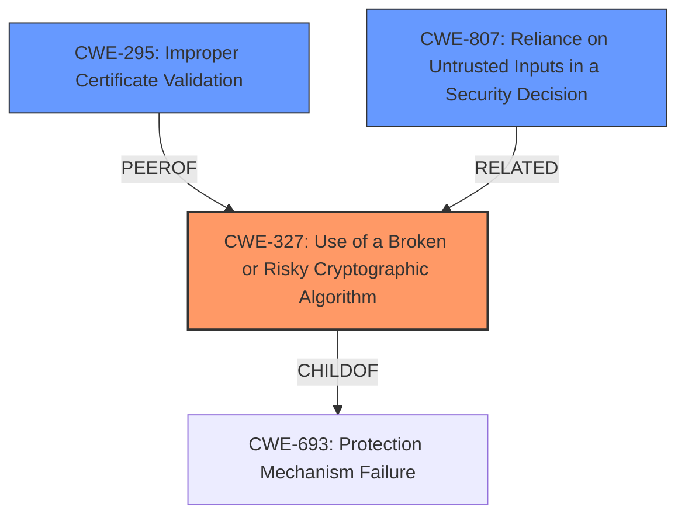

# Analysis Report for CVE-2022-20805

# Vulnerability Analysis Report: CVE-2022-20805

## Description


## Analysis (with Relationship Data)

# Summary
| CWE ID    | CWE Name                                                                       | Confidence | CWE Abstraction Level | CWE Vulnerability Mapping Label | CWE-Vulnerability Mapping Notes |
| :-------- | :----------------------------------------------------------------------------- | :--------- | :---------------------- | :------------------------------ | :------------------------------ |
| CWE-327   | Use of a Broken or Risky Cryptographic Algorithm                              | 0.8        | Class                   | Primary                         | Allowed-with-Review             |
| CWE-295   | Improper Certificate Validation                                                | 0.6        | Base                    | Secondary                       | Allowed                         |
| CWE-807   | Reliance on Untrusted Inputs in a Security Decision                            | 0.5        | Base                    | Secondary                       | Allowed                         |

## Evidence and Confidence

*   **Confidence Score:** 0.7
*   **Evidence Strength:** MEDIUM

## Relationship Analysis
The analysis focused on identifying the root cause of the **vulnerability in the automatic decryption process**, which is related to cryptographic algorithms and trust decisions. The primary CWE selected, CWE-327, reflects the use of a risky cryptographic algorithm, while secondary CWEs like CWE-295 and CWE-807 account for improper certificate validation and reliance on untrusted inputs. These are related to how the decryption process can be bypassed. The analysis considered the abstraction level of each CWE to ensure the most specific and relevant classification.



## Vulnerability Chain
The vulnerability chain starts with the **flawed automatic decryption process**.
  - The **weakness** lies in the decryption function's use of the TLS SNI extension.
  - The system **incorrectly relies** on SNI to decide on decryption.
  - An attacker crafts a TLS request to **bypass decryption**.
  - This **bypasses SSL decryption and content filtering policies**, leading to potential download of malicious content.
  - Root Cause: **Vulnerability in automatic decryption process**
  - Weakness 1: **Incorrect reliance** on TLS SNI
  - Impact: **Bypass of SSL decryption and content filtering policies**

## Summary of Analysis
The initial assessment focused on identifying the core **vulnerability in the automatic decryption process**. The primary CWE, CWE-327 (Use of a Broken or Risky Cryptographic Algorithm), was selected because the vulnerability involves the decryption function and how it uses the TLS SNI extension. According to the "CVE Reference Links Content Summary", "The system incorrectly relies on the SNI for determining if decryption is needed. This allows an attacker to craft a TLS request that bypasses the decryption process." This suggests there may be a broken or risky aspect to the cryptographic process being used, particularly in how it handles the SNI.

The analysis also considered secondary CWEs to provide a more complete picture of the vulnerability. CWE-295 (Improper Certificate Validation) was considered because the crafted TLS request might involve issues with certificate validation. However, the primary issue seems to be in how the system uses the SNI to make decryption decisions, rather than a direct failure of certificate validation. CWE-807 (Reliance on Untrusted Inputs in a Security Decision) was added because the system's reliance on the SNI, which can be manipulated by an attacker, leads to incorrect decryption decisions.

The final decision was to primarily map the vulnerability to CWE-327, as the **root cause** involves the decryption process itself. Secondary mappings to CWE-295 and CWE-807 were included to highlight the related issues of certificate validation and reliance on untrusted inputs, respectively. The selected CWEs are at the optimal level of specificity because they directly address the technical details of the vulnerability, as evidenced by the provided description and reference links.

Relevant CWE Information:

# Enhanced Context (25 CWEs)

## CWE-327: Use of a Broken or Risky Cryptographic Algorithm
**Technical Explanation:** The vulnerability involves how the Cisco Umbrella SWG decryption function uses the TLS SNI extension, indicating a potential flaw in the cryptographic algorithm or protocol being used. The security implication is that an attacker could bypass decryption, allowing malicious content to be downloaded. This is a Class-level CWE, and its parent is CWE-693 (Protection Mechanism Failure).
**Relationship Guidance Influence:** The "Allowed-with-Review" mapping guidance and the parent-child relationship with CWE-693 support the selection of this CWE.
**Supporting Evidence:** "The vulnerability lies in how the Cisco Umbrella Secure Web Gateway (SWG) decryption function uses the TLS Server Name Indication (SNI) extension of an HTTPS request."
**Confidence:** 0.8

## CWE-295: Improper Certificate Validation
**Technical Explanation:** While the primary issue is the decryption process, the crafting of TLS requests might involve issues with certificate validation. The security implication is that an attacker could spoof a trusted entity. This is a Base-level CWE, related to CWE-287 (Improper Authentication).
**Relationship Guidance Influence:** The "Allowed" mapping guidance supports the inclusion of this CWE.
**Supporting Evidence:** The attacker uses "a crafted request over TLS from a client to an unknown or controlled URL".
**Confidence:** 0.6

## CWE-807: Reliance on Untrusted Inputs in a Security Decision
**Technical Explanation:** The system relies on the SNI, which can be manipulated by an attacker, to make decryption decisions. This represents a reliance on untrusted inputs. The security implication is that an attacker could bypass the decryption process by manipulating the SNI. This is a Base-level CWE.
**Relationship Guidance Influence:** The "Allowed" mapping guidance supports the inclusion of this CWE.
**Supporting Evidence:** "The system incorrectly relies on the SNI for determining if decryption is needed."
**Confidence:** 0.5

## Other CWEs Considered But Not Used:
- CWE-20 (Improper Input Validation): This was considered but deemed too general. While the vulnerability involves input (the SNI), the core issue is not simply a lack of validation but how the decryption process uses that input.
- CWE-444 (Inconsistent Interpretation of HTTP Requests ('HTTP Request/Response Smuggling')): This was considered because the vulnerability involves HTTP requests, but the primary issue is not the smuggling of requests but the bypassing of decryption.
- CWE-319 (Cleartext Transmission of Sensitive Information): This was considered, but the primary issue is not the transmission of sensitive information in cleartext but the bypassing of decryption.


## CWE Relationship Analysis

Current CWEs represent these abstraction levels: .


### Vulnerability Chain Analysis

**Chain starting from CWE-327:**
- 327 (Use of a Broken or Risky Cryptographic Algorithm) - ROOT


**Chain starting from CWE-693:**
- 693 (Protection Mechanism Failure) - ROOT


### CWE Relationship Diagram

```mermaid
graph TD
    classDef primary fill:#f96,stroke:#333,stroke-width:2px
    classDef secondary fill:#69f,stroke:#333
    classDef tertiary fill:#9e9,stroke:#333
```


*Report generated on 2025-03-30 19:11:34*
