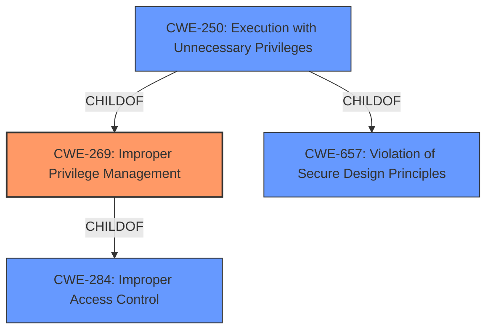

# Analysis for CVE-2022-20818

# Summary
| CWE ID | CWE Name | Confidence | CWE Abstraction Level | CWE Vulnerability Mapping Label | CWE-Vulnerability Mapping Notes |
|---|---|---|---|---|---|
| CWE-269 | Improper Privilege Management | 0.8 | Class | Primary | Discouraged |
| CWE-250 | Execution with Unnecessary Privileges | 0.6 | Base | Secondary | Allowed |
| CWE-284 | Improper Access Control | 0.4 | Pillar | Secondary | Discouraged |

## Evidence and Confidence

*   **Confidence Score:** 0.7
*   **Evidence Strength:** MEDIUM

## Relationship Analysis
The primary relationship influencing the selection is the hierarchical relationship between CWE-284 (Improper Access Control) and CWE-269 (Improper Privilege Management), where CWE-269 is a child of CWE-284. Since the vulnerability is specifically related to **improper access controls** leading to elevated privileges, CWE-269 is more specific and applicable than its parent. CWE-250 (Execution with Unnecessary Privileges) is a child of CWE-269 and CWE-657.

## Vulnerability Chain
The vulnerability chain starts with **improper access controls** (CWE-269), leading to the ability to execute arbitrary commands as the root user, which can also be seen as execution with unnecessary privileges (CWE-250).

## Summary of Analysis
The initial analysis focused on identifying the root cause of the vulnerability, which is attributed to **improper access controls** on commands within the application CLI. The vulnerability description states, "These vulnerabilities are due to **improper access controls** on commands within the application CLI. An attacker could exploit these vulnerabilities by running a malicious command on the application CLI. A successful exploit could allow the attacker to execute arbitrary commands as the root user."

CWE-269 (Improper Privilege Management) was chosen as the primary CWE because it directly addresses the **improper management of privileges** that leads to the vulnerability. While CWE-284 (Improper Access Control) is a broader category, CWE-269 provides a more specific classification.

CWE-250 (Execution with Unnecessary Privileges) was considered a secondary CWE because the successful exploit leads to arbitrary commands being executed as the root user. This aligns with the concept of executing with higher privileges than necessary.

I am overriding the discouragement of CWE-284 because it represents the general class of the root cause, but it is too high-level to be the primary cause.

Relevant CWE Information:

# Enhanced Context (25 CWEs)
The following CWEs were identified as potentially relevant to this vulnerability:

## CWE-269: Improper Privilege Management
**Abstraction:** Class
**Similarity Score**: N/A
**Source**: N/A

**Description**:
The product does not properly assign, modify, track, or check privileges for an actor, creating an unintended sphere of control for that actor.

**Mapping Guidance**:
- Usage: Discouraged
- Rationale: CWE-269 is commonly misused. It can be conflated with "privilege escalation," which is a technical impact that is listed in many low-information vulnerability reports [REF-1287]. It is not useful for trend analysis.
- Comments: If an error or mistake allows privilege escalation, then use the CWE ID for that mistake. Avoid using CWE-269 when only phrases such as "privilege escalation" or "gain privileges" are available, as these indicate technical impact of the vulnerability - not the root cause weakness. If the root cause seems to be directly related to privileges, then examine the children of CWE-269 for additional hints, such as Execution with Unnecessary Privileges (CWE-250) or Incorrect Privilege Assignment (CWE-266).

## CWE-250: Execution with Unnecessary Privileges
**Abstraction:** Base
**Similarity Score**: N/A
**Source**: N/A

**Description**:
The product performs an operation at a privilege level that is higher than the minimum level required, which creates new weaknesses or amplifies the consequences of other weaknesses.

**Mapping Guidance**:
- Usage: Allowed
- Rationale: This CWE entry is at the Base level of abstraction, which is a preferred level of abstraction for mapping to the root causes of vulnerabilities.

## CWE-284: Improper Access Control
**Abstraction:** Pillar
**Similarity Score**: N/A
**Source**: N/A

**Description**:
The product does not restrict or incorrectly restricts access to a resource from an unauthorized actor.

**Mapping Guidance**:
- Usage: Discouraged
- Rationale: CWE-284 is extremely high-level, a Pillar. Its name, "Improper Access Control," is often misused in low-information vulnerability reports [REF-1287] or by active use of the OWASP Top Ten, such as "A01:2021-Broken Access Control". It is not useful for trend analysis.
- Comments: Consider using descendants of CWE-284 that are more specific to the kind of access control involved, such as those involving authorization (Missing Authorization (CWE-862), Incorrect Authorization (CWE-863), Incorrect Permission Assignment for Critical Resource (CWE-732), etc.); authentication (Missing Authentication (CWE-306) or Weak Authentication (CWE-1390)); Incorrect User Management (CWE-286); Improper Restriction of Communication Channel to Intended Endpoints (CWE-923); etc.