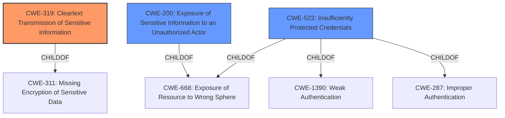

# Analysis Report for CVE-2022-2083

# Vulnerability Analysis Report: CVE-2022-2083

## Description


## Analysis (with Relationship Data)

# Summary
| CWE ID | CWE Name | Confidence | CWE Abstraction Level | CWE Vulnerability Mapping Label | CWE-Vulnerability Mapping Notes |
|---|---|---|---|---|---|
| CWE-319 | Cleartext Transmission of Sensitive Information | 0.9 | Base | Allowed | Primary CWE |
| CWE-200 | Exposure of Sensitive Information to an Unauthorized Actor | 0.6 | Class | Discouraged | Secondary Candidate |
| CWE-522 | Insufficiently Protected Credentials | 0.6 | Class | Allowed-with-Review | Secondary Candidate |

## Evidence and Confidence

*   **Confidence Score:** 0.9
*   **Evidence Strength:** HIGH

## Relationship Analysis
The primary relationship that influenced the decision was the direct match of **Cleartext Transmission of Sensitive Information** (CWE-319) to the **leaking of the OAuth client_secret**. The secondary considerations were around broader information exposure (CWE-200) and the nature of the leaked credential (CWE-522).



## Vulnerability Chain
The vulnerability chain starts with the **inclusion of the `client_secret` in the redirect URL (CWE-319)** which leads to **exposure of the secret** and potentially **unauthorized access to the site**. The chain can be summarized as:

1.  **CWE-319: Cleartext Transmission of Sensitive Information** (Root Cause: `client_secret` leaked in redirect URL)
2.  **Impact:** Unauthorized Access, Privilege Escalation, Account Takeover

## Summary of Analysis
The primary assessment is based on the explicit evidence from the vulnerability description and CVE Reference Links Content Summary, which clearly state that the `client_secret` is leaked in the redirect URL. This aligns directly with **CWE-319 (Cleartext Transmission of Sensitive Information)**.

The relationship graph reinforces the decision by highlighting the parent-child relationship between **CWE-319** and the more general **CWE-311 (Missing Encryption of Sensitive Data)**. Since the information is transmitted in cleartext, **CWE-319** is the more specific and appropriate choice.

The other CWEs considered, such as **CWE-200 (Exposure of Sensitive Information to an Unauthorized Actor)** and **CWE-522 (Insufficiently Protected Credentials)**, are less specific. While the vulnerability does lead to information exposure and involves a credential, the root cause is the cleartext transmission itself, making **CWE-319** the most accurate representation of the weakness. The retriever also lists **CWE-319** as a possible match.

The final selection of **CWE-319** is at the optimal level of specificity (Base) as it directly addresses the **root cause** of the vulnerability: the **cleartext transmission** of the OAuth `client_secret`.

Relevant CWE Information:

# Enhanced Context (25 CWEs)

## CWE-538: Insertion of Sensitive Information into Externally-Accessible File or Directory
**Abstraction Level**: Base
**Similarity Score**: 0.78
**Source**: dense

**Description**:
The product places sensitive information into files or directories that are accessible to actors who are allowed to have access to the files, but not to the sensitive information.

**Mapping Guidance**:
- Usage: Allowed
- Rationale: This CWE entry is at the Base level of abstraction, which is a preferred level of abstraction for mapping to the root causes of vulnerabilities.

This CWE was not selected as the vulnerability is due to the leakage of the **client_secret** through a URL and not insertion in a file or directory.

## CWE-226: Sensitive Information in Resource Not Removed Before Reuse
**Abstraction Level**: Base
**Similarity Score**: 0.78
**Source**: dense

**Description**:
The product releases a resource such as memory or a file so that it can be made available for reuse, but it does not clear or "zeroize" the information contained in the resource before the product performs a critical state transition or makes the resource available for reuse by other entities.

**Mapping Guidance**:
- Usage: Allowed
- Rationale: This CWE entry is at the Base level of abstraction, which is a preferred level of abstraction for mapping to the root causes of vulnerabilities.

This CWE was not selected as the vulnerability is not about resource reuse and failing to remove sensitive information before.

## CWE-807: Reliance on Untrusted Inputs in a Security Decision
**Abstraction Level**: Base
**Similarity Score**: 0.77
**Source**: dense

**Description**:
The product uses a protection mechanism that relies on the existence or values of an input, but the input can be modified by an untrusted actor in a way that bypasses the protection mechanism.

**Mapping Guidance**:
- Usage: Allowed
- Rationale: This CWE entry is at the Base level of abstraction, which is a preferred level of abstraction for mapping to the root causes of vulnerabilities.

This CWE was not selected as the core issue is not the reliance on untrusted inputs in a security decision, but rather the **exposure** of the `client_secret` itself.

## CWE-497: Exposure of Sensitive System Information to an Unauthorized Control Sphere
**Abstraction Level**: Base
**Similarity Score**: 0.77
**Source**: dense

**Description**:
The product does not properly prevent sensitive system-level information from being accessed by unauthorized actors who do not have the same level of access to the underlying system as the product does.

**Mapping Guidance**:
- Usage: Allowed
- Rationale: This CWE entry is at the Base level of abstraction, which is a preferred level of abstraction for mapping to the root causes of vulnerabilities.

This CWE was not selected as the leaked `client_secret` is not necessarily "system-level" information.

## CWE-319: Cleartext Transmission of Sensitive Information
**Abstraction Level**: Base
**Similarity Score**: 0.77
**Source**: dense

**Description**:
The product transmits sensitive or security-critical data in cleartext in a communication channel that can be sniffed by unauthorized actors.

**Mapping Guidance**:
- Usage: Allowed
- Rationale: This CWE entry is at the Base level of abstraction, which is a preferred level of abstraction for mapping to the root causes of vulnerabilities.

This CWE **was selected** as the primary weakness. The `client_secret` is transmitted in cleartext in the redirect URL.

## CWE-639: Authorization Bypass Through User-Controlled Key
**Abstraction Level**: Base
**Similarity Score**: 0.77
**Source**: dense

**Description**:
The system's authorization functionality does not prevent one user from gaining access to another user's data or record by modifying the key value identifying the data.

**Mapping Guidance**:
- Usage: Allowed
- Rationale: This CWE entry is at the Base level of abstraction, which is a preferred level of abstraction for mapping to the root causes of vulnerabilities.

This CWE was not selected as the vulnerability is not directly about authorization bypass through user-controlled key, but about the **exposure** of the `client_secret`.

## CWE-212: Improper Removal of Sensitive Information Before Storage or Transfer
**Abstraction Level**: Base
**Similarity Score**: 0.77
**Source**: dense

**Description**:
The product stores, transfers, or shares a resource that contains sensitive information, but it does not properly remove that information before the product makes the resource available to unauthorized actors.

**Mapping Guidance**:
- Usage: Allowed
- Rationale: This CWE entry is at the Base level of abstraction, which is a preferred level of abstraction for mapping to the root causes of vulnerabilities.

This CWE was not selected as the vulnerability is not about improper removal of sensitive information before storage or transfer, but about the **exposure** of the `client_secret` through a URL.

## CWE-472: External Control of Assumed-Immutable Web Parameter
**Abstraction Level**: Base
**Similarity Score**: 0.77
**Source**: dense

**Description


## CWE Relationship Analysis

Current CWEs represent these abstraction levels: .


### Vulnerability Chain Analysis

**Chain starting from CWE-200:**
- 200 (Exposure of Sensitive Information to an Unauthorized Actor) - ROOT


**Chain starting from CWE-472:**
- 472 (External Control of Assumed-Immutable Web Parameter) - ROOT


### CWE Relationship Diagram

```mermaid
graph TD
    classDef primary fill:#f96,stroke:#333,stroke-width:2px
    classDef secondary fill:#69f,stroke:#333
    classDef tertiary fill:#9e9,stroke:#333
```


*Report generated on 2025-03-30 22:57:14*
