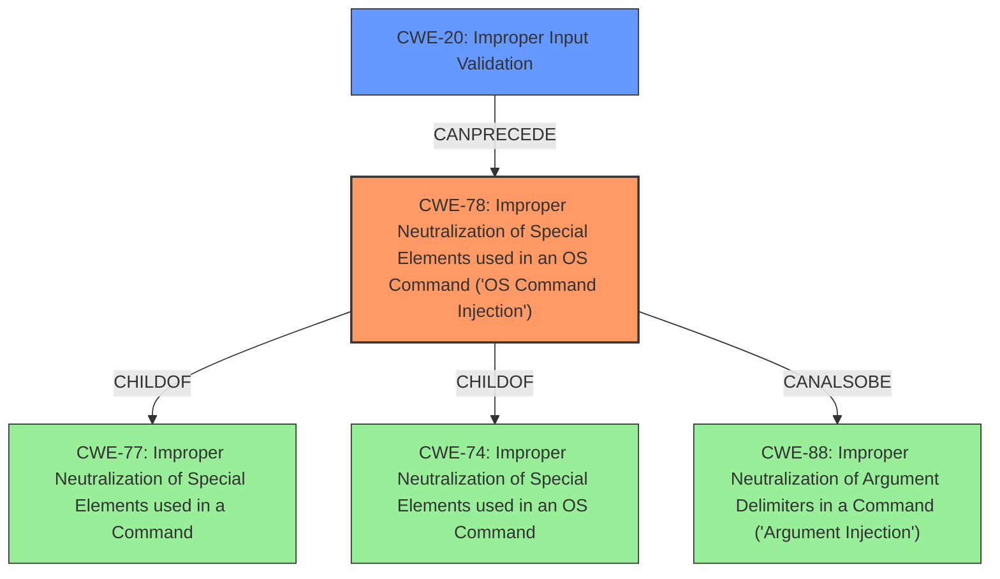

# Enhanced Analysis for CVE-2022-20842

# Summary
| CWE ID | CWE Name | Confidence | CWE Abstraction Level | CWE Vulnerability Mapping Label | CWE-Vulnerability Mapping Notes |
|---|---|---|---|---|---|
| CWE-78 | Improper Neutralization of Special Elements used in an OS Command ('OS Command Injection') | 1 | Base | Allowed | Primary CWE |
| CWE-20 | Improper Input Validation | 0.7 | Class | Discouraged | Secondary Candidate |

## Evidence and Confidence

*   **Confidence Score:** 0.9
*   **Evidence Strength:** HIGH

## Relationship Analysis
The primary CWE is CWE-78, which is a base-level CWE and a child of CWE-77 (Improper Neutralization of Special Elements used in a Command) and CWE-74 (Improper Neutralization of Special Elements used in an OS Command). CWE-78 is also related to CWE-88 (Improper Neutralization of Argument Delimiters in a Command) via CanAlsoBe, suggesting that argument injection could potentially play a role. CWE-20 is a class-level CWE that is frequently misused and discouraged, with suggestions to use more specific children like CWE-1284 or CWE-1289. CWE-20 can precede CWE-78, which means that improper input validation can lead to OS command injection.



## Vulnerability Chain
The vulnerability chain starts with **insufficient validation of user-supplied input** to the web-based management interface of the affected Cisco routers. This **lack of validation** then leads to the ability to inject OS commands, resulting in remote code execution and denial of service.

## Summary of Analysis
The primary weakness is clearly CWE-78 (Improper Neutralization of Special Elements used in an OS Command ('OS Command Injection')), as the vulnerability description and CVE details specifically mention the ability to execute arbitrary code on the device due to **insufficient input validation**. This maps directly to the core concept of CWE-78, where externally influenced input is used to construct an OS command without proper neutralization of special elements.

The "CWE for similar CVE Descriptions" section lists CWE-78 as the primary match and most frequent CWE. The CVE Reference Links Content Summary confirms **insufficient validation of user-supplied input**, which leads to arbitrary code execution.

CWE-20 (Improper Input Validation) is considered as a secondary candidate, as the **lack of proper input validation** is a contributing factor. However, CWE-20 is a broad class and is discouraged by MITRE for direct mapping when more specific CWEs are available. Given that the specific outcome is OS command injection, CWE-78 is a more precise and appropriate classification.

The retriever results also list several other CWEs, such as CWE-119, CWE-1284, and CWE-295. These CWEs are not directly applicable, as the primary issue is not related to memory buffers, quantity specifications, or certificate validation.

Therefore, the final decision is to classify the vulnerability as CWE-78 with high confidence, acknowledging that CWE-20 represents a related, contributing factor. The selected CWEs are at the optimal level of specificity, accurately reflecting the root cause and potential impact of the vulnerability.


## CWE Relationship Analysis

Current CWEs represent these abstraction levels: .


### Vulnerability Chain Analysis

**Chain starting from CWE-20:**
- 20 (Improper Input Validation) - ROOT


**Chain starting from CWE-78:**
- 78 (Improper Neutralization of Special Elements used in an OS Command ('OS Command Injection')) - ROOT


### CWE Relationship Diagram

```mermaid
graph TD
    classDef primary fill:#f96,stroke:#333,stroke-width:2px
    classDef secondary fill:#69f,stroke:#333
    classDef tertiary fill:#9e9,stroke:#333
```