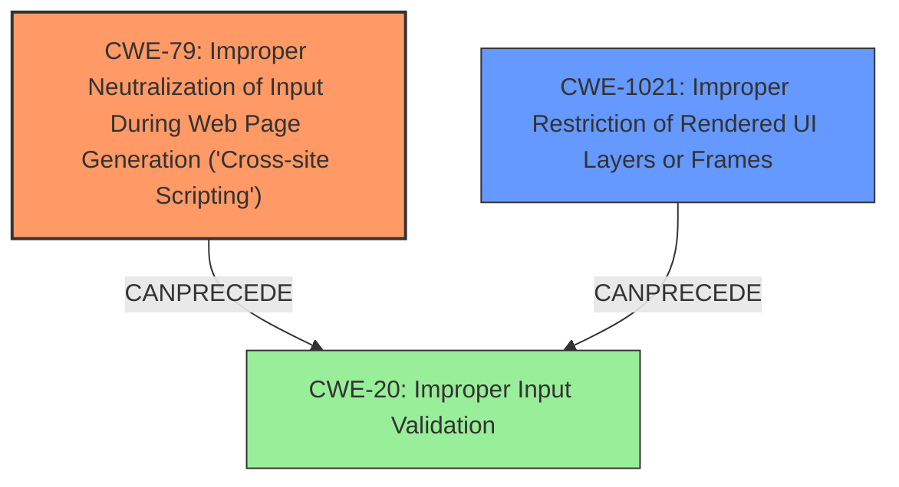

# Analysis for CVE-2022-20852

# Summary

| CWE ID | CWE Name | Confidence | CWE Abstraction Level | CWE Vulnerability Mapping Label | CWE-Vulnerability Mapping Notes |
|---|---|---|---|---|---|
| CWE-79 | Improper Neutralization of Input During Web Page Generation ('Cross-site Scripting') | 1.0 | Base | Primary | Allowed |
| CWE-1021 | Improper Restriction of Rendered UI Layers or Frames | 0.9 | Base | Secondary | Allowed |

## Evidence and Confidence

*   **Confidence Score:** 0.95
*   **Evidence Strength:** HIGH

## Relationship Analysis
The primary weakness is **CWE-79 [Improper Neutralization of Input During Web Page Generation ('Cross-site Scripting')]**, which reflects the **improper neutralization** of user-controllable input. The secondary weakness is **CWE-1021 [Improper Restriction of Rendered UI Layers or Frames]**, which represents the **frame hijacking** vulnerability. These are distinct issues, though they can both be exploited through the web interface. There isn't a direct parent-child relationship between the two, but they both represent vulnerabilities that can be exploited via a web interface.

## Vulnerability Chain
The vulnerability chain for **Cross-Site Scripting (XSS)** involves the product's failure to neutralize user-controllable input, leading to the execution of malicious scripts in the user's browser.

The vulnerability chain for **Frame Hijacking** involves the product's **improper restriction** of rendered UI layers or frames, potentially leading to user confusion and exploitation.

## Summary of Analysis
The analysis is strongly based on the provided evidence, which explicitly mentions **cross-site scripting** and **frame hijacking** as vulnerabilities.

For the **cross-site scripting** part, the vulnerability description states: "Multiple vulnerabilities in the web interface of Cisco Webex Meetings could allow a remote attacker to conduct a **cross-site scripting** (XSS) attack." This directly aligns with **CWE-79 [Improper Neutralization of Input During Web Page Generation ('Cross-site Scripting')]**, which describes a product's failure to neutralize user-controllable input before placing it in output used as a web page.

For the **frame hijacking** part, the vulnerability description states: "Multiple vulnerabilities in the web interface of Cisco Webex Meetings could allow a remote attacker to conduct a... a **frame hijacking** attack against a user of the web interface." This directly aligns with **CWE-1021 [Improper Restriction of Rendered UI Layers or Frames]**, which describes a web application not restricting or incorrectly restricting frame objects or UI layers that belong to another application or domain.

The selection of **CWE-79 [Improper Neutralization of Input During Web Page Generation ('Cross-site Scripting')]** and **CWE-1021 [Improper Restriction of Rendered UI Layers or Frames]** is at the optimal level of specificity, as they directly address the **root causes** of the vulnerabilities.
Relevant CWE Information:

# Enhanced Context (25 CWEs)
The following CWEs were identified as potentially relevant to this vulnerability:

## CWE-80: Improper Neutralization of Script-Related HTML Tags in a Web Page (Basic XSS)
**Abstraction Level**: Variant
**Similarity Score**: 0.77
**Source**: dense

**Description**:
The product receives input from an upstream component, but it does not neutralize or incorrectly neutralizes special characters such as "<", ">", and "&" that could be interpreted as web-scripting elements when they are sent to a downstream component that processes web pages.

**Mapping Guidance**:
- Usage: Allowed
- Rationale: This CWE entry is at the Variant level of abstraction, which is a preferred level of abstraction for mapping to the root causes of vulnerabilities.

## CWE-807: Reliance on Untrusted Inputs in a Security Decision
**Abstraction Level**: Base
**Similarity Score**: 0.75
**Source**: dense

**Description**:
The product uses a protection mechanism that relies on the existence or values of an input, but the input can be modified by an untrusted actor in a way that bypasses the protection mechanism.

**Mapping Guidance**:
- Usage: Allowed
- Rationale: This CWE entry is at the Base level of abstraction, which is a preferred level of abstraction for mapping to the root causes of vulnerabilities.

## CWE-497: Exposure of Sensitive System Information to an Unauthorized Control Sphere
**Abstraction Level**: Base
**Similarity Score**: 0.75
**Source**: dense

**Description**:
The product does not properly prevent sensitive system-level information from being accessed by unauthorized actors who do not have the same level of access to the underlying system as the product does.

**Mapping Guidance**:
- Usage: Allowed
- Rationale: This CWE entry is at the Base level of abstraction, which is a preferred level of abstraction for mapping to the root causes of vulnerabilities.

## CWE-451: User Interface (UI) Misrepresentation of Critical Information
**Abstraction Level**: Class
**Similarity Score**: 0.74
**Source**: dense

**Description**:
The user interface (UI) does not properly represent critical information to the user, allowing the information - or its source - to be obscured or spoofed. This is often a component in phishing attacks.

**Mapping Guidance**:
- Usage: Allowed-with-Review
- Rationale: This CWE entry is a Class and might have Base-level children that would be more appropriate

## CWE-74: Improper Neutralization of Special Elements in Output Used by a Downstream Component ('Injection')
**Abstraction Level**: Class
**Similarity Score**: 0.73
**Source**: dense

**Description**:
The product constructs all or part of a command, data structure, or record using externally-influenced input from an upstream component, but it does not neutralize or incorrectly neutralizes special elements that could modify how it is parsed or interpreted when it is sent to a downstream component.

**Mapping Guidance**:
- Usage: Discouraged
- Rationale: CWE-74 is high-level and often misused when lower-level weaknesses are more appropriate.

## CWE-1391: Use of Weak Credentials
**Abstraction Level**: Class
**Similarity Score**: 0.73
**Source**: dense

**Description**:
The product uses weak credentials (such as a default key or hard-coded password) that can be calculated, derived, reused, or guessed by an attacker.

**Mapping Guidance**:
- Usage: Allowed-with-Review
- Rationale: This CWE entry is a Class and might have Base-level children that would be more appropriate

## CWE-41: Improper Resolution of Path Equivalence
**Abstraction Level**: Base
**Similarity Score**: 0.73
**Source**: dense

**Description**:
The product is vulnerable to file system contents disclosure through path equivalence. Path equivalence involves the use of special characters in file and directory names. The associated manipulations are intended to generate multiple names for the same object.

**Mapping Guidance**:
- Usage: Allowed
- Rationale: This CWE entry is at the Base level of abstraction, which is a preferred level of abstraction for mapping to the root causes of vulnerabilities.

## CWE-134: Use of Externally-Controlled Format String
**Abstraction Level**: Base
**Similarity Score**: 0.73
**Source**: dense

**Description**:
The product uses a function that accepts a format string as an argument, but the format string originates from an external source.

**Mapping Guidance**:
- Usage: Allowed
- Rationale: This CWE entry is at the Base level of abstraction, which is a preferred level of abstraction for mapping to the root causes of vulnerabilities.

## CWE-668: Exposure of Resource to Wrong Sphere
**Abstraction Level**: Class
**Similarity Score**: 0.73
**Source**: dense

**Description**:
The product exposes a resource to the wrong control sphere, providing unintended actors with inappropriate access to the resource.

**Mapping Guidance**:
- Usage: Discouraged
- Rationale: CWE-668 is high-level and is often misused as a catch-all when lower-level CWE IDs might be applicable. It is sometimes used for low-information vulnerability reports [REF-1287]. It is a level-1 Class (i.e., a child of a Pillar). It is not useful for trend analysis.

## CWE-657: Violation of Secure Design Principles
**Abstraction Level**: Class
**Similarity Score**: 0.73
**Source**: dense

**Description**:

# Enhanced Query for CVE-2022-20852

# Vulnerability Description

    Multiple vulnerabilities in the web interface of Cisco Webex Meetings could allow a remote attacker to conduct a **cross-site scripting** (XSS) attack or a **frame hijacking** attack against a user of the web interface. For more information about these vulnerabilities, see the Details section of this advisory.

    # Keyphrase-Specific CWE Analysis
    This vulnerability contains multiple keyphrases that may map to different CWEs. 
    Please analyze each keyphrase separately and determine the most appropriate CWE(s) for each.

    ## WEAKNESS: 'cross-site scripting'

Relevant CWEs for this WEAKNESS:

### 1. CWE-80: Improper Neutralization of Script-Related HTML Tags in a Web Page (Basic XSS) (Score: 409.62)

The product receives input from an upstream component, but it does not neutralize or incorrectly neutralizes special characters such as "<", ">", and "&" that could be interpreted as web-scripting elements when they are sent to a downstream component that processes web pages....

### 2. CWE-79: Improper Neutralization of Input During Web Page Generation ('Cross-site Scripting') (Score: 371.81)

The product does not neutralize or incorrectly neutralizes user-controllable input before it is placed in output that is used as a web page that is served to other users....

### 3. CWE-352: Cross-Site Request Forgery (CSRF) (Score: 346.44)

The web application does not, or can not, sufficiently verify whether a well-formed, valid, consistent request was intentionally provided by the user who submitted the request....

### 4. CWE-942: Permissive Cross-domain Policy with Untrusted Domains (Score: 336.18)

The product uses a cross-domain policy file that includes domains that should not be trusted....

### 5. CWE-20: Improper Input Validation (Score: 320.98)

The product receives input or data, but it does
        not validate or incorrectly validates that the input has the
        properties that are required to process the data safely and
        correctly....

## WEAKNESS: 'frame hijacking'

Relevant CWEs for this WEAKNESS:

### 1. CWE-80: Improper Neutralization of Script-Related HTML Tags in a Web Page (Basic XSS) (Score: 409.62)

The product receives input from an upstream component, but it does not neutralize or incorrectly neutralizes special characters such as "<", ">", and "&" that could be interpreted as web-scripting elements when they are sent to a downstream component that processes web pages....

### 2. CWE-79: Improper Neutralization of Input During Web Page Generation ('Cross-site Scripting') (Score: 371.81)

The product does not neutralize or incorrectly neutralizes user-controllable input before it is placed in output that is used as a web page that is served to other users....

### 3. CWE-20: Improper Input Validation (Score: 320.98)

The product receives input or data, but it does
        not validate or incorrectly validates that the input has the
        properties that are required to process the data safely and
        correctly....

### 4. CWE-1021: Improper Restriction of Rendered UI Layers or Frames (Score: 294.73)

The web application does not restrict or incorrectly restricts frame objects or UI layers that belong to another application or domain, which can lead to user confusion about which interface the user is interacting with....

### 5. CWE-22: Improper Limitation of a Pathname to a Restricted Directory ('Path Traversal') (Score: 273.66)

The product uses external input to construct a pathname that is intended to identify a file or directory that is located underneath a restricted parent directory, but the product does not properly neutralize special elements within the pathname that can cause the pathname to resolve to a location th...

## ATTACKER: 'remote attacker'

Relevant CWEs for this ATTACKER:

### 1. CWE-80: Improper Neutralization of Script-Related HTML Tags in a Web Page (Basic XSS) (Score: 409.62)

The product receives input from an upstream component, but it does not neutralize or incorrectly neutralizes special characters such as "<", ">", and "&" that could be interpreted as web-scripting elements when they are sent to a downstream component that processes web pages....

### 2. CWE-79: Improper Neutralization of Input During Web Page Generation ('Cross-site Scripting') (Score: 371.81)

The product does not neutralize or incorrectly neutralizes user-controllable input before it is placed in output that is used as a web page that is served to other users....

### 3. CWE-20: Improper Input Validation (Score: 320.98)

The product receives input or data, but it does
        not validate or incorrectly validates that the input has the
        properties that are required to process the data safely and
        correctly....

### 4. CWE-22: Improper Limitation of a Pathname to a Restricted Directory ('Path Traversal') (Score: 273.66)

The product uses external input to construct a pathname that is intended to identify a file or directory that is located underneath a restricted parent directory, but the product does not properly neutralize special elements within the pathname that can cause the pathname to resolve to a location th...

### 5. CWE-23: Relative Path Traversal (Score: 104.68)

The product uses external input to construct a pathname that should be within a restricted directory, but it does not properly neutralize sequences such as ".." that can resolve to a location that is outside of that directory....

## PRODUCT: 'Cisco Webex Meetings'

Relevant CWEs for this PRODUCT:

### 1. CWE-80: Improper Neutralization of Script-Related HTML Tags in a Web Page (Basic XSS) (Score: 409.62)

The product receives input from an upstream component, but it does not neutralize or incorrectly neutralizes special characters such as "<", ">", and "&" that could be interpreted as web-scripting elements when they are sent to a downstream component that processes web pages....

### 2. CWE-20: Improper Input Validation (Score: 320.98)

The product receives input or data, but it does
        not validate or incorrectly validates that the input has the
        properties that are required to process the data safely and
        correctly....

### 3. CWE-22: Improper Limitation of a Pathname to a Restricted Directory ('Path Traversal') (Score: 273.66)

The product uses external input to construct a pathname that is intended to identify a file or directory that is located underneath a restricted parent directory, but the product does not properly neutralize special elements within the pathname that can cause the pathname to resolve to a location th...

### 4. CWE-183: Permissive List of Allowed Inputs (Score: 113.51)

The product implements a protection mechanism that relies on a list of inputs (or properties of inputs) that are explicitly allowed by policy because the inputs are assumed to be safe, but the list is too permissive - that is, it allows an input that is unsafe, leading to resultant weaknesses....

### 5. CWE-119: Improper Restriction of Operations within the Bounds of a Memory Buffer (Score: 108.58)

The product performs operations on a memory buffer, but it reads from or writes to a memory location outside the buffer's intended boundary. This may result in read or write operations on unexpected memory locations that could be linked to other variables, data structures, or internal program data....

## COMPONENT: 'web interface'

Relevant CWEs for this COMPONENT:

### 1. CWE-80: Improper Neutralization of Script-Related HTML Tags in a Web Page (Basic XSS) (Score: 409.62)

The product receives input from an upstream component, but it does not neutralize or incorrectly neutralizes special characters such as "<", ">", and "&" that could be interpreted as web-scripting elements when they are sent to a downstream component that processes web pages....

### 2. CWE-79: Improper Neutralization of Input During Web Page Generation ('Cross-site Scripting') (Score: 371.81)

The product does not neutralize or incorrectly neutralizes user-controllable input before it is placed in output that is used as a web page that is served to other users....

### 3. CWE-20: Improper Input Validation (Score: 320.98)

The product receives input or data, but it does
        not validate or incorrectly validates that the input has the
        properties that are required to process the data safely and
        correctly....

### 4. CWE-22: Improper Limitation of a Pathname to a Restricted Directory ('Path Traversal') (Score: 273.66)

The product uses external input to construct a pathname that is intended to identify a file or directory that is located underneath a restricted parent directory, but the product does not properly neutralize special elements within the pathname that can cause the pathname to resolve to a location th...

### 5. CWE-23: Relative Path Traversal (Score: 104.68)

The product uses external input to construct a pathname that should be within a restricted directory, but it does not properly neutralize sequences such as ".." that can resolve to a location that is outside of that directory....

    # Analysis Instructions
    1. For each keyphrase, identify the most appropriate CWE(s) that represent the weakness.
    2. Consider how the different keyphrases might relate to each other in the vulnerability chain.
    3. Provide a final determination of primary CWE(s) and any secondary CWEs.
    4. Format your response using the standard analysis template.

    Please analyze how these different weaknesses interact and provide a comprehensive CWE classification.
    