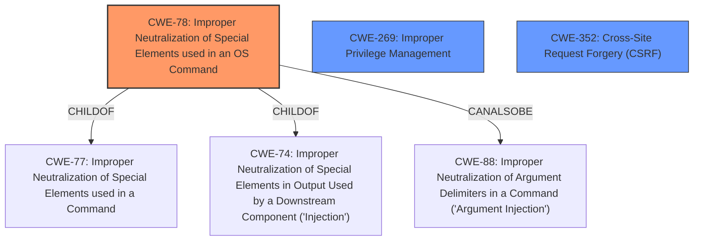

# Raw Analyzer Response for CVE-2022-20857

# Summary
| CWE ID | CWE Name | Confidence | CWE Abstraction Level | CWE Vulnerability Mapping Label | CWE-Vulnerability Mapping Notes |
|---|---|---|---|---|---|
| CWE-78 | Improper Neutralization of Special Elements used in an OS Command ('OS Command Injection') | 0.9 | Base | Allowed | Primary CWE |
| CWE-269 | Improper Privilege Management | 0.8 | Class | Allowed | Secondary CWE |
| CWE-352 | Cross-Site Request Forgery (CSRF) | 0.7 | Base | Allowed | Secondary CWE |

## Evidence and Confidence

*   **Confidence Score:** 0.8
*   **Evidence Strength:** MEDIUM

## Relationship Analysis
The primary CWE is CWE-78, which is a base-level weakness describing improper neutralization of special elements in OS commands. This is supported by the CVE description where arbitrary commands could be executed. CWE-78 is a child of CWE-77 (Improper Neutralization of Special Elements used in a Command) and CWE-74 (Improper Neutralization of Special Elements in Output Used by a Downstream Component ('Injection')), indicating a broader category of command injection. CWE-78 can also be related to CWE-88 (Improper Neutralization of Argument Delimiters in a Command ('Argument Injection')).

CWE-269 represents the root cause of **insufficient access control** allowing elevated privilege, and is a class-level weakness.

CWE-352 is related to Cross-Site Request Forgery which is an attack that forces an end user to execute unwanted actions on a web application in which they’re currently authenticated.

## Vulnerability Chain
The vulnerability chain involves a few distinct weaknesses that lead to different impacts:
1.  **Insufficient Access Control (CWE-269):** Root cause for CVE-2022-20857 and CVE-2022-20858, leading to unauthorized command execution and container image manipulation.
2.  **Improper Neutralization of Special Elements used in an OS Command ('OS Command Injection') (CWE-78):** Enables arbitrary command execution as root user.
3.  **Insufficient CSRF Protections (CWE-352):** Root cause for CVE-2022-20861, allowing actions with Administrator privileges.

## Summary of Analysis
The initial analysis identified CWE-78 as the primary candidate based on the ability to execute arbitrary commands. Further analysis of the CVE reference links content summary revealed that **insufficient access controls** were also a root cause for some of the vulnerabilities, leading to the inclusion of CWE-269. The **insufficient CSRF protections** for the web UI lead to the inclusion of CWE-352.

The selection of CWE-78 is justified by the "Impact of exploitation: Arbitrary command execution as root user in any pod on a node." extracted from the CVE reference links content summary. This aligns directly with the description of CWE-78, which involves the construction of an OS command using externally influenced input without proper neutralization.

The selection of CWE-269 is justified by the "Root cause of vulnerability: Insufficient access controls for a specific API." extracted from the CVE reference links content summary. This aligns directly with the description of CWE-269, which involves the **improper privilege management**.

The selection of CWE-352 is justified by the "Root cause of vulnerability: Insufficient CSRF protections for the web UI on an affected device." extracted from the CVE reference links content summary. This aligns directly with the description of CWE-352, which involves Cross-Site Request Forgery (CSRF).

CWE-20 (Improper Input Validation) was considered due to its high ranking in the Retriever Results. However, since the specific types of vulnerabilities are known (command injection and CSRF), it is more appropriate to use the more specific CWE-78 and CWE-352. The mapping guidance for CWE-20 also discourages its use when more specific CWEs are available.

CWE-22 (Improper Limitation of a Pathname to a Restricted Directory ('Path Traversal')) was considered as the attacker could read container images, but this is a consequence of the **insufficient access control** rather than a path traversal issue directly, so it was not selected.

CWE-306 (Missing Authentication for Critical Function) was not selected because, while authentication might be a factor, the primary weakness is the **insufficient access control** on an already authenticated session or API.

Relevant CWE Information:

# Enhanced Context (25 CWEs)
The following CWEs were identified as potentially relevant to this vulnerability:

## CWE-41: Improper Resolution of Path Equivalence
**Abstraction Level**: Base
**Similarity Score**: 0.77
**Source**: dense

**Description**:
The product is vulnerable to file system contents disclosure through path equivalence. Path equivalence involves the use of special characters in file and directory names. The associated manipulations are intended to generate multiple names for the same object.

**Mapping Guidance**:
- Usage: Allowed
- Rationale: This CWE entry is at the Base level of abstraction, which is a preferred level of abstraction for mapping to the root causes of vulnerabilities.

## CWE-73: External Control of File Name or Path
**Abstraction Level**: Base
**Similarity Score**: 0.77
**Source**: dense

**Description**:
The product allows user input to control or influence paths or file names that are used in filesystem operations.

**Mapping Guidance**:
- Usage: Allowed
- Rationale: This CWE entry is at the Base level of abstraction, which is a preferred level of abstraction for mapping to the root causes of vulnerabilities.

## CWE-119: Improper Restriction of Operations within the Bounds of a Memory Buffer
**Abstraction Level**: Class
**Similarity Score**: 0.77
**Source**: dense

**Description**:
The product performs operations on a memory buffer, but it reads from or writes to a memory location outside the buffer's intended boundary. This may result in read or write operations on unexpected memory locations that could be linked to other variables, data structures, or internal program data.

**Mapping Guidance**:
- Usage: Discouraged
- Rationale: CWE-119 is commonly misused in low-information vulnerability reports when lower-level CWEs could be used instead, or when more details about the vulnerability are available.

## CWE-1289: Improper Validation of Unsafe Equivalence in Input
**Abstraction Level**: Base
**Similarity Score**: 0.77
**Source**: dense

**Description**:
The product receives an input value that is used as a resource identifier or other type of reference, but it does not validate or incorrectly validates that the input is equivalent to a potentially-unsafe value.

**Mapping Guidance**:
- Usage: Allowed
- Rationale: This CWE entry is at the Base level of abstraction, which is a preferred level of abstraction for mapping to the root causes of vulnerabilities.

## CWE-59: Improper Link Resolution Before File Access ('Link Following')
**Abstraction Level**: Base
**Similarity Score**: 0.76
**Source**: dense

**Description**:
The product attempts to access a file based on the filename, but it does not properly prevent that filename from identifying a link or shortcut that resolves to an unintended resource.

**Mapping Guidance**:
- Usage: Allowed
- Rationale: This CWE entry is at the Base level of abstraction, which is a preferred level of abstraction for mapping to the root causes of vulnerabilities.

## CWE-74: Improper Neutralization of Special Elements in Output Used by a Downstream Component ('Injection')
**Abstraction Level**: Class
**Similarity Score**: 0.76
**Source**: dense

**Description**:
The product constructs all or part of a command, data structure, or record using externally-influenced input from an upstream component, but it does not neutralize or incorrectly neutralizes special elements that could modify how it is parsed or interpreted when it is sent to a downstream component.

**Mapping Guidance**:
- Usage: Discouraged
- Rationale: CWE-7