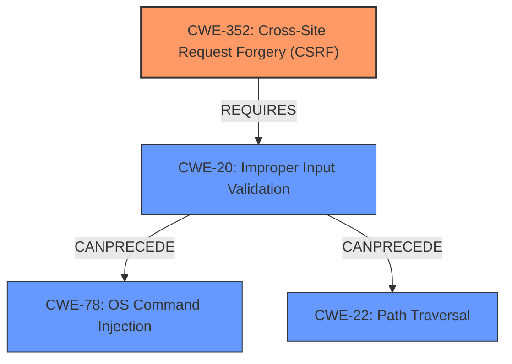

# Raw Analyzer Response for CVE-2022-20858

# Summary
| CWE ID  | CWE Name                                                                        | Confidence | CWE Abstraction Level | CWE Vulnerability Mapping Label | CWE-Vulnerability Mapping Notes |
| :-------- | :------------------------------------------------------------------------------ | :--------- | :---------------------- | :------------------------------ | :------------------------------ |
| CWE-352 | Cross-Site Request Forgery (CSRF)                                             | 0.9        | Compound                | Primary                       | Allowed                       |
| CWE-20  | Improper Input Validation                                                       | 0.6        | Class                   | Secondary                     | Discouraged                    |
| CWE-78  | Improper Neutralization of Special Elements used in an OS Command ('OS Command Injection') | 0.6        | Base                    | Secondary                      | Allowed                       |
| CWE-22  | Improper Limitation of a Pathname to a Restricted Directory ('Path Traversal') | 0.6        | Base                    | Secondary                     | Allowed                       |

## Evidence and Confidence

*   **Confidence Score:** 0.7
*   **Evidence Strength:** MEDIUM

## Relationship Analysis

The primary weakness identified is CWE-352 (Cross-Site Request Forgery). This is a compound weakness that requires other weaknesses to be present. The relationships of CWE-352 include *Requires* CWE-346, CWE-441, CWE-642, and CWE-613.

Additionally, the vulnerability description mentions the possibility of arbitrary command execution, which aligns with CWE-78 (OS Command Injection) and path traversal, which aligns with CWE-22. These could be caused by **improper input validation** (CWE-20), a class-level weakness that can lead to other vulnerabilities.

## Vulnerability Chain

The vulnerability chain starts with the **lack of CSRF protection** (CWE-352), which could stem from **improper input validation** (CWE-20). This **lack of validation** could allow an attacker to inject commands (CWE-78) or traverse directories (CWE-22), leading to arbitrary command execution or unauthorized file access.

## Summary of Analysis

The initial assessment identified CWE-352 as the primary vulnerability, supported by the **weakness** phrase "**cross-site request forgery**" in the "Vulnerability Description Key Phrases" section. However, the additional impacts described, such as arbitrary command execution and reading/uploading container images, suggest other underlying weaknesses. The CVE Reference Links Content Summary mentions "**insufficient access controls**" as a root cause for the container image vulnerability (CVE-2022-20858). This aligns with **improper input validation** (CWE-20), which could allow attackers to inject malicious input leading to OS command injection (CWE-78) or path traversal (CWE-22).

The graph relationships highlight how CWE-20 can precede CWE-78 and CWE-22.

The selected CWEs are at the optimal level of specificity. CWE-352 is a compound weakness representing the high-level vulnerability. CWE-78 and CWE-22 are base-level weaknesses that more specifically describe how the vulnerability can be exploited. CWE-20 is a class-level weakness that describes the **improper input validation** that leads to other weaknesses.

Relevant CWE Information:

# Enhanced Context (25 CWEs)

## CWE-24: Path Traversal: '../filedir'
**Abstraction Level**: Variant
**Similarity Score**: 0.73
**Source**: dense

**Description**:
The product uses external input to construct a pathname that should be within a restricted directory, but it does not properly neutralize "../" sequences that can resolve to a location that is outside of that directory.

**Mapping Guidance**:
- Usage: Allowed
- Rationale: This CWE entry is at the Variant level of abstraction, which is a preferred level of abstraction for mapping to the root causes of vulnerabilities.

## CWE-25: Path Traversal: '/../filedir'
**Abstraction Level**: Variant
**Similarity Score**: 0.73
**Source**: dense

**Description**:
The product uses external input to construct a pathname that should be within a restricted directory, but it does not properly neutralize "/../" sequences that can resolve to a location that is outside of that directory.

**Mapping Guidance**:
- Usage: Allowed
- Rationale: This CWE entry is at the Variant level of abstraction, which is a preferred level of abstraction for mapping to the root causes of vulnerabilities.

## CWE-23: Relative Path Traversal
**Abstraction Level**: Base
**Similarity Score**: 0.72
**Source**: dense

**Description**:
The product uses external input to construct a pathname that should be within a restricted directory, but it does not properly neutralize sequences such as ".." that can resolve to a location that is outside of that directory.

**Mapping Guidance**:
- Usage: Allowed
- Rationale: This CWE entry is at the Base level of abstraction, which is a preferred level of abstraction for mapping to the root causes of vulnerabilities.

## CWE-29: Path Traversal: '\..\filename'
**Abstraction Level**: Variant
**Similarity Score**: 0.72
**Source**: dense

**Description**:
The product uses external input to construct a pathname that should be within a restricted directory, but it does not properly neutralize '\..\filename' (leading backslash dot dot) sequences that can resolve to a location that is outside of that directory.

**Mapping Guidance**:
- Usage: Allowed
- Rationale: This CWE entry is at the Variant level of abstraction, which is a preferred level of abstraction for mapping to the root causes of vulnerabilities.

## CWE-27: Path Traversal: 'dir/../../filename'
**Abstraction Level**: Variant
**Similarity Score**: 0.72
**Source**: dense

**Description**:
The product uses external input to construct a pathname that should be within a restricted directory, but it does not properly neutralize multiple internal "../" sequences that can resolve to a location that is outside of that directory.

**Mapping Guidance**:
- Usage: Allowed
- Rationale: This CWE entry is at the Variant level of abstraction, which is a preferred level of abstraction for mapping to the root causes of vulnerabilities.

## CWE-41: Improper Resolution of Path Equivalence
**Abstraction Level**: Base
**Similarity Score**: 0.72
**Source**: dense

**Description**:
The product is vulnerable to file system contents disclosure through path equivalence. Path equivalence involves the use of special characters in file and directory names. The associated manipulations are intended to generate multiple names for the same object.

**Mapping Guidance**:
- Usage: Allowed
- Rationale: This CWE entry is at the Base level of abstraction, which is a preferred level of abstraction for mapping to the root causes of vulnerabilities.

## CWE-26: Path Traversal: '/dir/../filename'
**Abstraction Level**: Variant
**Similarity Score**: 0.72
**Source**: dense

**Description**:
The product uses external input to construct a pathname that should be within a restricted directory, but it does not properly neutralize "/dir/../filename" sequences that can resolve to a location that is outside of that directory.

**Mapping Guidance**:
- Usage: Allowed
- Rationale: This CWE entry is at the Variant level of abstraction, which is a preferred level of abstraction for mapping to the root causes of vulnerabilities.

## CWE-35: Path Traversal: '.../...//'
**Abstraction Level**: Variant
**Similarity Score**: 0.72
**Source**: dense

**Description**:
The product uses external input to construct a pathname that should be within a restricted directory, but it does not properly neutralize '.../...//' (doubled triple dot slash) sequences that can resolve to a location that is outside of that directory.

**Mapping Guidance**:
- Usage: Allowed
- Rationale: This CWE entry is at the Variant level of abstraction, which is a preferred level of abstraction for mapping to the root causes of vulnerabilities.

## CWE-73: External Control of File Name or Path
**Abstraction Level**: Base
**Similarity Score**: 0.72
**Source**: dense

**Description**:
The product allows user input to control or influence paths or file names that are used in filesystem operations.

**Mapping Guidance**:
- Usage: Allowed
- Rationale: This CWE entry is at the Base level of abstraction, which is a preferred level of abstraction for mapping to the root causes of vulnerabilities.

## CWE-37: Path Traversal: '/absolute/