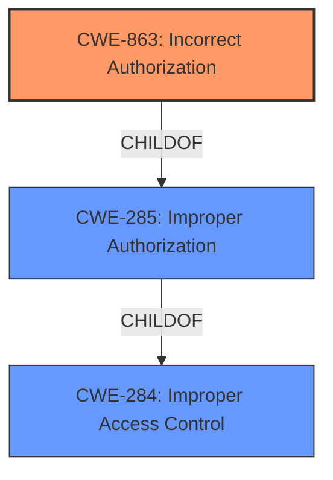

# Raw Analyzer Response for CVE-2022-20859

# Summary
| CWE ID | CWE Name | Confidence | CWE Abstraction Level | CWE Vulnerability Mapping Label | CWE-Vulnerability Mapping Notes |
|---|---|---|---|---|---|
| CWE-863 | Incorrect Authorization | 1.0 | Class | Primary | Allowed-with-Review |
| CWE-285 | Improper Authorization | 0.7 | Class | Secondary | Discouraged |
| CWE-284 | Improper Access Control | 0.6 | Pillar | Secondary | Discouraged |

## Evidence and Confidence

*   **Confidence Score:** 0.9
*   **Evidence Strength:** HIGH

## Relationship Analysis
The primary CWE selected is CWE-863, "Incorrect Authorization," which is a child of CWE-285, "Improper Authorization," and a grandchild of CWE-284, "Improper Access Control." The decision to select CWE-863 is based on the vulnerability description specifying **insufficient access control checks**, indicating that an authorization check was performed but was incorrect. Choosing CWE-863 provides a more specific classification than its parents.

## Vulnerability Chain
The vulnerability chain starts with the **insufficient access control checks** (CWE-863), leading to the ability for an authenticated remote attacker with read-only privileges to perform administrative actions.
  - **Root Cause:** CWE-863 Incorrect Authorization
  - **Impact:** Ability to perform unauthorized administrative actions.

## Summary of Analysis
The initial assessment focuses on the root cause identified in the vulnerability description: **insufficient access control checks**. The CVE Reference Links Content Summary confirms this root cause. The primary candidate is CWE-863 "Incorrect Authorization" because the vulnerability description specifically states that the access control checks were performed, but were insufficient.

The retriever results also suggest CWE-863 and CWE-285 as potential matches. CWE-284, "Improper Access Control," is a high-level pillar and is less descriptive. The decision to use CWE-863 is favored because it aligns directly with the described weakness: authorization checks being performed incorrectly.

The relationship analysis confirms that choosing a child CWE is more specific and appropriate.
The evidence from the Vulnerability Description Key Phrases and CVE Reference Links Content Summary supports this decision.

The selected CWEs are at the optimal level of specificity, with CWE-863 providing the most accurate representation of the vulnerability.

Relevant CWE Information:

# Enhanced Context (25 CWEs)
The following CWEs were identified as potentially relevant to this vulnerability:

## CWE-807: Reliance on Untrusted Inputs in a Security Decision
**Abstraction Level**: Base
**Similarity Score**: 0.76

**CWE-807 Not Selected:** This CWE describes situations where a security decision relies on untrusted input. While relevant to security vulnerabilities generally, it does not specifically address the **incorrect authorization** issue described.

## CWE-1289: Improper Validation of Unsafe Equivalence in Input
**Abstraction Level**: Base
**Similarity Score**: 0.76

**CWE-1289 Not Selected:** This CWE focuses on improper validation of input used as a resource identifier. The provided description does not suggest issues with input validation related to resource identifiers, making this CWE less suitable than CWE-863.

## CWE-274: Improper Handling of Insufficient Privileges
**Abstraction Level**: Base
**Similarity Score**: 0.76

**CWE-274 Not Selected:** This CWE focuses on how a product handles insufficient privileges. It's not relevant because the core issue is not the handling of insufficient privileges, but the **incorrect authorization** logic that allows actions beyond read-only privileges.

## CWE-280: Improper Handling of Insufficient Permissions or Privileges
**Abstraction Level**: Base
**Similarity Score**: 0.76

**CWE-280 Not Selected:** Similar to CWE-274, this CWE is about handling insufficient privileges, which is not the primary issue in this case. The problem is that an attacker with read-only privileges can perform administrative actions due to **incorrect authorization**, not the handling of insufficient privileges themselves.

## CWE-1220: Insufficient Granularity of Access Control
**Abstraction Level**: Base
**Similarity Score**: 0.75

**CWE-1220 Not Selected:** This CWE addresses situations where access controls lack granularity. While the vulnerability involves access control, the core problem is not the granularity but the **incorrect authorization** check.

## CWE-653: Improper Isolation or Compartmentalization
**Abstraction Level**: Class
**Similarity Score**: 0.75

**CWE-653 Not Selected:** This CWE describes improper isolation of functionality, which isn't the primary weakness here. The focus is more on the flawed authorization process, not the lack of isolation.

## CWE-691: Insufficient Control Flow Management
**Abstraction Level**: Pillar
**Similarity Score**: 0.75

**CWE-691 Not Selected:** This is a very high-level CWE. The vulnerability's root cause is more specifically related to **incorrect authorization**, rather than general control flow management.

## CWE-183: Permissive List of Allowed Inputs
**Abstraction Level**: Base
**Similarity Score**: 0.74

**CWE-183 Not Selected:** The vulnerability is not about an overly permissive list of allowed inputs but about the **incorrect authorization** process.

## CWE-184: Incomplete List of Disallowed Inputs
**Abstraction Level**: Base
**Similarity Score**: 0.74

**CWE-184 Not Selected:** Similar to CWE-183, this isn't about incomplete lists of disallowed inputs, but about **incorrect authorization**.

## CWE-799: Improper Control of Interaction Frequency
**Abstraction Level**: Class
**Similarity Score**: 0.74

**CWE-799 Not Selected:** This CWE relates to limiting interaction frequency, which is not relevant to the described vulnerability.

## CWE-22: Improper Limitation of a Pathname to a Restricted Directory ('Path Traversal')
**Abstraction Level**: Base
**Similarity Score**: 6279.01

**CWE-22 Not Selected:** This CWE focuses on path traversal vulnerabilities, which is not applicable to the described issue.

## CWE-639: Authorization Bypass Through User-Controlled Key
**Abstraction Level**: Base
**Similarity Score**: 6265.16

**CWE-639 Not Selected:** The description doesn't involve a user-controlled key to bypass authorization.

## CWE-287: Improper Authentication
**Abstraction Level**: Class
**Similarity Score**: 6116.60

**CWE-287 Not Selected:** The vulnerability occurs after authentication (attacker has read-only privileges), so improper authentication is not the issue.

## CWE-770: Allocation of Resources Without Limits or Throttling
**Abstraction Level**: base
**Similarity Score**: 4.33

**CWE-770 Not Selected:** Resource allocation issues are not indicated in the vulnerability description.

## CWE-190: Integer Overflow or Wraparound
**Abstraction Level**: base
**Similarity Score**: 4.33

**CWE-190 Not Selected:** Integer overflows are not mentioned or implied in the description.

## CWE-94: Improper Control of Generation of Code ('Code Injection')
**Abstraction Level**: base
**Similarity Score**: 3.89

**CWE-94 Not Selected:** There is no indication of code injection in the vulnerability description.

## CWE-178: Improper Handling of Case Sensitivity
**Abstraction Level**: base
**Similarity Score**: 3.64

**CWE-178 Not Selected:** This CWE is about case sensitivity issues, which is not applicable here.

## CWE-843: Access of Resource Using Incompatible Type ('Type Confusion')
**Abstraction Level**: base
**Similarity Score**: 3.44

**CWE-843 Not Selected:** Type confusion is not relevant to the described vulnerability.

## CWE-252: Unchecked Return Value
**Abstraction Level**: base
**Similarity Score**: 3.42

**CWE-252 Not Selected:** This CWE focuses on unchecked return values, which is not relevant to the **incorrect authorization** issue.

## CWE-1284: Improper Validation of Specified Quantity in Input
**Abstraction Level**: base
**Similarity Score**: 3.42

**CWE-1284 Not Selected:** The vulnerability isn