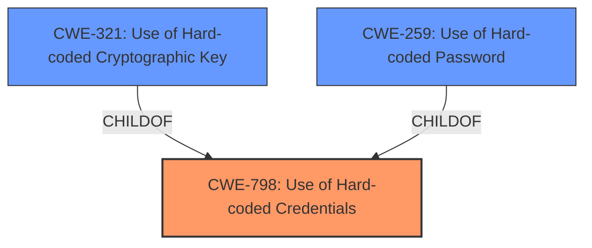

# Analysis Report for CVE-2022-20868

# Vulnerability Analysis Report: CVE-2022-20868

## Description


## Analysis (with Relationship Data)

# Summary
| CWE ID | CWE Name | Confidence | CWE Abstraction Level | CWE Vulnerability Mapping Label | CWE-Vulnerability Mapping Notes |
|---|---|---|---|---|---|
| CWE-798 | Use of Hard-coded Credentials | 1.0 | Base | Allowed | Primary CWE |
| CWE-321 | Use of Hard-coded Cryptographic Key | 0.8 | Variant | Allowed | Secondary Candidate |
| CWE-259 | Use of Hard-coded Password | 0.7 | Variant | Allowed | Secondary Candidate |

## Evidence and Confidence

*   **Confidence Score:** 0.9
*   **Evidence Strength:** HIGH

## Relationship Analysis
The primary CWE is CWE-798 (**Use of Hard-coded Credentials**) at the Base level. CWE-321 (**Use of Hard-coded Cryptographic Key**) and CWE-259 (**Use of Hard-coded Password**) are both variants of CWE-798. Since the vulnerability specifically mentions the **hardcoded value to encrypt a token**, CWE-321 is a strong secondary candidate.



## Vulnerability Chain
The chain of events is as follows:
1.  **Root Cause:** The application uses a **hardcoded value to encrypt a token used for certain APIs calls** (CWE-798).
2.  This allows an attacker to craft HTTP requests and impersonate other users.
3.  **Impact:** An attacker can elevate privileges and execute commands with the privileges of the impersonated user account.

## Summary of Analysis
The initial analysis identified the **root cause** as the usage of a **hardcoded value to encrypt a token used for certain APIs calls**. The retriever results also pointed towards CWE-798 (**Use of Hard-coded Credentials**) as the best match. The vulnerability description and CVE reference content summary provides strong evidence for this.

> Vulnerability Description Key Phrases:
> -   **rootcause:** **hardcoded value to encrypt a token used for certain APIs calls**
> CVE Reference Links Content Summary:
> -   **Root Cause of Vulnerability:**
> The vulnerability stems from the use of a hard-coded value to encrypt a token used for certain API calls within the next-generation UI management interface of the affected Cisco products.

CWE-798 is at the Base level of abstraction and accurately represents the weakness. While CWE-321 (**Use of Hard-coded Cryptographic Key**) is a more specific variant, it only focuses on the cryptographic key aspect, whereas CWE-798 covers the broader issue of hard-coded credentials. Since the hardcoded value is used to encrypt a token, I'm including CWE-321 as a secondary candidate, and CWE-259 as a tertiary candidate.

Relevant CWE Information:

# Enhanced Context (25 CWEs)
The following CWEs were identified as potentially relevant to this vulnerability:

## CWE-798: Use of Hard-coded Credentials
**Abstraction:** Base
**Similarity Score**: 8824.29
**Source**: sparse

**Description**:
The product contains hard-coded credentials, such as a password or cryptographic key.

**Mapping Guidance**:
- Usage: Allowed
- Rationale: This CWE entry is at the Base level of abstraction, which is a preferred level of abstraction for mapping to the root causes of vulnerabilities.

## CWE-321: Use of Hard-coded Cryptographic Key
**Abstraction:** Variant
**Similarity Score**: 8290.65
**Source**: sparse

**Description**:
The use of a hard-coded cryptographic key significantly increases the possibility that encrypted data may be recovered.

**Mapping Guidance**:
- Usage: Allowed
- Rationale: This CWE entry is at the Variant level of abstraction, which is a preferred level of abstraction for mapping to the root causes of vulnerabilities.

## CWE-259: Use of Hard-coded Password
**Abstraction:** Variant
**Similarity Score**: 8523.01
**Source**: sparse

**Description**:
The product contains a hard-coded password, which it uses for its own inbound authentication or for outbound communication to external components.

**Mapping Guidance**:
- Usage: Allowed
- Rationale: This CWE entry is at the Variant level of abstraction, which is a preferred level of abstraction for mapping to the root causes of vulnerabilities.


## CWE Relationship Analysis

Current CWEs represent these abstraction levels: .


### Vulnerability Chain Analysis

**Chain starting from CWE-259:**
- 259 (Use of Hard-coded Password) - ROOT


**Chain starting from CWE-321:**
- 321 (Use of Hard-coded Cryptographic Key) - ROOT


### CWE Relationship Diagram

```mermaid
graph TD
    classDef primary fill:#f96,stroke:#333,stroke-width:2px
    classDef secondary fill:#69f,stroke:#333
    classDef tertiary fill:#9e9,stroke:#333
```


*Report generated on 2025-03-31 01:54:32*
