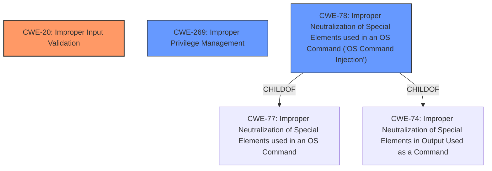

# Raw Analyzer Response for CVE-2022-20909

# Summary
| CWE ID | CWE Name | Confidence | CWE Abstraction Level | CWE Vulnerability Mapping Label | CWE-Vulnerability Mapping Notes |
|---|---|---|---|---|---|
| CWE-20 | Improper Input Validation | 0.9 | Class | Primary | Discouraged |
| CWE-269 | Improper Privilege Management | 0.7 | Class | Secondary | Discouraged |
| CWE-78 | Improper Neutralization of Special Elements used in an OS Command ('OS Command Injection') | 0.6 | Base | Secondary | Allowed |

## Evidence and Confidence

*   **Confidence Score:** 0.8
*   **Evidence Strength:** HIGH

## Relationship Analysis
The primary CWE selected is CWE-20, **Improper Input Validation**, because the vulnerability description explicitly states **insufficient input validation** as the root cause. While CWE-20 is a Class-level CWE and typically discouraged, it directly reflects the identified root cause. CWE-269, **Improper Privilege Management**, is considered as a secondary CWE because the impact of the vulnerability is privilege escalation. CWE-78, **Improper Neutralization of Special Elements used in an OS Command ('OS Command Injection')**, is added as another secondary CWE because the vulnerability involves CLI command execution. The hierarchical relationships influenced the decision to prioritize the root cause (CWE-20) and then consider the impact (CWE-269) and the execution context (CWE-78).

## Vulnerability Chain
The chain of root cause and weaknesses is as follows:
  1.  **Root Cause:** **Insufficient input validation** (CWE-20) in CLI command execution.
  2.  **Weakness:** The malicious payload is not neutralized, leading to potential command injection.
  3.  **Impact:** Privilege escalation to root, granting the attacker full administrative control.

## Summary of Analysis
The analysis is based on the provided evidence, which clearly states that the vulnerability is due to **insufficient input validation** during CLI command execution. The "Vulnerability Description Key Phrases" section explicitly identifies "**insufficient input validation**" as the root cause. The "CVE Reference Links Content Summary" section also confirms that the root cause is **improper input validation** that allows a malicious payload to be injected into CLI commands.

The graph relationships influenced the decision to map the vulnerability to CWE-20, because the root cause is directly related to input validation. While CWE-20 is a Class-level CWE, it is the most accurate representation of the root cause based on the available evidence. The other considered CWEs, such as CWE-269 and CWE-78, are added as secondary issues because they represent the impact (privilege escalation) and the method of exploitation (command injection) respectively.

CWE-20 is selected even though it is discouraged because the vulnerability description explicitly names **insufficient input validation** as the root cause. While more specific CWEs exist, the available information does not provide enough detail to pinpoint the exact type of input validation error. Therefore, CWE-20 is the most appropriate choice.

Other CWEs Considered and Not Used:

*   CWE-78: **Improper Neutralization of Special Elements used in an OS Command ('OS Command Injection')**: While the vulnerability involves CLI command execution, the primary issue is the **lack of input validation**, which could then lead to command injection. Therefore, CWE-78 is added as a secondary issue.
*   CWE-269: **Improper Privilege Management**: The impact of the vulnerability is privilege escalation, but the root cause is **insufficient input validation**. Therefore, CWE-269 is added as a secondary issue.
*   CWE-22: **Improper Limitation of a Pathname to a Restricted Directory ('Path Traversal')**: This CWE is related to path traversal vulnerabilities, but the description doesn't mention path manipulation, making it less relevant.
*   CWE-284: **Improper Access Control**: This is a very high-level CWE (Pillar) and not specific enough to describe the vulnerability.
*   CWE-1284: **Improper Validation of Specified Quantity in Input**: This CWE focuses on the validation of quantities, which is not explicitly mentioned in the vulnerability description.
*   CWE-25: **Path Traversal: '/../filedir'**: This is related to path traversal vulnerabilities, but the description doesn't mention path manipulation, making it less relevant.