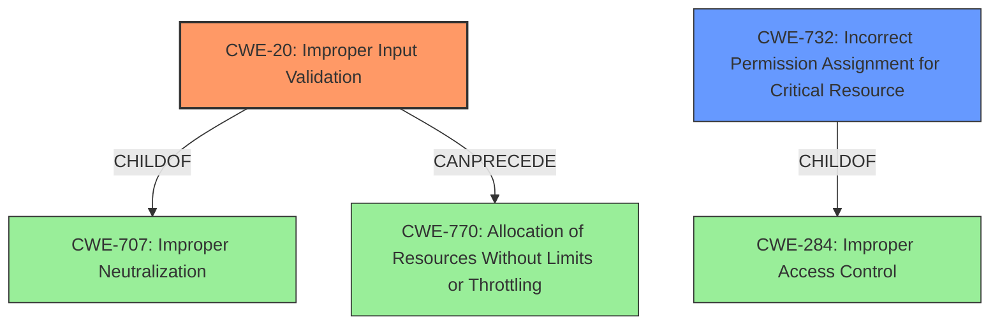

# Raw Analyzer Response for CVE-2022-20913

# Summary
| CWE ID    | CWE Name                                                                                                                   | Confidence | CWE Abstraction Level | CWE Vulnerability Mapping Label | CWE-Vulnerability Mapping Notes |
| --------- | -------------------------------------------------------------------------------------------------------------------------- | ---------- | ----------------------- | ------------------------------- | ------------------------------- |
| CWE-20    | Improper Input Validation                                                                                                   | 0.7        | Class                   | Primary                         | Discouraged                    |
| CWE-732   | Incorrect Permission Assignment for Critical Resource | 0.4        | Base                   | Secondary                      | Discouraged                    |

## Evidence and Confidence

*   **Confidence Score:** 0.7
*   **Evidence Strength:** MEDIUM

## Relationship Analysis
The primary CWE is CWE-20 **Improper Input Validation**, which is a class-level CWE. While the description mentions **insufficient input validation**, the lack of specifics makes it challenging to pinpoint a more specific Base or Variant. CWE-20 has many potential child CWEs. The relationship to CWE-732 **Incorrect Permission Assignment for Critical Resource** exists because the vulnerability involves writing arbitrary files on the system, which could be related to incorrect permission assignments, but is less direct than the **improper input validation**.

## Vulnerability Chain
The vulnerability chain starts with **insufficient input validation** (CWE-20), which leads to the ability to upload a crafted file and overwrite arbitrary files on the affected device. The chain is relatively short:

1.  **Insufficient Input Validation** (CWE-20)
2.  Arbitrary File Overwrite

## Summary of Analysis
The initial assessment identified **insufficient input validation** as the root cause, aligning with the provided vulnerability description. The evidence points to a weakness in how the Cisco Nexus Dashboard handles uploaded files, specifically that it does not adequately validate the file contents before allowing them to be written to the system. The retriever results support the selection of CWE-20 and other related CWEs such as CWE-22 **Improper Limitation of a Pathname to a Restricted Directory ('Path Traversal')**, CWE-78 **Improper Neutralization of Special Elements used in an OS Command ('OS Command Injection')**, and CWE-1284 **Improper Validation of Specified Quantity in Input**, but those are not as strong a fit as CWE-20, given the available information.

The relationships between CWEs were also considered. CWE-20 is a class-level CWE, and the mapping guidance discourages its use when more specific CWEs are available. However, based on the provided information, it is difficult to determine the exact type of input validation that is missing. Therefore, CWE-20 is the most appropriate choice.

The selection of CWE-20 is based on the evidence provided in the vulnerability description and CVE reference links content summary, specifically the phrase "**insufficient input validation** in the web-based management interface of Cisco Nexus Dashboard." The high-level nature of this description limits the ability to select a more specific CWE.

Relevant CWE Information:

# Enhanced Context (25 CWEs)

## CWE-20: Improper Input Validation
**Abstraction:** Class
**Status:** Stable

### Description
The product receives input or data, but it does
        not validate or incorrectly validates that the input has the
        properties that are required to process the data safely and
        correctly.

### Extended Description
Input validation is a frequently-used technique for checking potentially dangerous inputs in order to ensure that the inputs are safe for processing within the code, or when communicating with other components. When software does not validate input properly, an attacker is able to craft the input in a form that is not expected by the rest of the application. This will lead to parts of the system receiving unintended input, which may result in altered control flow, arbitrary control of a resource, or arbitrary code execution.

### Mapping Guidance
**Usage:** Discouraged
**Rationale:** CWE-20 is commonly misused in low-information vulnerability reports when lower-level CWEs could be used instead, or when more details about the vulnerability are available [REF-1287]. It is not useful for trend analysis. It is also a level-1 Class (i.e., a child of a Pillar).

## CWE-732: Incorrect Permission Assignment for Critical Resource
**Abstraction:** Base
**Status:** Stable

### Description
The product does not assign the correct permissions to a critical resource, which allows unintended actors to gain inappropriate access.

### Extended Description
This weakness can be caused by the product explicitly setting permissions for resources, or by using default permissions without considering their security implications.

### Mapping Guidance
**Usage:** Allowed
**Rationale:** This CWE entry is at the Base level of abstraction, which is a preferred level of abstraction for mapping to the root causes of vulnerabilities.

### Summary of other considered CWEs:

*   **CWE-78 Improper Neutralization of Special Elements used in an OS Command ('OS Command Injection')**: Considered but not used because the vulnerability description does not explicitly mention OS command injection.
*   **CWE-22 Improper Limitation of a Pathname to a Restricted Directory ('Path Traversal')**: Considered but not used because the vulnerability description does not explicitly mention path traversal.
*   **CWE-770 Allocation of Resources Without Limits or Throttling**: Considered but not used because the vulnerability description does not explicitly mention resource allocation issues.
*   **CWE-94 Improper Control of Generation of Code ('Code Injection')**: Considered but not used because the vulnerability description does not explicitly mention code injection.

I'm overriding the general mapping guidance to select CWE-20, despite it being discouraged, because the available evidence is insufficient to pinpoint a more specific CWE. The vulnerability is due to **insufficient input validation**, but the exact nature of the missing validation is not specified.