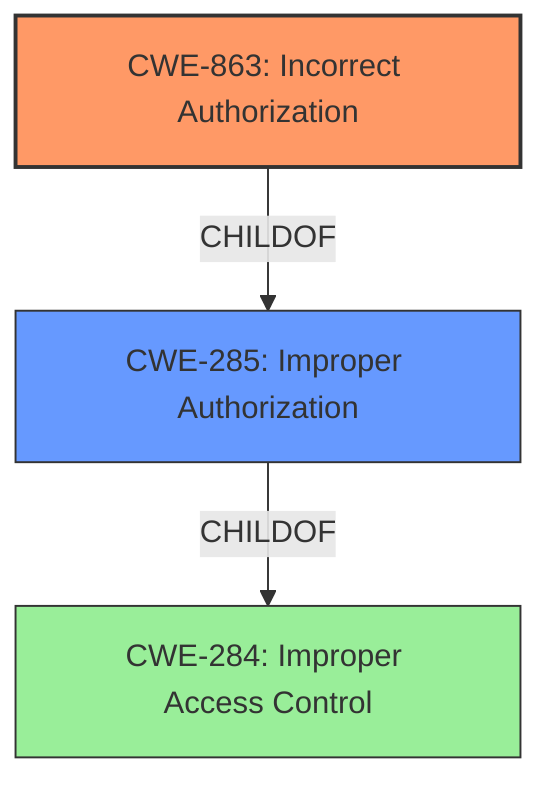

# Enhanced Analysis for CVE-2022-20921

# Summary
| CWE ID    | CWE Name                                                                   | Confidence | CWE Abstraction Level | CWE Vulnerability Mapping Label | CWE-Vulnerability Mapping Notes |
| :-------- | :------------------------------------------------------------------------- | :--------- | :-------------------- | :------------------------------ | :------------------------------ |
| CWE-863   | Incorrect Authorization                                                    | 0.9        | Class                 | Primary                         | Allowed-with-Review           |
| CWE-285   | Improper Authorization                                                     | 0.7        | Class                 | Secondary                       | Discouraged                   |

## Evidence and Confidence

*   **Confidence Score:** 0.9
*   **Evidence Strength:** HIGH

## Relationship Analysis
The primary CWE, CWE-863 **Incorrect Authorization**, is a child of CWE-285 **Improper Authorization**, which in turn is a child of CWE-284 **Improper Access Control**. This indicates a hierarchical relationship where CWE-863 is more specific than CWE-285 and CWE-284. Given the vulnerability description explicitly mentions **improper authorization**, and the available information does not allow us to determine the exact nature of the **incorrect authorization**, CWE-863 is the most suitable choice.


## Vulnerability Chain
The vulnerability chain starts with **improper authorization** (CWE-863) on specific APIs, leading to privilege escalation. The chain is relatively short and direct:

1.  **Root Cause:** **Improper Authorization** (CWE-863).
2.  **Impact:** Privilege escalation, allowing an attacker with non-Administrator privileges to gain Administrator privileges.

## Summary of Analysis
The analysis indicates that the primary weakness is **improper authorization** on specific APIs, which leads to privilege escalation. The vulnerability description and CVE Reference Links Content Summary provide sufficient evidence to support this classification.
The vulnerability description explicitly states: "This vulnerability is due to **improper authorization** on specific APIs."
The CVE Reference Links Content Summary reiterates: "The vulnerability is due to **improper authorization** on specific APIs in Cisco ACI Multi-Site Orchestrator (MSO)."
Based on the evidence, CWE-863 **Incorrect Authorization** is the most appropriate choice as it is a more specific child of the higher-level CWE-285 **Improper Authorization**. While CWE-285 is also a relevant candidate, CWE-863 offers a more precise classification of the root cause.

Other CWEs considered but not used:

*   CWE-284 **Improper Access Control**: This is a high-level pillar, and while relevant, it's too broad given the more specific evidence of **improper authorization**.
*   CWE-269 **Improper Privilege Management**: While privilege escalation is the impact, the root cause is the **improper authorization**, not the management of privileges themselves.
*   CWE-20 **Improper Input Validation**: There is no information about input validation errors in the description.
*   CWE-250 **Execution with Unnecessary Privileges**: This is not about the program running with more privileges than necessary.
*   CWE-22 **Improper Limitation of a Pathname to a Restricted Directory ('Path Traversal')**: This is not related to path traversal.
*   CWE-306 **Missing Authentication for Critical Function**: The vulnerability is about **improper authorization**, not missing authentication, as the attacker is authenticated but has limited privileges.
*   CWE-287 **Improper Authentication**: The vulnerability is not related to authentication.
*   CWE-620 **Unverified Password Change**: This is not related to password changes.

The selected CWE is at the optimal level of specificity because it directly reflects the root cause stated in the vulnerability description and CVE summary: **improper authorization** on specific APIs.


## CWE Relationship Analysis

Current CWEs represent these abstraction levels: .


### Vulnerability Chain Analysis

**Chain starting from CWE-250:**
- 250 (Execution with Unnecessary Privileges) - ROOT


**Chain starting from CWE-20:**
- 20 (Improper Input Validation) - ROOT


### CWE Relationship Diagram

```mermaid
graph TD
    classDef primary fill:#f96,stroke:#333,stroke-width:2px
    classDef secondary fill:#69f,stroke:#333
    classDef tertiary fill:#9e9,stroke:#333
```