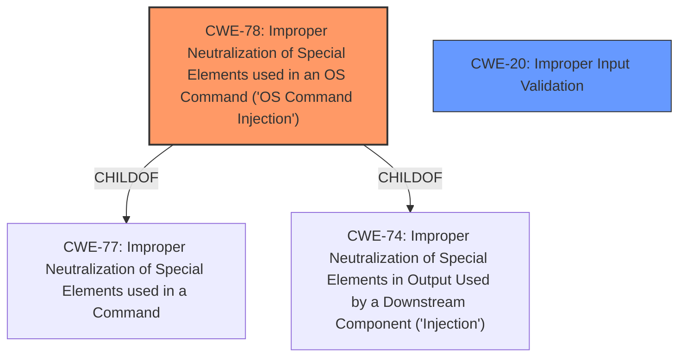

# Enhanced Analysis for CVE-2022-20926

# Summary
| CWE ID | CWE Name | Confidence | CWE Abstraction Level | CWE Vulnerability Mapping Label | CWE-Vulnerability Mapping Notes |
|---|---|---|---|---|---|
| CWE-78 | Improper Neutralization of Special Elements used in an OS Command ('OS Command Injection') | 1.0 | Base | Primary | Allowed |
| CWE-20 | Improper Input Validation | 0.7 | Class | Secondary | Discouraged |

## Evidence and Confidence

*   **Confidence Score:** 0.9
*   **Evidence Strength:** HIGH

## Relationship Analysis
The primary CWE is CWE-78, which is a base-level CWE and a child of CWE-77 (Improper Neutralization of Special Elements used in a Command ('Command Injection')) and CWE-74 (Improper Neutralization of Special Elements in Output Used by a Downstream Component ('Injection')). CWE-20 is a class-level CWE that represents improper input validation.



## Vulnerability Chain
The vulnerability chain starts with **insufficient validation of user-supplied parameters**, which leads to the ability to inject OS commands.
  - **Root Cause:** **Insufficient validation of user-supplied parameters** (CWE-20)
  - **Weakness:** Improper Neutralization of Special Elements used in an OS Command (CWE-78)
  - **Impact:** Execution of arbitrary commands on the underlying operating system.

## Summary of Analysis
The analysis indicates that the primary weakness is CWE-78, which directly addresses the ability to execute arbitrary OS commands due to **insufficient validation of user-supplied parameters**. The vulnerability description key phrases mention "**insufficient validation of user-supplied parameters**" as the root cause, which aligns with CWE-78 as well as CWE-20.

The "CVE Reference Links Content Summary" also supports this:
```
{
      "cve": "CVE-2022-20926",
      "root_cause": "Insufficient validation of user-supplied parameters for certain API endpoints in the web management interface of Cisco Firepower Management Center (FMC) Software.",
      "weaknesses": [
        "CWE-77: Improper Neutralization of Special Elements used in a Command ('Command Injection')"
      ],
```

The retriever results also list CWE-78 as a potential match.

CWE-20 is considered as a secondary weakness because the core issue is the lack of proper neutralization of special elements in OS commands, which CWE-78 accurately captures. While **insufficient validation of user-supplied parameters** is a contributing factor, CWE-78 represents the direct cause of the vulnerability. CWE-20 is a class-level CWE and the mapping guidance discourages its use when more specific CWEs are available.

The selection of CWE-78 is at the optimal level of specificity because it directly describes the vulnerability's root cause and impact.

Relevant CWE Information:

# Enhanced Context (25 CWEs)

## CWE-78: Improper Neutralization of Special Elements used in an OS Command ('OS Command Injection')
**Technical Explanation:**
The vulnerability allows an attacker to execute arbitrary OS commands by sending crafted input to an affected API endpoint. This is due to the software's failure to properly neutralize special elements in the input, which can then be interpreted as commands by the operating system.
**Security Implications:**
An attacker can execute arbitrary commands on the device with low system privileges, potentially leading to complete system compromise.
**Relationships:**
CWE-78 is a base-level CWE and a child of CWE-77 and CWE-74.
**Mapping Guidance Influence:**
The MITRE mapping guidance recommends using base-level CWEs when available, which supports the selection of CWE-78.
**Primary/Secondary:**
Primary

## CWE-20: Improper Input Validation
**Technical Explanation:**
The vulnerability is due to **insufficient validation of user-supplied parameters**. This means that the software does not properly check if the input meets the expected format or constraints, which can lead to unexpected behavior and security vulnerabilities.
**Security Implications:**
**Insufficient validation** can allow attackers to inject malicious input that can compromise the system.
**Relationships:**
CWE-20 is a class-level CWE.
**Mapping Guidance Influence:**
The MITRE mapping guidance discourages using CWE-20 when more specific CWEs are available.
**Primary/Secondary:**
Secondary


## CWE Relationship Analysis

Current CWEs represent these abstraction levels: .


### Vulnerability Chain Analysis

**Chain starting from CWE-78:**
- 78 (Improper Neutralization of Special Elements used in an OS Command ('OS Command Injection')) - ROOT


**Chain starting from CWE-77:**
- 77 (Improper Neutralization of Special Elements used in a Command ('Command Injection')) - ROOT


### CWE Relationship Diagram

```mermaid
graph TD
    classDef primary fill:#f96,stroke:#333,stroke-width:2px
    classDef secondary fill:#69f,stroke:#333
    classDef tertiary fill:#9e9,stroke:#333
```