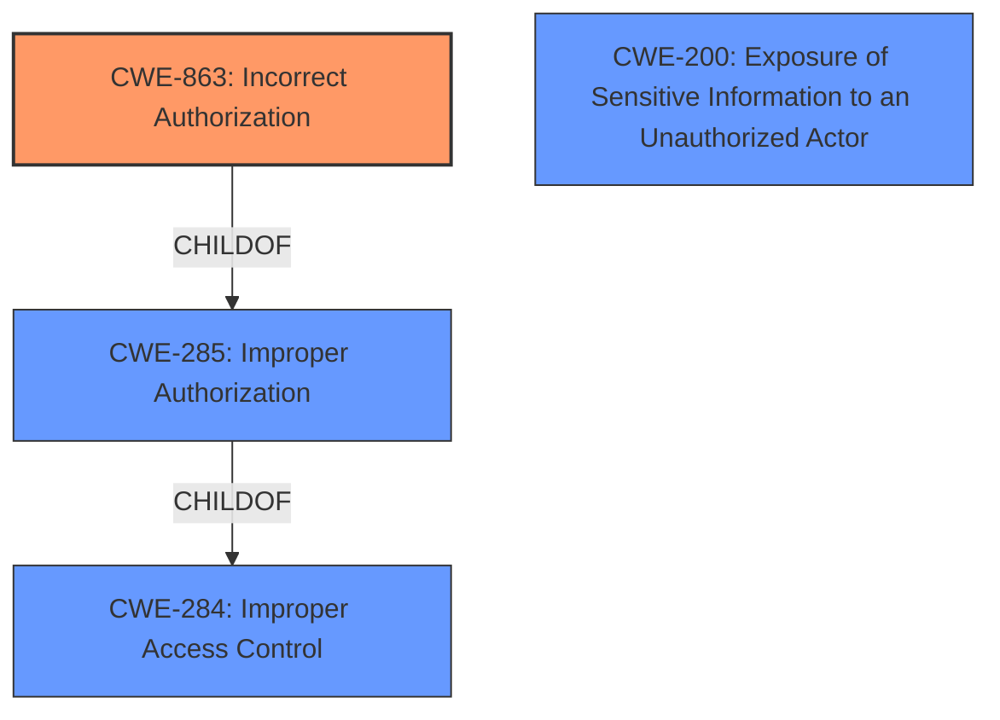

# Raw Analyzer Response for CVE-2022-20942

# Summary
| CWE ID  | CWE Name | Confidence | CWE Abstraction Level | CWE Vulnerability Mapping Label | CWE-Vulnerability Mapping Notes |
|-----------------|-------------------------------------------------|-------------------|--------------------------|---------------------------------|-----------------------------------|
| CWE-863 | Incorrect Authorization | 0.9 | Class | Primary | Allowed-with-Review |
| CWE-200 | Exposure of Sensitive Information to an Unauthorized Actor | 0.5 | Class | Secondary | Discouraged |

## Evidence and Confidence

*   **Confidence Score:** 0.7
*   **Evidence Strength:** HIGH

## Relationship Analysis
The primary CWE selected is CWE-863, Incorrect Authorization, which is a child of CWE-285, Improper Authorization, and CWE-284, Improper Access Control. This indicates a hierarchical relationship where CWE-863 is a more specific type of authorization issue. CWE-200, Exposure of Sensitive Information to an Unauthorized Actor, is a related impact but less directly indicative of the root cause. The abstraction levels influenced the decision by favoring the more specific Class-level CWE-863 over the higher-level Pillar CWE-284.

## Vulnerability Chain
The vulnerability chain starts with **weak enforcement of back-end authorization checks** (CWE-863), which leads to an attacker being able to retrieve sensitive information (CWE-200). The initial flaw is the **incorrect authorization**, and the final impact is the **exposure of sensitive information**.

## Summary of Analysis
The initial analysis focused on the **root cause**, which is the **"weak enforcement of back-end authorization checks."** This aligns well with CWE-863, Incorrect Authorization, which describes situations where authorization checks are not correctly performed. The evidence from the vulnerability description and the CVE Reference Links Content Summary both support this. The CVE states: "The vulnerability stems from **weak enforcement of back-end authorization checks** within the web-based management interface of affected Cisco products." The relationship analysis also supports this decision, as CWE-863 is a more specific child of the more general CWE-285 (Improper Authorization) and CWE-284 (Improper Access Control).

CWE-200, Exposure of Sensitive Information to an Unauthorized Actor, was considered but classified as a secondary concern. While the impact of the vulnerability is information disclosure, the **root cause** is the **authorization failure**. CWE-200 is also discouraged for representing root causes.

The selected CWEs are at the optimal level of specificity because CWE-863 directly addresses the **incorrect authorization mechanism**, while CWE-200 describes the impact but not the underlying weakness. The decision is primarily based on the provided evidence, the retriever results, and the mapping guidance, which favors more specific CWEs for root causes.