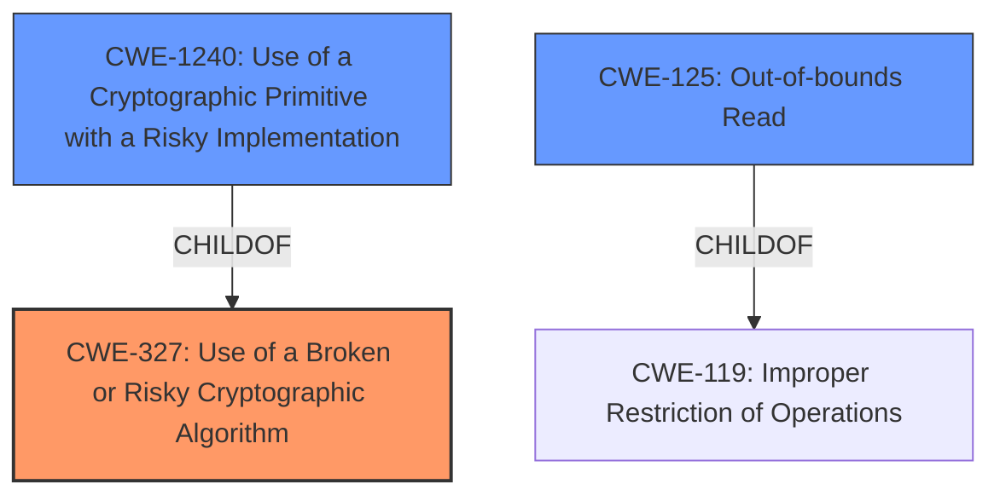

# Raw Analyzer Response for CVE-2022-2097

# Summary
| CWE ID | CWE Name | Confidence | CWE Abstraction Level | CWE Vulnerability Mapping Label | CWE-Vulnerability Mapping Notes |
|---|---|---|---|---|---|
| CWE-327 | Use of a Broken or Risky Cryptographic Algorithm | 0.9 | Class | Primary | Allowed-with-Review |
| CWE-1240 | Use of a Cryptographic Primitive with a Risky Implementation | 0.8 | Base | Secondary | Allowed |
| CWE-125 | Out-of-bounds Read | 0.6 | Base | Secondary | Allowed |

## Evidence and Confidence

*   **Confidence Score:** 0.8
*   **Evidence Strength:** HIGH

## Relationship Analysis
The primary relationship that impacted the decision was the parent-child relationship between CWE-327 (Use of a Broken or Risky Cryptographic Algorithm) and CWE-1240 (Use of a Cryptographic Primitive with a Risky Implementation). CWE-1240 is a more specific case of CWE-327, indicating a risky implementation of a cryptographic algorithm. Also, the relationship between CWE-125 and CWE-119 was important. CWE-125 is a child of CWE-119 (Improper Restriction of Operations Within the Bounds of a Memory Buffer), because an out-of-bounds read is a specific type of memory buffer error.

## Vulnerability Chain
The vulnerability chain starts with the **incomplete encryption** due to a flaw in the AES OCB mode implementation. This leads to the potential disclosure of sensitive information, specifically sixteen bytes of data.

## Summary of Analysis
The initial assessment considered the "incomplete encryption" aspect and the potential disclosure of sixteen bytes of data. The retriever results suggested CWE-327 (Use of a Broken or Risky Cryptographic Algorithm), CWE-1204 (Generation of Weak Initialization Vector (IV)), and CWE-125 (Out-of-bounds Read).

The primary focus is on the **weakness** in the AES OCB mode implementation. The CVE description states that "AES OCB mode for 32-bit x86 platforms using the AES-NI assembly optimized implementation will not encrypt the entirety of the data under some circumstances." This points to a flaw in the cryptographic algorithm's implementation, making CWE-327 (Use of a Broken or Risky Cryptographic Algorithm) the most relevant primary CWE.

The "CVE Reference Links Content Summary" provides strong evidence, stating, "The AES OCB mode implementation for 32-bit x86 platforms with AES-NI assembly optimization does not correctly encrypt all data under certain conditions." This clearly indicates a problem with the algorithm's implementation, supporting the selection of CWE-327.

CWE-1240 (Use of a Cryptographic Primitive with a Risky Implementation) is also applicable because it is a child of CWE-327 and represents a more specific scenario where the cryptographic primitive has a non-standard, unproven, or disallowed implementation. This aligns with the fact that the AES-NI assembly optimized implementation has a flaw.

CWE-125 (Out-of-bounds Read) is considered because the vulnerability description mentions that "This could reveal sixteen bytes of data that was preexisting in the memory that wasn't written." This suggests that the incomplete encryption leads to reading data outside the intended buffer.

The selected CWEs are at the optimal level of specificity because they address the root cause (flawed cryptographic implementation) and a potential consequence (out-of-bounds read leading to information disclosure).

Relevant CWE Information:

# Enhanced Context (25 CWEs)

## CWE-327: Use of a Broken or Risky Cryptographic Algorithm
**Abstraction:** Class
**Status:** Draft

### Description
The product uses a broken or risky cryptographic algorithm or protocol.

### Extended Description
Cryptographic algorithms are the methods by which data is scrambled to prevent observation or influence by unauthorized actors. Insecure cryptography can be exploited to expose sensitive information, modify data in unexpected ways, spoof identities of other users or devices, or other impacts.

### Observed Examples
- **CVE-2022-30273:** SCADA-based protocol supports a legacy encryption mode that uses Tiny Encryption Algorithm (TEA) in ECB mode, which leaks patterns in messages and cannot protect integrity

## CWE-1240: Use of a Cryptographic Primitive with a Risky Implementation
**Abstraction:** Base
**Status:** Draft

### Description
To fulfill the need for a cryptographic primitive, the product implements a cryptographic algorithm using a non-standard, unproven, or disallowed/non-compliant cryptographic implementation.

### Extended Description
Cryptographic protocols and systems depend on cryptographic primitives (and associated algorithms) as their basic building blocks. Some common examples of primitives are digital signatures, one-way hash functions, ciphers, and public key cryptography; however, the notion of "primitive" can vary depending on point of view. See "Terminology Notes" for further explanation of some concepts.

## CWE-1204: Generation of Weak Initialization Vector (IV)
This CWE was considered because some cryptographic vulnerabilities involve weak IV generation. However, this vulnerability is not directly related to IVs.

## CWE-125: Out-of-bounds Read
**Abstraction:** Base
**Status:** Draft

### Description
The product reads data past the end, or before the beginning, of the intended buffer.

### Extended Description
Not provided

### Observed Examples
- **CVE-2023-1018:** The reference implementation code for a Trusted Platform Module does not implement length checks on data, allowing for an attacker to read 2 bytes past the end of a buffer.

## CWE-329: Generation of Predictable IV with CBC Mode
This CWE was considered because some cryptographic vulnerabilities involve predictable IVs with CBC mode. However, this vulnerability is not directly related to CBC mode or predictable IVs.

## CWE-203: Observable Discrepancy
This CWE was considered because the **incomplete encryption** could potentially lead to observable discrepancies. However, the primary issue is the flawed encryption itself, not the observable discrepancy.

## CWE-780: Use of RSA Algorithm without OAEP
This CWE is specific to RSA algorithms and the absence of OAEP padding. The vulnerability involves AES OCB mode, so this CWE is not applicable.

## CWE-208: Observable Timing Discrepancy
This CWE relates to timing discrepancies that reveal information. While the vulnerability might have timing implications, the primary issue is the **incomplete encryption**, not the timing.

## CWE-295: Improper Certificate Validation
This CWE relates to certificate validation issues. The vulnerability is not related to certificate validation, so this CWE is not applicable.

## CWE-321: Use of Hard-coded Cryptographic Key
This CWE relates to hard-coded cryptographic keys. The vulnerability does not involve hard-coded keys, so this CWE is not applicable.