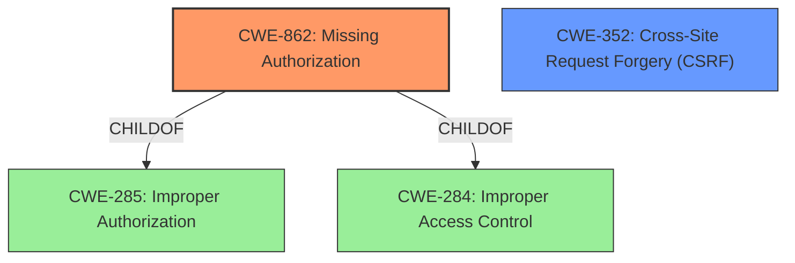

# Analysis for CVE-2022-2108

# Summary

| CWE ID | CWE Name | Confidence | CWE Abstraction Level | CWE Vulnerability Mapping Label | CWE-Vulnerability Mapping Notes |
|---|---|---|---|---|---|
| CWE-862 | Missing Authorization | 0.9 | Class | Primary | Allowed-with-Review |
| CWE-352 | Cross-Site Request Forgery (CSRF) | 0.7 | Compound | Secondary | Allowed |

## Evidence and Confidence

*   **Confidence Score:** 0.8
*   **Evidence Strength:** HIGH

## Relationship Analysis

The primary relationship influencing the decision is that CWE-862 [CWE-862: Missing Authorization] is a child of CWE-285 [CWE-285: Improper Authorization] and CWE-284 [CWE-284: Improper Access Control]. Given the specific context of **missing capability checks**, CWE-862 provides a more precise classification than its parents. CWE-352 [CWE-352: Cross-Site Request Forgery (CSRF)] is a compound weakness that requires multiple conditions to be met, including **improper nonce checks**, making it a relevant, secondary consideration.

## Vulnerability Chain

The vulnerability chain starts with the **missing capability checks** and **improper nonce checks**, leading to unauthorized actions.

1.  **Missing Capability Checks (CWE-862):** The plugin **fails to** verify if the user has the necessary permissions to perform certain actions.
2.  **Improper Nonce Checks (CWE-352):** The plugin **does not properly validate** nonces, which are security tokens designed to prevent CSRF attacks.
3.  **Unauthorized Actions:** Due to the above weaknesses, unauthenticated attackers can modify reviews and plugin settings.

## Summary of Analysis

The initial analysis identified **missing capability checks** as a primary factor, aligning well with CWE-862 [CWE-862: Missing Authorization]. The secondary consideration was **improper nonce checks**, which is a requirement for CWE-352 [CWE-352: Cross-Site Request Forgery (CSRF)].

The vulnerability description states: "The plugin ... is vulnerable to unauthorized settings changes and review modification due to **missing capability checks and improper nonce checks** in several functions related to said actions..." This provides direct evidence for both CWE-862 [CWE-862: Missing Authorization] (due to **missing capability checks**) and CWE-352 [CWE-352: Cross-Site Request Forgery (CSRF)] (due to **improper nonce checks**).

The retriever results and relationship analysis further support this selection. CWE-862 [CWE-862: Missing Authorization] is a child of CWE-285 [CWE-285: Improper Authorization] and CWE-284 [CWE-284: Improper Access Control], providing a more specific classification.

The selected CWEs are at an optimal level of specificity, with CWE-862 [CWE-862: Missing Authorization] being a Class that directly addresses the **missing capability checks**, and CWE-352 [CWE-352: Cross-Site Request Forgery (CSRF)] being a compound weakness that addresses the **improper nonce checks**.

Relevant CWE Information:

# Enhanced Context (25 CWEs)

## CWE-639: Authorization Bypass Through User-Controlled Key
**Abstraction Level**: Base
**Similarity Score**: 0.78
**Source**: dense

**Description**:
The system's authorization functionality does not prevent one user from gaining access to another user's data or record by modifying the key value identifying the data.

**Mapping Guidance**:
- Usage: Allowed
- Rationale: This CWE entry is at the Base level of abstraction, which is a preferred level of abstraction for mapping to the root causes of vulnerabilities.

*Not Used:* While authorization bypass is a component of the vulnerability, the bypass is not directly caused by a user-controlled key. Instead, it's due to **missing capability checks** and **improper nonce checks**.

## CWE-472: External Control of Assumed-Immutable Web Parameter
**Abstraction Level**: Base
**Similarity Score**: 0.77
**Source**: dense

**Description**:
The web application does not sufficiently verify inputs that are assumed to be immutable but are actually externally controllable, such as hidden form fields.

**Mapping Guidance**:
- Usage: Allowed
- Rationale: This CWE entry is at the Base level of abstraction, which is a preferred level of abstraction for mapping to the root causes of vulnerabilities.

*Not Used:* While the vulnerability could involve external control of parameters, the root cause is more accurately described by **missing capability checks** and **improper nonce checks**, rather than a failure to verify assumed-immutable parameters.

## CWE-1220: Insufficient Granularity of Access Control
**Abstraction Level**: Base
**Similarity Score**: 0.77
**Source**: dense

**Description**:
The product implements access controls via a policy or other feature with the intention to disable or restrict accesses (reads and/or writes) to assets in a system from untrusted agents. However, implemented access controls lack required granularity, which renders the control policy too broad because it allows accesses from unauthorized agents to the security-sensitive assets.

**Mapping Guidance**:
- Usage: Allowed
- Rationale: This CWE entry is at the Base level of abstraction, which is a preferred level of abstraction for mapping to the root causes of vulnerabilities.

*Not Used:* The primary issue is the **missing capability checks**, not insufficient granularity of existing access controls.

## CWE-807: Reliance on Untrusted Inputs in a Security Decision
**Abstraction Level**: Base
**Similarity Score**: 0.76
**Source**: dense

**Description**:
The product uses a protection mechanism that relies on the existence or values of an input, but the input can be modified by an untrusted actor in a way that bypasses the protection mechanism.

**Mapping Guidance**:
- Usage: Allowed
- Rationale: This CWE entry is at the Base level of abstraction, which is a preferred level of abstraction for mapping to the root causes of vulnerabilities.

*Not Used:* While the vulnerability involves untrusted inputs, the core issue is the **missing capability checks** and **improper nonce checks**, rather than the reliance on untrusted inputs in a security decision.

## CWE-274: Improper Handling of Insufficient Privileges
**Abstraction Level**: Base
**Similarity Score**: 0.76
**Source**: dense

**Description**:
The product does not handle or incorrectly handles when it has insufficient privileges to perform an operation, leading to resultant weaknesses.

**Mapping Guidance**:
- Usage: Discouraged
- Rationale: This CWE entry could be deprecated in a future version of CWE.

*Not Used:* This CWE is discouraged and the **missing capability checks** provide a more direct description of the vulnerability.

## CWE-280: Improper Handling of Insufficient Permissions or Privileges
**Abstraction Level**: Base
**Similarity Score**: 0.75
**Source**: dense

**Description**:
The product does not handle or incorrectly handles when it has insufficient privileges to access resources or functionality as specified by their permissions. This may cause it to follow unexpected code paths that may leave the product in an invalid state.

**Mapping Guidance**:
- Usage: Allowed
- Rationale: This CWE entry is at the Base level of abstraction, which is a preferred level of abstraction for mapping to the root causes of vulnerabilities.

*Not Used:* The **missing capability checks** is a more precise description than improper handling of insufficient privileges.

## CWE-424: Improper Protection of Alternate Path
**Abstraction Level**: Class
**Similarity Score**: 0.75
**Source**: dense

**Description**:
The product does not sufficiently protect all possible paths that a user can take to access restricted functionality or resources.

**Mapping Guidance**:
- Usage: Allowed-with-Review
- Rationale: This CWE entry is a Class and might have Base-level children that would be more appropriate

*Not Used:* The vulnerability is not specifically related to alternate paths.

## CWE-799: Improper Control of Interaction Frequency
**Abstraction Level**: Class
**Similarity Score**: 0.74
**Source**: dense

**Description**:
The product does not properly limit the number or frequency of interactions that it has with an actor,