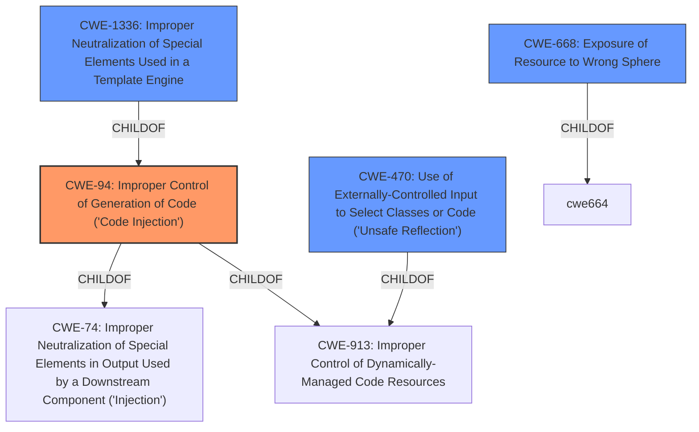

# Analysis Report for CVE-2022-21122

# Vulnerability Analysis Report: CVE-2022-21122

## Description


## Analysis (with Relationship Data)

# Summary
| CWE ID | CWE Name | Confidence | CWE Abstraction Level | CWE Vulnerability Mapping Label | CWE-Vulnerability Mapping Notes |
|---|---|---|---|---|---|
| **CWE-94** | **Improper Control of Generation of Code ('Code Injection')** | 1 | Base | Allowed-with-Review | Primary CWE |
| CWE-470 | Use of Externally-Controlled Input to Select Classes or Code ('Unsafe Reflection') | 0.7 | Base | Allowed | Secondary Candidate |
| CWE-1336 | Improper Neutralization of Special Elements Used in a Template Engine | 0.6 | Base | Allowed | Secondary Candidate |
| CWE-668 | Exposure of Resource to Wrong Sphere | 0.4 | Class | Discouraged | Secondary Candidate |

## Evidence and Confidence

*   **Confidence Score:** 0.8
*   **Evidence Strength:** HIGH

## Relationship Analysis
The primary CWE selected is CWE-94, which represents code injection. This choice is influenced by the vulnerability description explicitly stating arbitrary code execution. CWE-94 is a base-level CWE, providing a good balance of specificity and broad applicability. CWE-94 is a child of CWE-74 and CWE-913, which indicates that it's a more specific type of injection related to code generation. CWE-470, CWE-1336 and CWE-668 were also considered, but ultimately, CWE-94 best fits the root cause.



## Vulnerability Chain
The vulnerability chain starts with the **improper access control** of the JavaScript Math class. This **root cause** allows access to the Function constructor, leading to the **improper control of code generation**, and finally, **arbitrary code execution** (the impact).

## Summary of Analysis
The initial assessment strongly points towards CWE-94 due to the presence of arbitrary code execution. The vulnerability description states "Arbitrary Code Execution when it exposes JavaScripts Math class to the v8 context." The CVE Reference Links Content Summary further reinforces this, mentioning the ability to execute arbitrary JavaScript code.

CWE-94 (Improper Control of Generation of Code ('Code Injection')) is selected as the primary CWE because the vulnerability allows an attacker to inject and execute arbitrary code. The **root cause** is the **improper exposure** of the JavaScript Math class, which then can be used to access the Function constructor. This aligns with the description of CWE-94, which states that the product constructs a code segment using externally-influenced input.

The evidence from the "CVE Reference Links Content Summary" states "The vulnerability stems from the `metacalc` library exposing the JavaScript `Math` class directly to the v8 context. This allows an attacker to use the `Math` class to access the `Function` constructor, which can then be exploited to execute arbitrary JavaScript code."

CWE-470 (Use of Externally-Controlled Input to Select Classes or Code ('Unsafe Reflection')) was considered because the Math class is being used to access the Function constructor, which can be seen as a form of reflection.

CWE-1336 (Improper Neutralization of Special Elements Used in a Template Engine) was considered since the Math class is exposed in a context similar to a template.

CWE-668 (Exposure of Resource to Wrong Sphere) was considered but deemed too high-level and not specific enough to the actual weakness.

CWE-94 is at the optimal level of specificity, representing the core issue of code injection resulting from the **improper access control** and **lack of input validation**.


## CWE Relationship Analysis

Current CWEs represent these abstraction levels: .


### Vulnerability Chain Analysis

**Chain starting from CWE-470:**
- 470 (Use of Externally-Controlled Input to Select Classes or Code ('Unsafe Reflection')) - ROOT


**Chain starting from CWE-913:**
- 913 (Improper Control of Dynamically-Managed Code Resources) - ROOT


### CWE Relationship Diagram

```mermaid
graph TD
    classDef primary fill:#f96,stroke:#333,stroke-width:2px
    classDef secondary fill:#69f,stroke:#333
    classDef tertiary fill:#9e9,stroke:#333
```


*Report generated on 2025-03-30 20:31:04*
