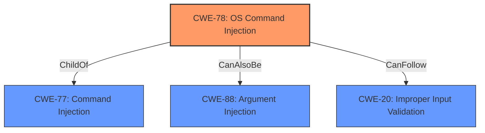

# Enhanced Analysis for CVE-2022-21129

# Summary
| CWE ID | CWE Name | Confidence | CWE Abstraction Level | CWE Vulnerability Mapping Label | CWE-Vulnerability Mapping Notes |
|---|---|---|---|---|---|
| CWE-78 | Improper Neutralization of Special Elements used in an OS Command ('OS Command Injection') | 1.0 | Base | Allowed | Primary CWE |
| CWE-20 | Improper Input Validation | 0.7 | Class | Discouraged | Secondary Candidate |

## Evidence and Confidence

*   **Confidence Score:** 0.9
*   **Evidence Strength:** HIGH

## Relationship Analysis
The primary relationship is that CWE-78 [Improper Neutralization of Special Elements used in an OS Command ('OS Command Injection')] is a child of CWE-77 [Improper Neutralization of Special Elements used in a Command ('Command Injection')]. This indicates that CWE-78 is a more specific type of command injection that is focused on OS commands. CWE-78 also has a peer relationship with CWE-88 [Improper Neutralization of Argument Delimiters in a Command ('Argument Injection')], which is another type of command injection. CWE-20 [Improper Input Validation] can precede CWE-78. The vulnerability's root cause is **improper input sanitization**, directly leading to command injection, making CWE-78 the most accurate and specific classification.



## Vulnerability Chain
The vulnerability chain starts with **improper input sanitization**, which leads to OS command injection.

1.  **Root Cause:** **Improper Input Sanitization**
2.  **Weakness:** OS Command Injection (CWE-78)
3.  **Impact:** Full Loss of Confidentiality, Integrity, and Availability

## Summary of Analysis
The initial analysis identified the root cause as **improper input sanitization** which leads to a **command injection** vulnerability. The retriever results and the vulnerability description key phrases strongly suggest CWE-78 [Improper Neutralization of Special Elements used in an OS Command ('OS Command Injection')]. The CVE Reference Links Content Summary confirms that the `apath` argument is not properly validated, allowing an attacker to inject arbitrary OS commands.

The graph relationships show that CWE-78 is a specific type of command injection (child of CWE-77) and can be related to argument injection (peer of CWE-88). However, the core issue is the ability to execute arbitrary OS commands due to **improper input sanitization**, making CWE-78 the most accurate classification.

The selected CWEs are at the optimal level of specificity because CWE-78 is a Base level CWE that accurately describes the vulnerability, while CWE-20, although relevant, is a more general Class level CWE.

Relevant CWE Information:

# Enhanced Context (25 CWEs)

## CWE-77: Improper Neutralization of Special Elements used in a Command ('Command Injection')
**Abstraction:** Class
**Similarity Score**: 1.00
The product constructs all or part of a command using externally-influenced input from an upstream component, but it does not neutralize or incorrectly neutralizes special elements that could modify the intended command when it is sent to a downstream component.
**Mapping Guidance**:
Usage: Allowed-with-Review
Rationale: CWE-77 is often misused when OS command injection (CWE-78) was intended instead [REF-1287].

## CWE-78: Improper Neutralization of Special Elements used in an OS Command ('OS Command Injection')
**Abstraction:** Base
**Similarity Score**: 0.70
The product constructs all or part of an OS command using externally-influenced input from an upstream component, but it does not neutralize or incorrectly neutralizes special elements that could modify the intended OS command when it is sent to a downstream component.
**Mapping Guidance**:
Usage: Allowed
Rationale: This CWE entry is at the Base level of abstraction, which is a preferred level of abstraction for mapping to the root causes of vulnerabilities.

### CWE Selection:
CWE-78 [Improper Neutralization of Special Elements used in an OS Command ('OS Command Injection')] is the primary CWE because the vulnerability specifically involves the injection of OS commands. The CVE description mentions that the `apath` argument is used to execute a command, and **improper input sanitization** allows an attacker to inject arbitrary OS commands. This aligns directly with the description of CWE-78.

### CWE-20: Improper Input Validation
**Abstraction:** Class
**Similarity Score**: 0.25
The product receives input or data, but it does not validate or incorrectly validates that the input has the properties that are required to process the data safely and correctly.
**Mapping Guidance**:
Usage: Discouraged
Rationale: CWE-20 is commonly misused in low-information vulnerability reports when lower-level CWEs could be used instead, or when more details about the vulnerability are available [REF-1287].

### CWE Selection:
CWE-20 [Improper Input Validation] is considered as a secondary candidate because the root cause is **improper input sanitization**, which falls under the broader category of **improper input validation**. However, CWE-78 [Improper Neutralization of Special Elements used in an OS Command ('OS Command Injection')] is more specific and accurately describes the vulnerability. Thus, CWE-20 is a less preferred, higher-level classification.


## CWE Relationship Analysis

Current CWEs represent these abstraction levels: .


### Vulnerability Chain Analysis

**Chain starting from CWE-78:**
- 78 (Improper Neutralization of Special Elements used in an OS Command ('OS Command Injection')) - ROOT


**Chain starting from CWE-77:**
- 77 (Improper Neutralization of Special Elements used in a Command ('Command Injection')) - ROOT


### CWE Relationship Diagram

```mermaid
graph TD
    classDef primary fill:#f96,stroke:#333,stroke-width:2px
    classDef secondary fill:#69f,stroke:#333
    classDef tertiary fill:#9e9,stroke:#333
```