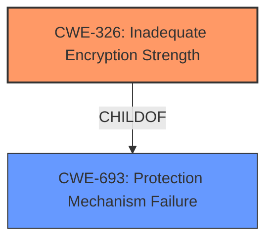

# Analysis for CVE-2022-21139

# Summary
| CWE ID | CWE Name | Confidence | CWE Abstraction Level | CWE Vulnerability Mapping Label | CWE-Vulnerability Mapping Notes |
|---|---|---|---|---|---|
| CWE-326 | Inadequate Encryption Strength | 1.0 | Class | Primary | Allowed-with-Review |

## Evidence and Confidence

*   **Confidence Score:** 1.0
*   **Evidence Strength:** HIGH

## Relationship Analysis
The primary CWE is CWE-326 **Inadequate Encryption Strength**, which is a Class-level CWE. It has a single parent CWE-693 **Protection Mechanism Failure**, which is a Pillar. Since the description specifically mentions **inadequate encryption strength**, using the more specific CWE-326 is more appropriate than the more general CWE-693.

## Vulnerability Chain
The vulnerability chain starts with the **inadequate encryption strength** (CWE-326), which then leads to the potential for escalation of privilege.

## Summary of Analysis
The initial analysis and conclusion are based on the provided evidence, which clearly states that the root cause of the vulnerability is **inadequate encryption strength**.

The vulnerability description states: "**Inadequate encryption strength** for some Intel(R) PROSet/Wireless WiFi products may allow an unauthenticated user to potentially enable escalation of privilege via adjacent access."

The CVE Reference Links Content Summary states: "Root cause of vulnerability: **Inadequate encryption strength**"

The graph relationship shows that CWE-326 is a child of CWE-693. Choosing CWE-326 is at the optimal level of specificity because it directly addresses the weakness in encryption strength. CWE-693 is a more general category that doesn't specify the type of protection mechanism failure.

Relevant CWE Information:

# Enhanced Context (25 CWEs)
The following CWEs were identified as potentially relevant to this vulnerability:

## CWE-691: Insufficient Control Flow Management
**Abstraction Level**: Pillar
**Similarity Score**: 0.79
**Source**: dense
...
(Other CWEs listed)
## CWE-326: Inadequate Encryption Strength
**Abstraction:** Class
**Status:** Draft

### Description
The product stores or transmits sensitive data using an encryption scheme that is theoretically sound, but is not strong enough for the level of protection required.

### Extended Description
A weak encryption scheme can be subjected to brute force attacks that have a reasonable chance of succeeding using current attack methods and resources.

### Alternative Terms
None

### Relationships
ChildOf -> CWE-693

### Mapping Guidance
**Usage:** Allowed-with-Review
**Rationale:** This CWE entry is a Class and might have Base-level children that would be more appropriate
**Comments:** Examine children of this entry to see if there is a better fit
**Reasons:**
- Abstraction